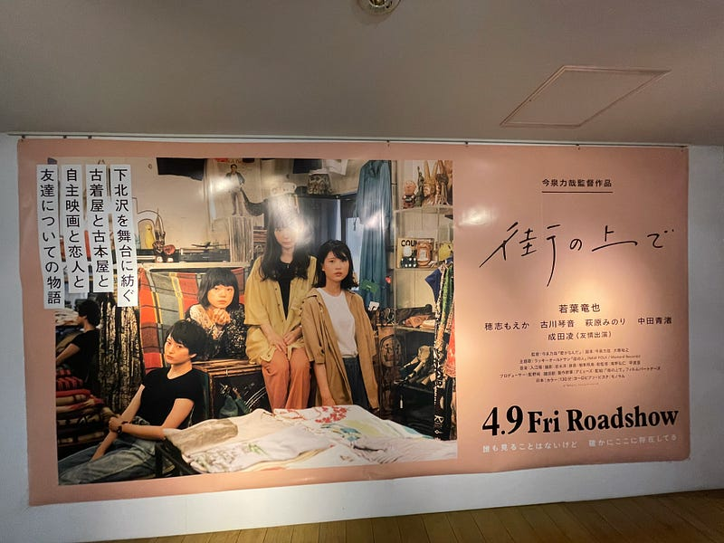

2021年4月9日、「街の上で」という映画を見た。

本来ならば、2020年5月1日に公開されているはずの映画。その日付の直前2020年4月17日には「劇場」という映画が公開されているはずだった。「劇場」も公開を延期され、7月に見た。

「劇場」という映画は、下北沢に住む、演劇に青春を捧げる男の物語。「街の上で」は、下北沢で生活する人たちの出会いの物語。

この2つは下北沢を舞台にした映画だったので、もしかしたら下北沢に注目した企画が動いていたのかもしれないし、それはないかもしれない。

ライブを見るときも映画を見るときも、どちらかというと静かに見ていたい人だった。自然発生する手拍子も笑い声も、どちらかというとネガティブな感情を持っていた。スピーカーから出る音以外は雑音だとそう思っていた。

「街の上で」を見るという体験をして、捉え方が大きく変わった。一緒に見ている人たちから湧き出る笑い声が心地よかった。それが一つのSEになっていた。

もしかしたら、その前に別の映画を見ていたことがよかったのかもしれない。

「まともじゃないのは君も一緒」

あ、こういう軽い映画もあるんだ、ということを気付かされてくれた映画だった。会話が心地よく、そしておかしな映画だった。

「街の上で」はスクリーンの中の登場人物が、その場で発生する状況にドギマギし、それが心地よい笑いとなり、会場全体を包んでいくような、心地よい映画だった。

２回目みたいと思っている。この映画を、このストーリーをもう一度見たいというよりは、「あの街で見たらみんなどこで笑うんだろう」という方に興味がある。例えば、東京と大阪で笑うポイントに違いがあるんちゃうかとか。

こういう興味を持たせてくれた映画は「街の上で」が最初だった。

2021年4月29日に公開する予定だった「くれなずめ」という映画が公開延期になった。この映画は何を見せてくれるのか、楽しみに待ちたいと思う。