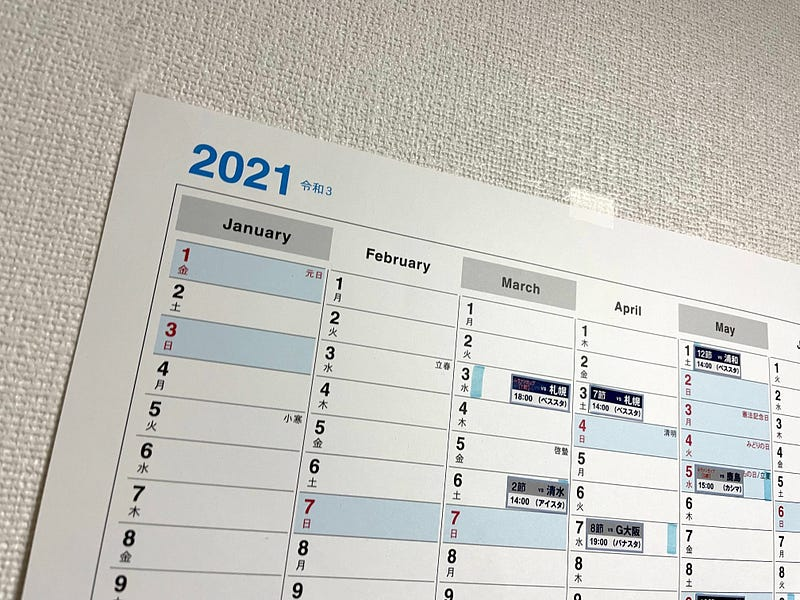

このブログは7月3日に公開されています。

オリンピックがあるのに閏年ではない2021年の半分は7月3日。そうです。ちょうど今年の折り返しを過ぎたところです。

普段のカレンダーイベントは、iCloudで管理しています。macOSでもiOSでも、イベントが管理でき、イベントの場所へ移動する時間になればレコメンドを表示してくれたりと、なかなかと便利です。

WEBカレンダーの欠点は、月間は見えるけど、年間は見れないこと。長期間の予定を検討したいときには見通しが悪すぎると思うことが多いのです。そこで、紙のカレンダーの登場です。

そこで、使っているのが、A2の広さに１年間が書いてある紙のカレンダー。東急ハンズとかに季節ものとして展示されるカレンダーコーナーにも隅の方においてあったりします（きっと買う人少ないんでしょうね）。

[**2021年版 1月始まりA2 イヤープランナーCK-32**  
_クレジットカード決済（クロネコWebコレクト） 下記バナーに記載のクレジットカードがご利用になります。 ・JCB・VISA・Master Card・Diners Club・American…_www.nplan.jp](http://www.nplan.jp/calendar/19169.html "http://www.nplan.jp/calendar/19169.html")

重要なのはひと目で１年間が俯瞰してみれること。

自分の場合は、Jリーグのシーズンの日程を書き込んで、「このあたりのアウェイに行けるな」とか、「このあたりフェスありそうだから行動を詳細に考えよう」とか、そういう粒度の荒い計画をここで立てることが多いです。

2021年はカレンダー印刷後に休日の日程が動いたりしてて、紙のカレンダーには不幸な年になってしまいましたが、どこかに掲示して、時間があるときにパッと目に入るカレンダーはとても便利なので、おすすめです。

来年1月始まりの手帳の発売ももうすぐ。ぜひ参考にしてみてください。