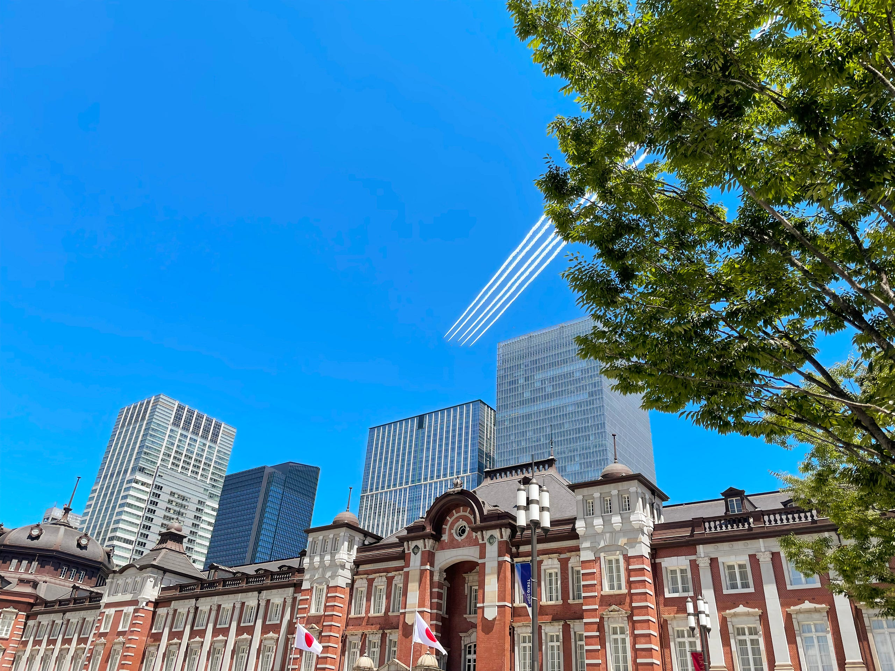

僕がサッカーを、Jリーグを、好きな理由は、Jリーグが設立当時に夢をきっちりと語っていたからだ。Jリーグの成功を通じて、日本中に芝のグランドを作る、そして、多くの人がスポーツに触れる機会を作る。

野球しかなかった国で、サッカーやバスケ、そして、ラグビーなど、さまざまな選択肢が提供されることは、やがて多様性を育み、そして、それ以外の文化、音楽や、映画といった「時間の使い方の選択肢」に繋がっていく、とそう信じていた。

もちろん、プロスポーツ興行だけを見ているわけではない。いわゆるアマチュアと呼ばれるスポーツを選択肢にもつ人がいてもいい。その選択肢をたくさんの人に提供する大会が、まさにオリンピックだと思っている。そのオリンピックを日本でやることは、まさに時間帯を気にせずに楽しめることにある。見にいく機会がなくても、僕らは睡眠時間を削ることなく、カメラを通じた映像で楽しむことができる。

その機会を作るために、多くのサポートが必要なのは理解している。残念ながらスポーツはその活動自身でお金を生み出すことができない。それを「魅せる」ことによって、人々を惹きつけ、広告ビジネスとして、成り立っていることがほとんどだ。これはオリンピックに限らない。

その利益がプレイヤーに渡っていくプロとは違い、その利益が渡っていかないアマチュアの場合は、プレイヤー本人が関与しない形でビジネスとして膨れ上がりやすいという少し捻れた現象が起きてしまうことになる。

プロの世界ですら、欧州でショウに特化しようとしたスーパーリーグ構想が発表され、そして破綻した。また、サッカーの90分は今の若者には長すぎるのではないかという議論も起こっている。

同じようなことがアマチュアでも起きる可能性はあるし、もしかしたらそれがIOC周辺なのかもしれない。

アマチュアスポーツをどう捉え、そして、どうサポートしていくか、ここ何十年もオリンピックのたびに起こる議論を忘れないようにしたい、と思う。

p.s.

多様性ある選択肢の中から、ひとつを選び取るには、強いアイデンティティとリーダーシップが必要である。多様性を担保しようという声の中で、それを培うこともできるかが問われていると思う。東京2020 の開会式はまさにそれを体現したということもできるのではないかと感じている。