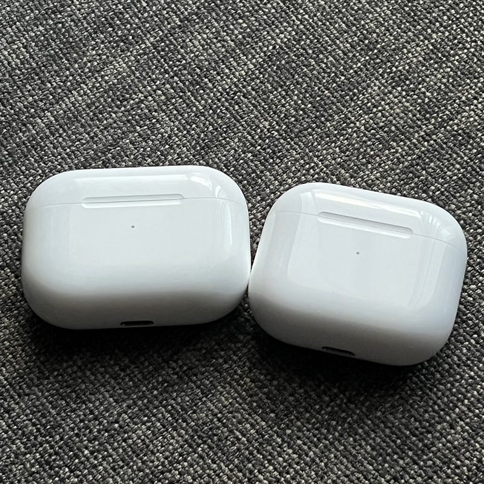

「Apple 2021秋まつり Mac編」こと、unleashedイベントが無事に終わり、今日は26日。macOSをはじめとした、Appleの各種OSのアップデートと、AirPods、新しいMacBook、そして布が出荷されています。

その中でも、注目を集めなさそうなAirPids 3rd Genを中心に触れておきます。unleashイベントについては、各媒体でのまとめと、Appleのアーカイブ動画をご覧ください。

#### 形が大きく変わったAirPods 3rd Generation

今回unleashedイベントが終わって一番最初に注文したのが、このAirPodsでした。

AirPodsもAirPods ProもAirPods Maxも使っていますが、「静かな室内で作業するときのイヤホンの軽快なつけ心地」を得ようとするとAirPodsが最適なので、作業中によく使っています。

AirPods Proは、密閉感が強すぎる（そのおかげでノイズキャンセリングが成立しているのですが）ので、主に外出する時にしか使っていません。AirPods Maxは、音楽に浸りたい時などに使うことが多いです。（本気で音楽に浸りたい時は T3–01を使って爆音で聞いていたりします）

というわけで、今回のAirPodsのアップデートは “待望の” という形でした。

AirPods 3rd Gen はこれまでのAirPodsと大きく形が変わっています。イヤーチップなしのAirPods Proと呼んだ方がいいのかもしれません。形状が変わったおかげか、装着感が安定し、低音を強く感じることができるようになりました。街を歩きながら、ベースラインが聞き取れたというのは驚きでした。

そして、形状と合わせて、操作方法もAirPods Proと全く同じになりました。

これまではタップによって操作していました。旧モデルのAirPodsは安定した状態で装着されているわけではなかったので、タップすることによって、ズレたり、人によっては外れたりすることがありました。今回の感圧センサーによる操作に変更になったことで、AirPods Proを使ったことがある場合でも戸惑うことなく操作できるようになりました。

ケースもMagSafe付きのものに変更されました。これによって、iPhoneと充電の互換性を保つことができ、iPhoneを充電していない時間に充電をすることができました。もっともこれまでのモデルでもQi対応のケースがあったので、できることが大きく増えたわけではありませんが、MagSafeの無線充電は位置を合わせることに注意する必要がないため、力まずに使える感覚があります。AirPods Proでも10月からMagSafe対応モデルが出荷されているようです。

装着して軽く街を歩いてきた感じでは音量も十分で実用的だと感じました。AirPods Proを使っていてノイズキャンセリングを普段からオフにして使っているという場合はそのまま乗り換えても良いのかもしれません。電車など公共交通機関での移動や、駅など人が多いところではノイズキャンセリングが効果が発揮されるので難しいかもしれません。もちろん、AirPodsは開放的なので、それなりに音漏れもします。

#### 一旦様子見したMacBook Pro

MacBook Proは一旦様子見することにしました。今回がM1 Max/Proを使った初めてのデバイスということもありますし、新しいデザイン一期生ということもあります。何より、Apple Sillicon時代のMacの使い方を少し見直してもいいかなと思っています。

日常生活のコンピューティング環境としてはiPad Pro で十分になりつつあります。それで何かできなくなった時に取り出す程度ということで、MacBook Air、もしくはMacBook Pro / M1Pro でいいかもと思っています。動画を編集したり、写真を大きく加工したりということをするつもりは将来的にもありません。

最近よく思うんです。iPhone 13 Pro、iPad mini、MacBook Pro 14 あたりの組み合わせがベストマッチなんじゃないかと…。

次のWWDCまでに、Apple Silliconへの移行は済ませたいと思っています。