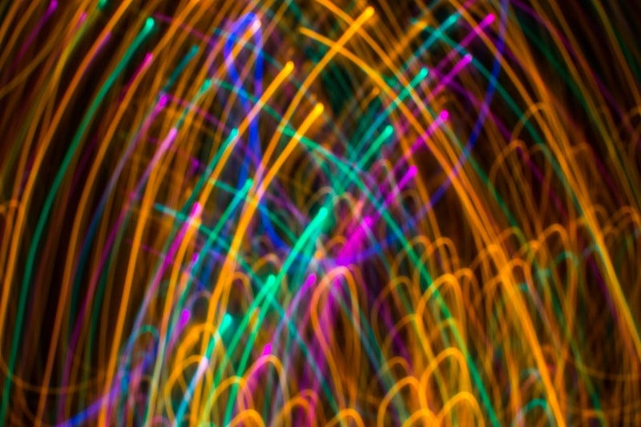

5月初め、音楽フェスに出向いた。5月のフェスは何度かさいたまの方に出向くことはあったが、今回は千葉の方に行った。

サッカーゴールのように向かい合うステージで、音が重なることがないようタイムテーブルが組まれ、お互いが音を出すという環境で進行していた。ステージ間の移動も障害物が比較的少なく、狭いところがあるとそこがボトルネックになって混雑が発生しがちなのだけど、そんなことはなかった。そして、ほぼワントラックな感じで進行していくフェスは、みんなが同じ瞬間に同じ音楽を聴いていた。

もうすっかり当たり前になったような感覚もあるが、数年前から「ロックフェス」にアイドルが出演するようになっている。自分が行った日もアイドルが出演していた。数年前は、その時間を食事の時間にあてたり休憩にあてたりする人たちも多かったり、とてもアウェイな雰囲気だったこともある。しかし、その日は非常に多くの人が、そのステージに集まっていた。

「音楽の好みは14歳の時に聴いた音楽で形成されている」という話がある。自分が14歳に出会った音楽は、まさにMr.Childrenだった。その当時は長く続いたバンドブームがあり、「ロックこそがこれからの音楽」という時代だった。何度も聴きたい音楽を聴くためにはCDを買う必要があり、14歳の自分にはたくさんのCDを一度に買う余裕はなかった。当然ながら、Mr.ChildrenのCDを買うことを最優先にしつつ、他の音楽は音楽番組で流れてくるものを聴いていた。自分の周りには、HMV渋谷のように、音楽世界を広げてくれるようなCD屋もなかった。だからこそ、Mr.Childrenが1年休止というタイミングで登場した、宇多田ヒカルには大きな衝撃を受けたんだと思う。（14歳のときにEAST END x YURI の音楽を聴いていたんだけども）

“アイドル冬の時代”と呼ばれる時代が終わったのは、モーニング娘。が登場したかららしい。そこから、秋葉原に劇場が登場し、メディア活動を主軸にする坂道が登場する。つまり、自分の音楽の好みは、アイドルがいなかった時代に形成されている。

中高生にとって、音楽はその決して広くない活動範囲に差し込む光のようなところがある。サブスクという音楽の聴き方は、その光に、プリズムのような色を与え、乱反射のような輝きを与えているんだろう。

自分の14歳はMr.Childrenを聴き、そして、ロックバンドの音楽を聴いていた。今の14歳はきっと、多様なジャンルの音楽が混ざったプレイリストを聴き、そして、それぞれの音楽の中に、自分なりの「よさ」を見つけつつ、自分の好みを見つけていくんだろう。

Cover image from [https://www.pakutaso.com/20171108334post-14298.html](https://www.pakutaso.com/20171108334post-14298.html)