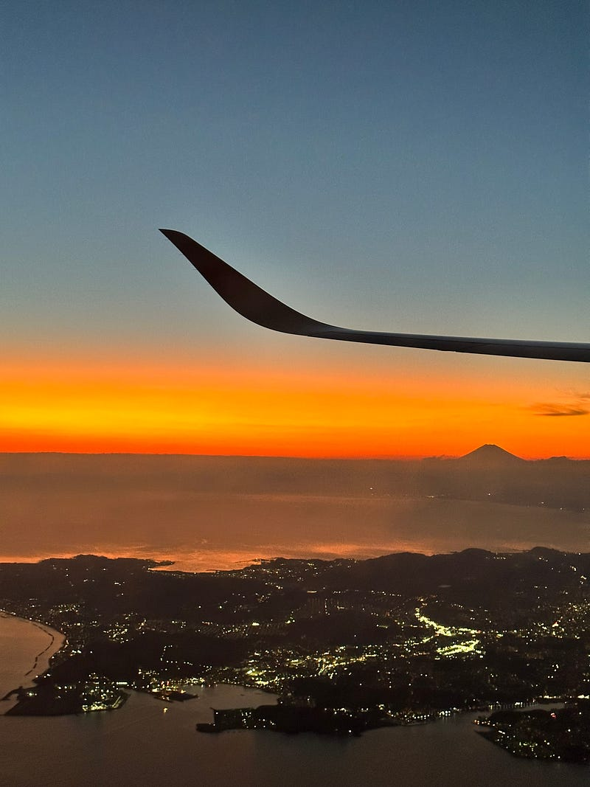

特に大きな理由はないのですが、何となくブログ名とアイコンを変えました。

さて、先日8か月ぶりに飛行機に乗る旅行をしました。諸事情でキャンセルにしたものもあって本当に久しぶり。そして、約3年ぶりに実家というものに帰省しました。周辺の環境が少し変わっていました。

今回の目的は、アビスパ福岡の2022シーズン、ホーム最終戦でした。ベスト電器スタジアムはいつ行っても美しく、そして素晴らしかったです。そして、今年のスタジアムは、試合前からスタジアム全体のボルテージが上がっていました。試合を観戦しにきたというよりも、チームを応援しにきている、そんな空気感が充満していました。いつもはアウェイで感じていた空気感をホームで感じられたことにとても感動しました。

飛行機に乗る旅ということで、WH-1000XM5を実戦投入しました。そう、もともと飛行機の移動で使うのが目的でしたから。結論から言うと素晴らしかったです。約2時間の移動も、エンジンの低音を強く感じることもなく、ただひたすら音楽やPodcastを聴いていました。素晴らしかったので何も書くことがありません。

[**旅のお供にしたいヘッドフォン WH-1000XM5**  
_ソニーのノイズキャンセリングヘッドフォン WH-1000XM5を手に入れました。_qli.jp](https://qli.jp/%E6%97%85%E3%81%AE%E3%81%8A%E4%BE%9B%E3%81%AB%E3%81%97%E3%81%9F%E3%81%84%E3%83%98%E3%83%83%E3%83%89%E3%83%95%E3%82%A9%E3%83%B3-wh-1000xm5-965714e87628 "https://qli.jp/%E6%97%85%E3%81%AE%E3%81%8A%E4%BE%9B%E3%81%AB%E3%81%97%E3%81%9F%E3%81%84%E3%83%98%E3%83%83%E3%83%89%E3%83%95%E3%82%A9%E3%83%B3-wh-1000xm5-965714e87628")

飛行機以外の移動ではAirPods Pro（第二世代）でした。いつも使っているイヤホンですが、やっぱり素晴らしいイヤホンだなと思います。電車の中でしっかり音楽を楽しめるようになりました。個人的には、外音取り込みモードで街を歩くのが好きな使い方だなと思います。

