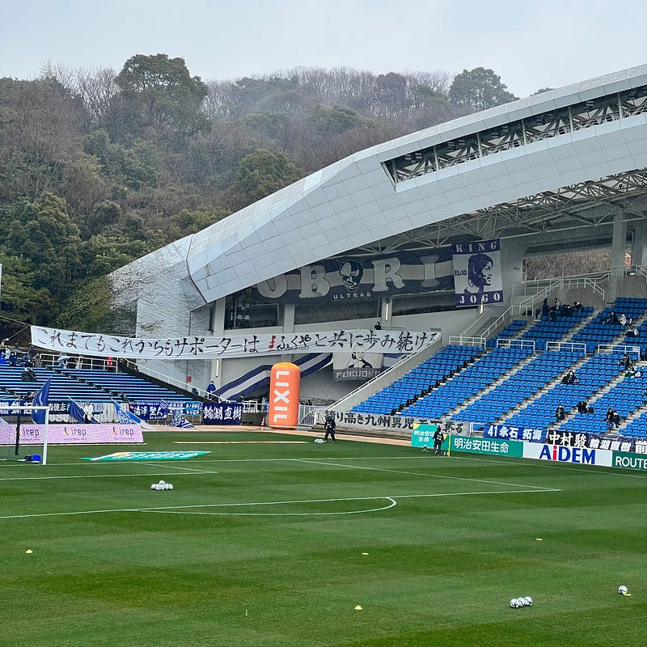

3月24日に、アジア最終予選としてオーストラリアと日本の試合が行われる。かねてより、DAZNのみで中継されることが決まっていたのだが、改めてDAZN側から独占配信を宣言する事態となった。

[**DAZNがW杯最終予選オーストラリア代表戦の独占配信を改めて発表 | サッカーキング**  
_10月のオーストラリア戦で円陣を組む日本代表 \[写真\]=Getty Images…_www.soccer-king.jp](https://www.soccer-king.jp/news/japan/national/20220228/1625159.html "https://www.soccer-king.jp/news/japan/national/20220228/1625159.html")

これが出た背景には、日本サッカー協会(JFA)からサブライセンス提供を地上波にできないかという提案があったということらしい。なぜJFAが地上波にこだわるのか。

これまで日本代表は、日本のサッカーのフラグシップとして、”オールスターチーム” のように扱われてきた。Jリーグを普段見ない人でも名前を知っているような選手たちがいる、日本代表の試合を見ることによって、サッカーに触れるきっかけを与えてきた。そして、それらは地上波で放送され、サッカーを知らない人でもテレビをつければ見ることができるという状況が生まれている。

日本のトップリーグであるJリーグは、その放送を、スカパーやDAZNなど、「加入」が必要なプラットフォームを中心に展開してきた。注目が集まり試合、例えば、開幕戦や優勝が決まる試合などは、地上波で放送されることもあるが、年間を通じて見るためには「加入」しなければいけない。「加入」のモチベーションとして、Jリーグが好きだ、が必須条件なのだ。まだ見てもないのに。

そのモチベーションを高める役割として、地上波で放送される日本代表チームの試合は特別な意味があった。今回の最終予選では、日本ホームの試合だけ地上波で放送されるということになった。

地上波で放送されるメリットはまだある。中継する放送局はその枠の注目を集めることが必須になるので、朝の情報番組を筆頭にさまざまな企画で日本代表の試合があることを周知してくれる。それだけで十分なムーブメントを発生させることができる。DAZNでの放送だけでは「いつの間にかサッカーやっていた」という人が増える。それはサッカー熱の低下に繋がりかねない。

と、同時に重要なことを考慮しなければいけない。JリーグがDAZNを選んだ背景には、「若年層はテレビを見なくなった」という現実もある。彼らが普段から接しているメディア、YouTubeやTikTokなどと戦う必要がある。そのために彼らは、TikTokアプリの横にDAZNアプリを置いてもらう戦略を選んだ。（実際DAZN以前にJリーグを放送していたスカパーも、今はSpooxという配信サービスを開始している）

とても簡単にまとめれば、あまりにもスマホの位置付けが上がってきたために、メディアが個人化し、マスの効果が薄れ、そして、趣味が個人化しているということだと思う。例え朝の情報番組で周知しても、視聴率が見込めない程に日本代表の試合を放送することに放送局が興味を持っていないということなのだろうと思う。（Payできないほどライセンスが高いというのも関わっているので実際はこんなに単純な話でもないが）

街を歩いている人たちが、それぞれに自分の好きなものがあり、それを楽しんでいて、おそらく同じ趣味を持ってる人たちを見つけることが難しいという状況なのだろう。それは人の数と同じくらいのストーリーがあるのではないかと思う。

あなたが好きなものは何ですか？そして、それを好きになったきっかけは何でしょう？

最近はラジオを聞く時間がとても増えた。ラジオを聞くようになったきっかけは、親からもらったソニーのラジオだった。

音楽を聴くきっかけは、毎晩11:30にラジオから聞こえてきたコカコーラのCMの boy meets girlだった（[YouTube](https://youtu.be/EgGnreyPmaQ)）。

J-POPを特に聴き始めたきっかけは、Mr.Childrenのinnocent worldだった（[YouTube](https://youtu.be/rfVhsgCqG0I)）。

サッカーを好きになったきっかけは、2002年ワールドカップ誘致とJリーグ開幕のムーブメントだった。野球しかなかった世界に、新しい価値観をぶち込まれる感覚がたまらなかった。

アビスパ福岡を応援するきっかけは、知人に連れられていった大宮公園サッカー場（NACK5スタジアム）のアウェイ側のゴール裏の雰囲気だった（[公式記録](https://data.j-league.or.jp/SFMS02/?match_card_id=7367)）。

あなたが好きなものは何ですか？

そして、それを好きになったきっかけは何でしょう？