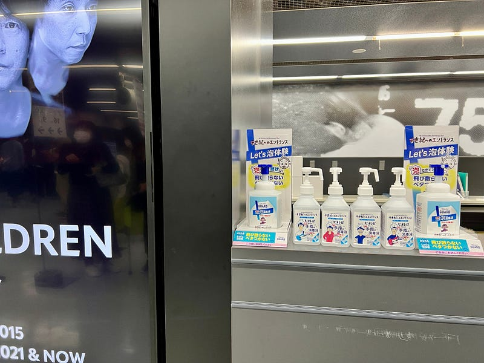

Mr.Childrenの30周年をお祝いするツアー、「半世紀へのエントランス」に参加してきた。ファンクラブメンバー向けのイベント「半世紀へのエントランスのエントランス」を含めて全３回。どれも素晴らしいライブでした。

#### エントランスに立つまでの物語

Mr.Childrenがデビューしてもうすぐ30周年という話は2019年くらいから聞こえてきたように記憶している。ドームやスタジアムなどは2年以上前から日程含めて計画されていることが多く、おそらく30周年をお祝いするツアーもそれくらいには計画されていたんだろうと思う。

2019年、Mr.Childrenはアルバム「重力と呼吸」を引っ提げて、全国のホールとドームを回るツアーを行った。そのツアーの中で「レコーディングのためにロンドンに行ってきます」という宣言があった。それを聞いたのは東京ドームだった。

そのレコーディングの成果はアルバム “SOUNDTRACKS” という形でパッケージングされた。パンデミックで往来が禁止される直前に海外での制作を終え、アルバムは12月にリリースされた。

その後のツアーやライブ企画も予定されていたと聞くが、2021年の年越しはそれどころではなく、発表されることもなく中止されたようだ。

そして、2022年4月8日。Mr.Childrenは久しぶりに有観客の単独ライブを開催する。

#### エントランスのエントランス

「半世紀へのエントランス」の準備運動のために用意されたステージ。東京ガーデンシアターは新しいハコで、パンデミック後にライブの開催ができるようになってから、非常によく見かけるようになったミュージックプレイスだ。ステージに対して横幅が広く、どこからでも見やすいハコとして知られている。

[**住友不動産｜東京ガーデンシアター/劇場型イベントホール8,000人収容 | 東京ガーデンシアター**  
_2020年開業。東京の中枢にほど近い、湾岸エリアの一角"有明"。ここに、東京屈指の広がりを見せる劇場型イベントホールが誕生。世界に誇るエンタテインメントホールとして、かつてない臨場感、経験したことのない感動を人々に提供する。_www.shopping-sumitomo-rd.com](https://www.shopping-sumitomo-rd.com/tokyo_garden_theater/ "https://www.shopping-sumitomo-rd.com/tokyo_garden_theater/")

動いているMr.Childrenのメンバーたちを見るのは実に3年ぶり。彼らが登場し、youthful days が流れ始めた時、これまで味わったことのない強い多幸感を感じた。これまでMr.Childrenの音楽とは少し距離を置いたこともあるし、日常の音楽すぎて「今めっちゃ聴きたい音楽」になることはそんなにないので、多幸感を感じた自分に驚きを感じた一夜だった。

#### 半世紀へのエントランス ドーム編

最初の「半世紀へのエントランス」は東京ドームだった。Mr.Childrenが1992年にシングルを発売した5月10日。いろんな曲とともに「誕生日おめでとう」を静かに祝う夜だった。

この日の様子は後日オンライン配信された。

Mr.Childrenが次々に繰り出すサウンドに酔いながら、綺麗な映像を映し出すディスプレイ、そして、ドームの壁を使った照明などの演出に魅了された一夜だった。なにしろ、2019年とほぼ同じ場所ながら、2019年よりも音がいい。ギターのサウンドの弦が揺れる音が聞こえてくる。そして同時に、ボーカル桜井和寿の声が、まったく別ものと思えるくらい、とても伸びやかになっているのを感じた。30周年に、最高を記録できるバンドとは、すごいものを体験した。

#### 半世紀へのエントランス スタジアム編

「半世紀へのエントランス」第二夜は日産スタジアム。すでに関東は梅雨入りし、天気と睨めっこしながら、その日が来るのを待った。

ドームのライブはすでに配信されているし、チケットの売り出し方もドームとスタジアムとは別だった。そして、すでに「セットリストを毎回変えている」という宣言もあり、スタジアムのライブはどうなるんだろう、という期待とともにスタジアムに移動する。

スタジアムに入って最初に驚いたのはそのセットだった。どう見ても東京ドームで見たそれと同じ。スタジアムは、ドームと大きさが違ったり、天候の影響などもあるので、セットは変わるのでは、演出も変わるのではと思っていた。あまりにも同じものがあるので、演出も同じなのかなと思いながら、開演時間を待つ。

やがて、開演時間になり、４人が出てくる。オープニングの映像も東京ドームで見たものと同じ。「そうきたか」と思った。実際、セットリストは違うけど、演出としての映像は同じ。追加されたのは、野外ならではの花火だった。

でも、正直演出が同じであることに戸惑いはなかった。彼らが奏でるサウンドはすばらしく、スタジアムでもドームと同じくらいに、いや、それ以上に響いていた。あまりにも素晴らしい光景に、大合唱がないことだけが悔やまれる一夜だった。

#### セットリスト

セットリストで何が起きていたのか。「半世紀へのエントランス」も本日のヤンマースタジアム長居で終了ということで、各地のセットリストを比べてみることにしたい。

セットリストは、Webサイトに投稿されているものを参考にしました。

[**Mr.Children -Mr.Children 30th Anniversary Tour 半世紀へのエントランス | ライブ・セットリスト情報サービス【 LiveFans (ライブファンズ) 】**  
_5月の東京ドーム公演に続いての参加となりました。 今回も圧巻のパフォーマンスで今までになかった炎の演出もあり、パフォーマンスと演出は文句なしでした。 気になった点としては選曲です。…_www.livefans.jp](https://www.livefans.jp/groups/187653 "https://www.livefans.jp/groups/187653")

まず１曲目。今回の演出では、一旦下がったディスプレイが幕の役割になり、１曲目の演奏開始とともに上がるとMr.Childrenが登場するという演出だった。

ドームでは「Brand my planet」、ツアーができなかった最新アルバムの曲で始めることで「未来」を感じさせる出だし。一方、スタジアムでは「終わりなき旅」で始めることで「未来」を感じさせつつ、往年の名曲を披露することで「30周年」のお祭りの始まるを予感させた。

2曲目。ドームツアーでは「youthful days」「PADDLE」「箒星」の中から１曲が選ばれている。どれもアップテンポで疾走感のある曲。スタジアムでは「名もなき詩」が選ばれている。これもシングル曲。お祭りだ。

そして3曲目「海にて、心は裸になりたがる」に続く（全会場共通）。Mr.Childrenの中ではとてもロックな曲で、大合唱したくなる曲だ（できない）。

その後、「シーソーゲーム」「innocent world」と続くのだが、東京ドームをのぞくドームでは、どちらかしか歌われていない。

次にミドルテンポゾーンに入る。「Replay」「LOVE」「Over」のどれかと「Any」がドームで、「彩り」「口笛」がスタジアムで演奏され、センターステージへの演奏となる。

その後、繰り広げられるのが、このライブの軸となる楽曲たち。このパートでは、映像演出があり、全公演楽曲がほぼ固定されていた。Mr.Childrenの演奏の迫力を存分に楽しめるパートだ。

*   タガタメ
*   Documentary film
*   DANCING SHOES
*   LOVEはじめました
*   フェイク （東京ドーム以外で演奏）
*   ニシエヒガシエ （東京ドームとスタジアムでのみ演奏）
*   Worlds end

その次に続く楽曲たちを披露してライブは終幕を迎える。

*   永遠
*   others
*   Tomorrow never knows
*   Dance Dance Dance (ドーム/東京ドーム以外） / 光の射す方へ（スタジアム）
*   fanfare （東京ドームとスタジアムのみ）
*   エソラ （日産スタジアム Day1ではアンコール1曲目）
*   GIFT

どうやら、日産スタジアムDay1では、夕方からの降水確率が上がっていたため、出来るだけ雨が降っている状態でやりたかったようである。

盛り上げるだけ盛り上げておいて、「GIFT」で締めるあたりがとてもにくい。

アンコール、ドームでは「Your Song」が選ばれ、スタジアムでは「HANABI」が選ばれる。スタジアムでのお祭り感がここでも顔をのぞかせる。

そして未来への大事なメッセージとともに、「生きろ」で締める。

ドームツアーで東京ドームだけ少しセットリストが変わったのは、5月10日という日付を考えてのことだろうと思う。

これだけ大規模なライブで会場によってセットリストが変わるというのがよくあることなのかどうかはわからないが、5人編成のバンドの演奏の力だけで、ドームを、スタジアムを沸かせる瞬間もあり、Mr.Childrenがモンスターバンドであることを、改めて示す、そういうライブだった。

改めて、30周年おめでとうございます。そして、半世紀、50周年までまずはよろしくお願いします。お互い歳をとりました。