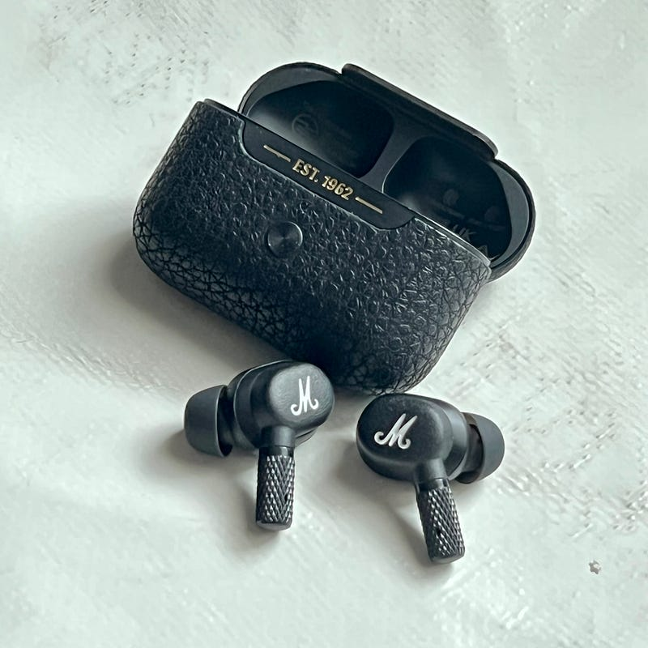

Marshall から出ている Motif A.N.C.を試してみたので紹介します。

Marshalはギターの世界では有名なアンプメーカー。そしてそのヘッドフォン部門であるMarshal Headphonesは、初期から音の傾向が好みで使っています。今ではオンイヤーヘッドフォンである MAJOR IV をたまに使います。「たまに」というほど頻度が低い理由は、このヘッドフォンがノイズキャンセリングを搭載していないことと、ヘッドフォンという形状がマスクと一緒だと使いづらい、という２つです。

[**Buy Marshall Motif A.N.C. True Wireless Headphones**  
_You should never have to go down in sound when you go down in size. Motif A.N.C. delivers the same Marshall sound in a…_www.marshallheadphones.com](https://www.marshallheadphones.com/jp/en/motif-anc.html "https://www.marshallheadphones.com/jp/en/motif-anc.html")

Motif A.N.C.は、Marshall Headphonesのイヤホンのラインナップの一つ。もともとヘッドフォンはMAJOR、イヤホンはMINORというラインだったのですが、ANC付きのためか、新しくMotifというラインが登場しました。と言っても発売されたのは2022年1月21日。もう半年以上前のことです。

少し詳細に紹介していきます。

Motif A.N.C.のペアリングは、Marshallから出ているアプリを通じて行われます。MODE IIの時は接続に不安定さを感じることもあったのですが、Motifは安定してペアリングできているのを感じました。電車を使ったり、人通りの多い場所で街歩きをしてみましたが、特別切れやすい感じもしなかったですね。

ヘッドフォンをケースから取り出し、耳につける動作に少し気になるところがありました。たとえばAirPods Proでは、ケースに収まっているものをそのまま耳につける形になります。Motif A.N.C.は、ケースに収まっているものを耳につけるときに180度回転させる必要がありました。これだと動作がひとつ多く、慣れが必要になっているのを感じました。落としやすさの原因に繋がりそうだなと思います。

Motif A.N.C.の音は、確かにMarshallの音。ギターの音の雑味を再現してくれるような、そんな音を聞かせてくれます。全体的に音質がよいという音ではないのですが、とても聞き応えのある音です。ギターサウンド、特に歪みのある音が好きな人にはおすすめしたいです。逆に、打ち込み系や女性ボーカルの声を綺麗に聞かせるサウンドは苦手かもしれません。

Motif A.N.C.には、TRAと呼ばれる外部音取り込みモードがついています。外の音は自然に聞こえるのですが、発話した時に耳栓しているような感覚があります。これは、Motif A.N.C.がカナル型だからということが大きそうなので、形状によるものと理解したほうがよさそうです。

ノイズキャンセリングは、周りの音を遮断するというより、音楽をよりききやすくするというコンセプトと理解したほうが良いかもしれません。効き具合はAirPods Proと同程度と説明したほうがわかりやすいかもしれません。

普段使いは、音も程よい感じで総合的に使いやすいのがAirPods Proだと思います。Motif A.N.C.は気分を変えて音楽を楽しく聴きたい時に使うのが良いかも。小さいパッケージなので、AirPods Proと一緒に持ち歩いても大きな荷物にはならないのが一番良いですね。