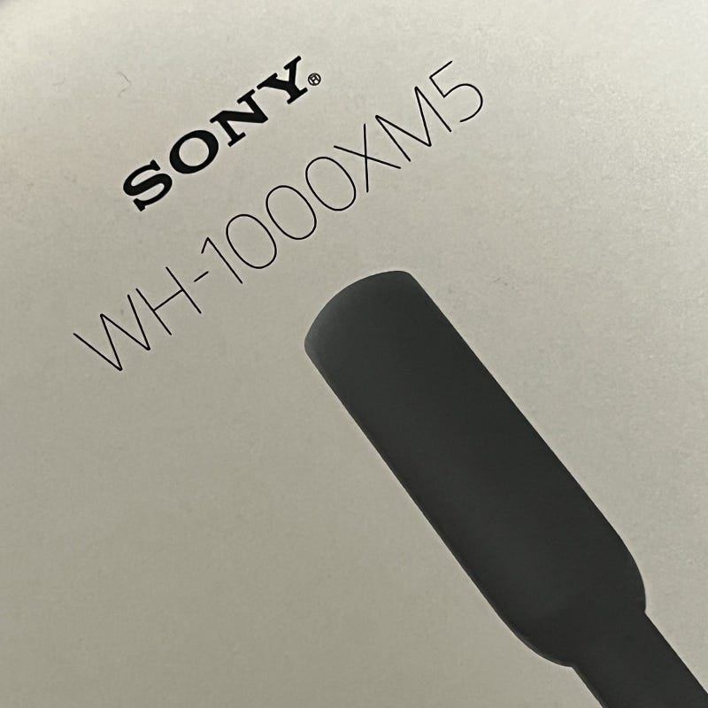

ソニーのノイズキャンセリングヘッドフォン WH-1000XM5を手に入れました。

[**WH-1000XM5 | ヘッドホン | ソニー**  
_ソニー ヘッドホン 公式ウェブサイト。ヘッドホンWH-1000XM5の商品ページです。_www.sony.jp](https://www.sony.jp/headphone/products/WH-1000XM5/ "https://www.sony.jp/headphone/products/WH-1000XM5/")

AirPods Maxは2020年12月に発売されたのと同時に導入し、特に新幹線や飛行機の移動の時に重宝していました。AirPods Maxは今でも空間オーディオ（Dolby Atmos）を楽しむ環境としては最高のAirPodsだと思っていますし、AirPodsシリーズの特性であるAppleデバイスであればどのデバイスでも気軽にペアリングできる点や、電源ボタンが存在しないところなど、とても素晴らしいヘッドフォンだと思います。しかし、飛行機のためのノイズキャンセリング環境としては、物足りなさ印象を感じていました。

新幹線はAirPods Proが手軽で十分なのですが、気圧の変化を強く受ける飛行機ではイヤホンタイプのものはできる限り避けたいと考えているので、ヘッドフォン、それも耳への接着が少なく、長時間でも疲れにくいオーバーイヤーヘッドフォンを選びたいと考えました。

ノイズキャンセリング性能を最重視した上で、オーバーイヤーヘッドフォンを選びたい。まず初めに定番のQuiet Comfortを中心に検討を始めました。Quiet Comfortのノイズキャンセリング性能はもちろん信頼しているのですが、過去BOSEの低音に酔ったという悪い経験があります。それもあり、店頭で今の最新機種であるQC45を試し聞きしたところ、自分にとってあまり好ましいと思える音ではなかったので、選択肢から外すことに。

[**QuietComfort 45 Headphones | ボーズ**  
_ボーズのアイコニックなノイズキャンセリングヘッドホンをベースにしたワイヤレスのBose QuietComfort 45…_www.bose.co.jp](https://www.bose.co.jp/ja_jp/products/headphones/noise_cancelling_headphones/quietcomfort-headphones-45.html#v=qc45_black "https://www.bose.co.jp/ja_jp/products/headphones/noise_cancelling_headphones/quietcomfort-headphones-45.html#v=qc45_black")

そこで選ばれたのはWH-1000XM5でした。もともとソニーの音には馴染みがあり、むしろ好んで聴いていたこともあり、この選択はさほど難しくはありませんでした。

WH-1000XM5は発売から2ヶ月程度経っていることもあり、きっとこの記事を目にする人もレビュー記事や動画を本職にする方々のたくさんのレビューを見ていると思うので、個人的な使用感だけ書きたいと思います。

AirPodsがバイヴスを届ける音だとすれば、ソニーは音を忠実に耳に届けるような音作りだなと感じています。特にWH-1000XM5は、AirPodsシリーズでは聞こえなかった音も聞こえるような気がします。AirPodsシリーズでは、日常的に空間オーディオになっているので、その辺りの聞こえ方の違いも大きいのかもしれません。

このヘッドフォンにはDSEE Extreme が搭載されています。DSEEはいつか体験してみたいと思っていた機能のひとつなので、楽しみにしていました。さっそくiPhoneのApple Musicとの組み合わせで試してみていますが、今のところ違いがさっぱりわかっていません。バッテリーとのトレードオフ関係だったらオフにしてもいいかもと思っています。

音に関してはこれくらいですが、追加するとすればその軽さ、そしてパッケージ全体の薄さもお気に入りポイントです。

これから長時間の移動の相棒になってくれるはずです。それでは。

