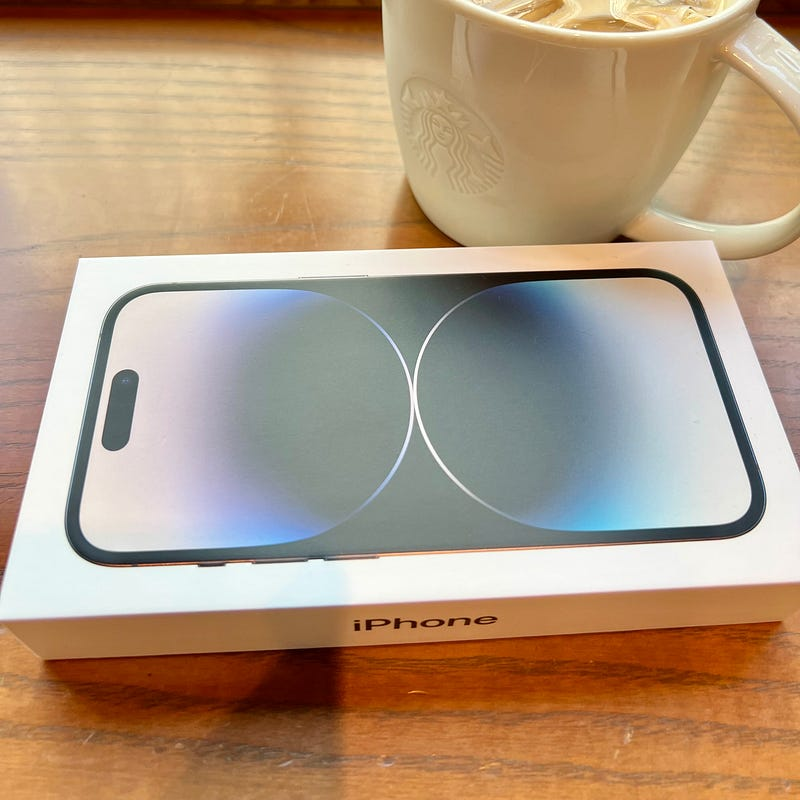

iPhone 14 Pro を使って約1日が経ちました。気づいたことが多々ありました。ここ数年、Appleのハードウェアはすんなりと切り替えられることが多く、気づいたことが多いのは久しぶりなのではないかと思います。

というわけで、全部で４つポイントを絞ってまとめます。

#### Dynamic Island

iPhone 14 Pro を使う最大の理由は、先週のイベントでどや顔で紹介していたDynamic Islandでした。iPhoneには、フロント側にフロントカメラとFaceIDなどで使われるセンサーなどがあり、本体サイズいっぱいに画面を広げようとするとどうしてもこのセンサーとぶつかってしまいます。iPhone13 Proでは、この部分を画面としない設計にしてそれを解消していたのですが、iPhone14 Proではハードウェアとしてはパンチホール型の設計にし、それをソフトウェアで覆い隠すことによって、パンチホールに見せないという設計がされています。

Dynamic Islandをサードパーティが全面的に使うのはiOS16.1からだそうなので、それほどお世話になることはありませんが、なんだか折りたたみガラケー時代の外側についていたサブディスプレイを彷彿とさせます。何かが再生中だったり、刻々と状況が変わるものだったりがここに表示されるということなので、楽しみたいと思います。

#### 常時点灯

iPhone14 Pro でこっそり導入されたのが常時点灯でした。ずっと噂ではあったんですけどね。この常時点灯、明るさを落とした上で点灯してくれるので、邪魔になりません。また、ロック画面のウィジェットは更新されているので、状況を把握するのにとても便利です。

例えば、Apple Watchの充電が完了したら、iPhoneに通知が出て教えてくれる機能があるのですが、iPhoneが常時点灯しているので、それもiPhoneを触らずに知ることができます。

通知の使い方が変わるかもしれないですね。

#### クイックスタート

クイックスタートは、初めてiPhoneを起動した時に表示される、初期セットアップのガイダンスです。そして、ここは毎年機種変更をするたびに便利になっていっているのを感じる部分でもあります。

今回は、Apple Watchをペアリングするときのような、画像読み込み認証に始まり、ダイアログに沿って進めていくだけで、SIMが物理SIMからeSIMに変更され、iCloudバックアップから全てのデータが移行され、新しい端末にすべてが元通りに揃ってしまいました。（キャリアはauを利用しています）

eSIM化されたので、SIMトレイも触っていません。iPhoneでは、iCloud経由でeSIMのデータを移動することができるそうで、次回の機種変更の時もSIMトレイを触ることも、キャリアの手続きをすることもなく、変更ができるようです。

[**iPhone の eSIM について**  
_eSIM はデジタルの SIM です。物理的な SIM を使わなくても、通信事業者 (キャリア) のモバイル通信プランをアクティベートすることができます。iPhone には 8 個以上の eSIM をインストールでき、同時に 2…_support.apple.com](https://support.apple.com/ja-jp/HT212780 "https://support.apple.com/ja-jp/HT212780")

紛失や盗難にあった際は、iCloud経由でデータを消去してしまえばよく、かつSIMトレイは空で、新しく受け取ったiPhoneにiCloud経由でデータを入れてしまえばすべてが完了してしまうということになります。

#### 側面の摩擦とディスプレイ

ハードウェアの変更点といえば、ディスプレイと側面。

ディスプレイはとにかく綺麗になりました。うまく表現できないのですが、iPhone 13 Proよりはずっとみていられるディスプレイになったなと思います。光の反射の具合が変わったのかなという印象です。

また、iPhone13 Proの側面は、握った時にツルツルしていて、うまく掴めないことがたびたびあったのですが、iPhone14 Proはぐっと掴める感覚があります。おそらくコーティングが変わったのではと推測しますが、こういう細かいところが変わるのがAppleデバイスの面白いところです。