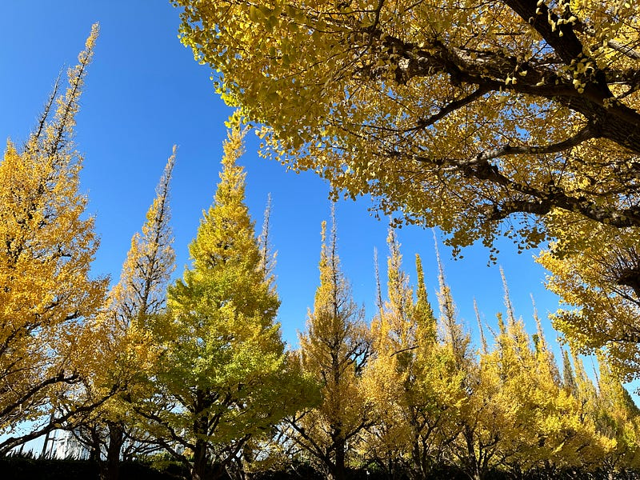

今年は紅葉がいつもより早くきたような感覚があります。これを書いている日は一日中雨なのですが、もしかしたら雨が止んだ頃には紅葉の絨毯が広がっているのかもしれません。

気温がちょうど良い感じになってきて、iPhoneとは別にカメラを持ってお散歩する機会が増えました。いつも使っているカメラは GR III。手軽に使えるのが一番の強み。出会った風景をパシャパシャと撮って、自宅に帰ってから確認するという方法をとっています。

ここ最近はクロスプロセスで撮るようになってきました。見た色をそのまま表現したい場合はiPhoneで撮ればいいと割り切ってしまって、GR IIIでは印象的な写真を撮りたいというのがその動機です。

撮った写真は、自宅に帰ってからMacBook Proで読み込みます。外出している間にBluetooth機能などを使って読み込みしてたこともあるのですが、バッテリーをとても消費するのと、そこまで急ぎで確認したいものでもないので、これに落ち着きました。いくつかピックアップして、instagramに上げることが多いです。MacBook Pro(M1)にはSDカードスロットがあるので、アダプタが要らないのも楽ですね。