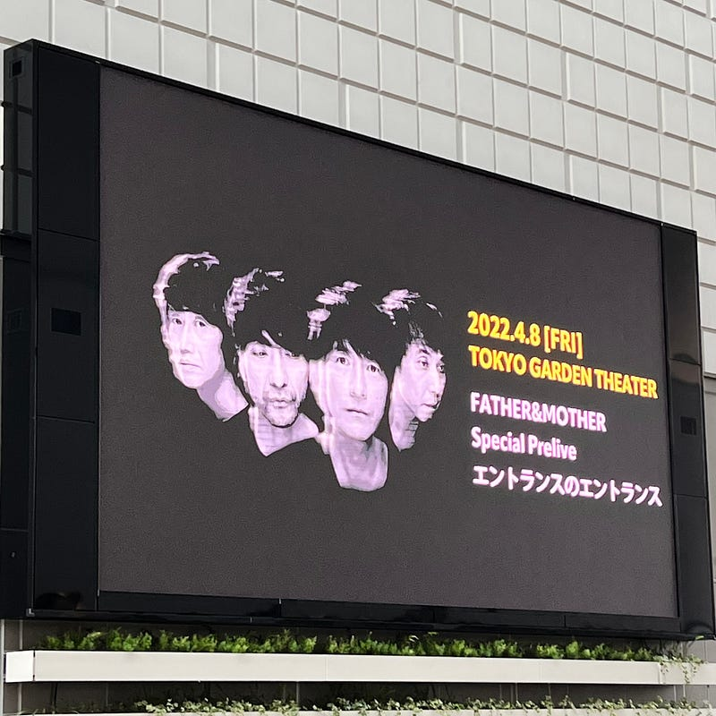

今年は昨年と比べていろんなことが”解放”された年だったなと思います。まだ制限を受けることもあるし、注意しなければいけないこともあるのだけれども、少しずつ緩くなってきているなと思います。

#### ビッグバンドの「周年」と帰ってきた野外フェス

2月、くるりの25周年公演を、東京ガーデンシアターで見ました。ガーデンシアターは昨年から急に名前を目にすることが多かったハコで、そこにやっと足を運ぶことができました。噂には聞いていたのですが、動線、客席、ステージング全てがとても素晴らしいハコでした。もう少し近隣カフェの座席数が増えればな、と思ったりしています。

くるりの演奏も素晴らしく、25年を振り返るような、ベスト盤的なセットリストで、懐かしい気持ちに寄り添って聞いていたら、あっという間に最近の曲が演奏され、終演となってしまいました。それくらい時間を忘れる、とても素晴らしいライブでした。

3月、snootyが東京に来てくれて、見に行くことができました。感染症流行以来、久しぶりの小さいハコで少し戸惑ったりしてしまいましたが、演奏は素晴らしく、いい時間を過ごすことができました。

今年はMr.Childrenの30周年イヤーとして、東京ガーデンシアター、東京ドーム、日産スタジアムと、たくさんの場所でMr.Childrenの演奏に酔いしれることができました。Mr.Childrenは最新作「SOUNDTRACKS」を引っ提げたツアーができておらず、久しぶりのライブとなりましたが、それでも演出・演奏ともに素晴らしいステージを見ることができました。東京ガーデンシアターで久しぶりに動くメンバーの姿を見たときの昂る感情はまだ忘れることができません。

それともに、ラジオでもMr.Childrenの周年企画が放送され、Mr.Childrenの楽曲がたくさんかかったことも記憶に残りました。Mr.Childrenというバンドが、特別注目されることはそれほど多くないのですが、それぞれの人たちが「いつの日もこの胸に流れてるメロディー」を持ってることを感じることができました。

くるりもMr.Childrenも、ライブを生配信ではなく、サウンド面の調整を入れた上で、後日配信してくれました。このスタイルは、特に音響に力を入れるバンドの配信のひとつの方法として定着していくのかもしれません。

フェスも帰ってきました。5月連休のJAPAN JAM、10月の京都音楽博覧会は、どちらも素晴らしいフェスでした。野外って素晴らしいですね。行く予定にしていた8月のRIJF2022 Day4が台風で中止になったのが残念でなりません。

#### 等身大を奏でるロック

今年もたくさんの音楽との出会いがありました。その中で特に紹介したいのは、Chilli Beans. とステレオガールです。

どちらもガールズロックバンド。今年、Chilli Beans. は、バンド名そのままのタイトル Chilli Beansというアルバムを、ステレオガールは Spirit & Opportunity というアルバムを発表しています。

スタンダードなロックをベースに持ちながら、彼女たちの等身大の姿を音楽に投影している。その音を今聴くのが気持ちいい。音楽はコンピュータの前で作るのがメジャーな時代になっていますが、だからこそ、みんなで鳴らしている音楽が強く響くのかもしれません。彼女らが、年齢を重ねるにつれ、どういうサウンドを作り出してくるのかとても楽しみです。

昨年出会った、福岡で活動するバンドSnootyの新しい音にも会いに行くことができました。Snootyは今年アルバム「たゆたう」を発表。その後、彼女らは、３ヶ月連続リリース「センターライン」「ガール・インザ・スペースルーム」「心音」を発表。直球のバンドサウンドもあれば、チルなサウンドもあり、音楽の幅を広げています。

そのほかにも、ギターテクニックとリズムトラックが素晴らしい竹内アンナ「TICKETS」、その空気にどっぷり浸れるLaura day romance「roman candles 憧憬蝋燭」、羊文学「our hope」、音楽の幅を見せつけてくれた miida「miida」、そして、For Tracy Hyde「Hotel Insomnia」など、素晴らしい音楽に今年も出会えました。全部きちんと紹介したいのですが、ひたすらに文章が長くなってしまうので、ぜひ聴いてみてください。

#### 映画の話

そろそろ映画の話を始めましょう。今年は頻繁に映画館に通ったという感覚はないのですが、振り返ってみれば、今年も素晴らしい邦画に出会えました。

**ちょっと思い出しただけ**：「思いだす」というフレームで紡ぎ出されるキラキラとした物語が素敵でした。

[**映画『ちょっと思い出しただけ』の感想・レビュー\[46130件\] | Filmarks**  
_レビュー数：46130件 ／ 平均スコア：★★★★3.9点_filmarks.com](https://filmarks.com/movies/98991 "https://filmarks.com/movies/98991")

**女子高生に殺されたい**：最高潮に持っていくまでのすべてのお膳立てが綺麗で、感情を持ってかれました。

[**映画『女子高生に殺されたい』の感想・レビュー\[9407件\] | Filmarks**  
_レビュー数：9407件 ／ 平均スコア：★★★3.3点_filmarks.com](https://filmarks.com/movies/100797 "https://filmarks.com/movies/100797")

**よだかの片想い**：文章で書くとおひれがつきそうですが、主人公アイコの心の動き、その周りの人たちとの心の動きを感じながら見ていられるのがよかったです。

[**映画『よだかの片想い』の感想・レビュー\[1121件\] | Filmarks**  
_レビュー数：1121件 ／ 平均スコア：★★★★3.8点_filmarks.com](https://filmarks.com/movies/99165 "https://filmarks.com/movies/99165")

**マイ・ブロークン・マイコ**： 少し過激な「弔い」の話。それぞれの役の表現も素晴らしかったし、ムダに長くないのが好印象でした。

[**映画『マイ・ブロークン・マリコ』の感想・レビュー\[8164件\] | Filmarks**  
_今年一番の鬱映画...なんとなく今の自分の状況とも少し近いものがあり、なんとも言えない気持ちになりました。ずっと心が痛いですが、ラストシーンはどこか暖かく、とても好みのおわり方でした。テンポも…_filmarks.com](https://filmarks.com/movies/101136 "https://filmarks.com/movies/101136")

**Mondays**： タイムループの演出が面白かったし、タイムループだったからこそ省かれる表現と、新しく起きる出来事がちょうどいいバランスに組み合わさっていました。

[**映画『MONDAYS／このタイムループ、上司に気づかせないと終わらない』の感想・レビュー\[8072件\] | Filmarks**  
_レビュー数：8072件 ／ 平均スコア：★★★★4.1点_filmarks.com](https://filmarks.com/movies/104426 "https://filmarks.com/movies/104426")

**窓辺にて**： 急に何かが刺さるような表現もあり、ヒヤヒヤドキドキとする流れが素晴らしかったです。

[**映画『窓辺にて』の感想・レビュー\[7301件\] | Filmarks**  
_レビュー数：7301件 ／ 平均スコア：★★★★4.0点_filmarks.com](https://filmarks.com/movies/103708 "https://filmarks.com/movies/103708")

#### 最後に

今年は、エンタメが何らかの事情で止まったり延期になることも少なく、落ち着いた一年だったなと思います。たくさんライブに行ったり、映画館に行ったりしているわけではないのですが、うまく活動ができず制作に力を注いだ作品がたくさん出てくるタイミングでもあり、素晴らしい作品にもたくさん出会うことができました。

今年のカレンダーの都合上、Jリーグは11月にシーズンが終了したため、早めにまとめました。今年は、観客数を少し減らしつつも、チャントのあるスタジアム空間を作れるようになりました。音楽でも、\[Alexandros\]や打首獄門同好会のように、場所を限定して声出しありを作るなど新しい試みが生まれ始めています。

感染症が急になくなることはありませんが、強いフォース（制限）がある状況だからこそ生まれるクリエイティビティと新しいエンタメ空間が生まれることを期待しながら、年明けを迎えたいと思います。