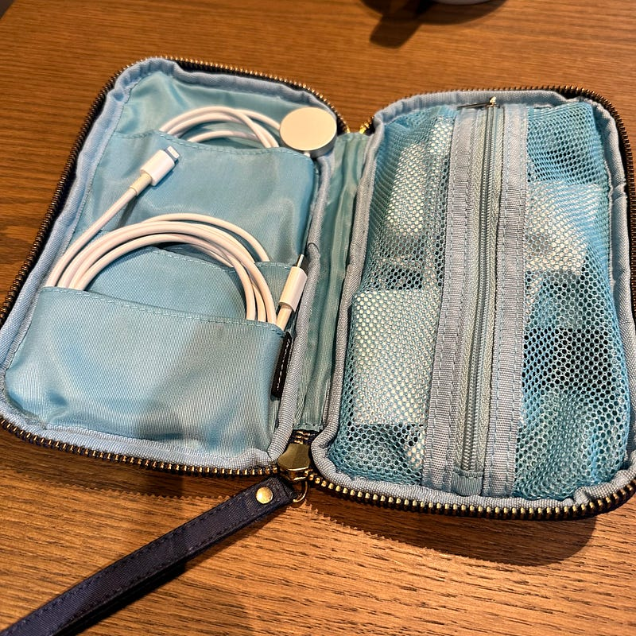

持ち歩き用にガジェットポーチを整備したりしてたんですが、まとめたことがなかったので、2023年1月の状況をまとめておきます。

まず最初に入れ物から。ポーチはほぼ日の「ちいさいひきだしポーチ」を使っています。少し前のモデルなのでいま販売されているものとは少し形が変わってるかもしれません。

[**ちいさいひきだしポーチ - ひきだしポーチ - ほぼ日手帳**  
_ウォレットサイズの「ちいさいひきだしポーチ」は筆記用具やハサミなどの文房具を入れてふでばこのように使えるのはもちろん、カード類、名刺、充電コードといったこまかなものもきれいに収納できるポーチです。 ..._www.1101.com](https://www.1101.com/store/hikidashi/ja/chiisai.html "https://www.1101.com/store/hikidashi/ja/chiisai.html")

ポケットが多くあるので使いやすく、とても重宝しています。ちいさいひきだしポーチは色違いを持っていて、そちらは文房具をまとめています。

このポーチは会社に出勤する時に持ち歩いていたもので、iPhoneと、iPadかMacBookを持ち歩いた時にやりたいことが増えても困らないようになっています。とはいえ、最近は出勤することが多くなく、またプライベートで数時間お出かけするくらいであれば持ち歩くことは少なくなりました。荷物はなるべく軽く少なくしたいですしね。

長距離の移動を伴う、旅行とかの時には荷物の中にポーチごと入れることが多いです。

#### ポーチの中身はこんな感じ

**■Apple USB-C — Lightningケーブル（1 m）**

もちろん、iPhoneの充電用です。ポーチに入っているケーブル類で一番使うケーブルがこれかもしれません。AirPods Proもこれで充電ができます。

**■Apple USB-C充電ケーブル（1m）**

これはiPadやMacBookの充電用です。たまにSonyのヘッドフォンが旅の相棒になるのですが、その時にも使うことができます。（充電が必要になることはほとんどありませんけども）

**■Apple Apple Watch 磁気充電ケーブル（1 m）**

出先でWatchの充電をしたい時用に。旅行でも行かない限り滅多にそんなことはないですけどね。旅行のときに必要なものを旅行の時だけ入れるということをしていると、忘れてしまうことにつながるので、いつも入っています。

**■Apple EarPods with 3.5 mm Headphone Plug**

出先でビデオ会議したいとか動画編集したいとかいう時のために。こういう時って有線であることが大事なのと、持ち運びも嵩張らないので入れています。汎用性大事なので3.5mmバージョンです。iPhoneやiPadではなく、MacBookで使う用ですね。

**■Apple USB-C — SDカードリーダー**

普段持ち歩いているカメラ GRIIIで読み込むときに使います。旅行先で撮った写真をiPadに取り込むときに使うために入れています。

**■Apple USB-C — USBアダプタ**

USB-Aの周辺機器をどうしても繋ぎたい時などに用意しています。使用頻度はとても低いです。

**■Apple デュアルUSB-Cポート搭載35Wコンパクト電源アダプタ**

これ一つで、iPhoneとApple Watch、もしくはiPhoneとiPadが充電できるので便利です。小さいですし。35Wですが、スリープ中のMacBookなら十分充電できる（はず）。

**■Apple MagSafeバッテリーパック**

Appleのモバイルバッテリーは、充電スピードが遅いという評価をされることが多いです。一般的にモバイルバッテリーは、iPhoneのバッテリーが危ない時に急激に充電してくれるものが多いと思うのですが、Appleのモバイルバッテリーは、本体のバッテリーを充電することなく、バッテリーを追加して長時間使えるようにするという捉え方をした方がよさそうだなと思います。

このモバイルバッテリーはLightningで充電するのですが、Lightningで繋げた状態でiPhoneやAirPods Proを置くと、MagSafeのアダプタとして機能するので、Lightningケーブル一本で、バッテリーとiPhoneの同時充電が可能です。

#### 最後に

Appleの純正アクセサリーは、サイレントにアップデートされるので、今買うと、自分が持ち歩いているものと仕様が変わっているかもしれません。また、宿泊を伴う旅行の時、これだけではホテルでの充電が難しいのと、コンセントの場所によっては延長ケーブルが欲しくなったりするので、Ankerの充電器を持ち歩いています。

それでは。