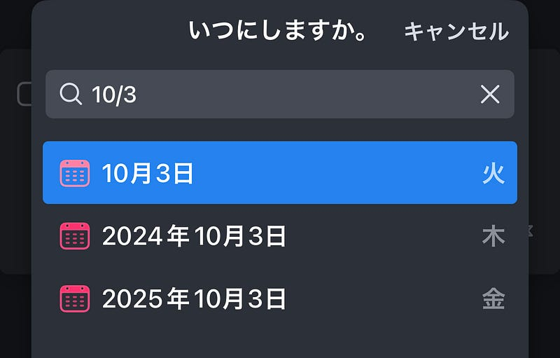
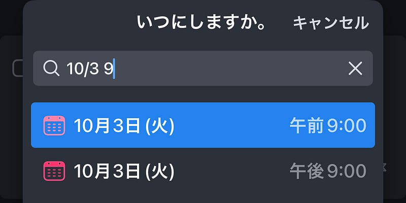
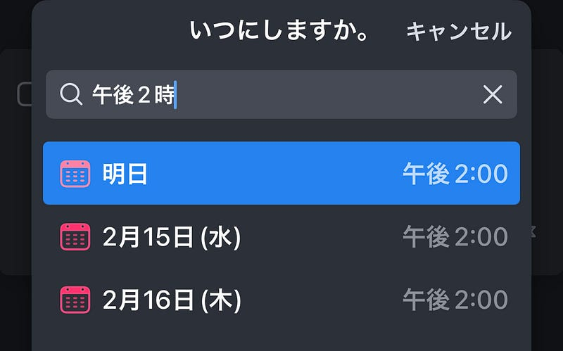
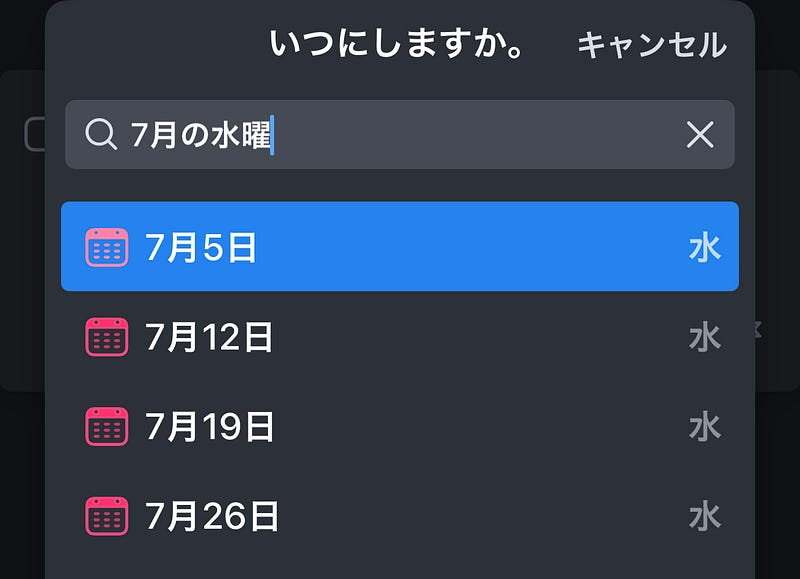

Cultured Code社が作るリマインダーアプリ Things for Macには、日付を自然言語で入力できる機能があります。Cultured Code では、入力例が提示されていますが、Thingsを日本語環境で使っていると、この入力例が使えません。

[**Using Natural Language Input**  
_Use natural language to quickly schedule to-dos, add reminders, or set deadlines. It's easy to set a start date…_culturedcode.com](https://culturedcode.com/things/support/articles/9780167/ "https://culturedcode.com/things/support/articles/9780167/")

ということで、日本語入力例をまとめてみました。サンプルは上記の記事をそのまま使っています。

#### Things の日本語での日付入力例

#### 「今日」

今日を入力するには「今日」と入力します。

#### 「10月3日」

10月3日を入力するには「10–3」、もしくは「10/3」と入力します。

#### 「10月3日 9時」

10月3日9時のリマインダーを入力するには「10/3 9」と入力した後、午前か午後かを選択します。午前9時の場合は「10/3 9am」と入力するとダイレクトに選択できます。「10/3 21」と入力すると10月3日午後9時が入力できます。

#### 「午後2時にリマインダー」

「2pm」と入力すると、午後2時にリマインダーします。今日、明日、明後日の日付が選択できます。

#### 「17日後」

「17」と入力すると、17日後が選択できます。「17日」でも入力できます。

「17週」と入力すると、17週間後が選択できます。「17ヶ月後」で17日後が選択できます。ちなみに「14日後」を入力すると2週間後が選択できます。（スマートです）

#### 「特定の日から17日後」

「7月9日から17日後」と入力すると、7月9日から17日後の7月26日が選択できます。

#### 「7月の水曜日」

「7月の水曜」と入力すると、7月の水曜日の中から選択できるようになります。”水曜日”と入れてしまうと、日曜日を候補に入れてしまいます。

#### 「7月の第三水曜日」

日本語での入力方法が見つかりませんでした。

#### 「2024年の7月第三水曜日」

日本語での入力方法が見つかりませんでした。

#### 「7月の最終金曜日」

日本語での入力方法が見つかりませんでした。

#### まとめ

日本語では実装されていない機能もいくつかありそうですが、マウスを使えば未来の日付も設定できるので、全くできないという状況ではありません。 これを使って、ぜひリマインダーの整理をしてみてください。音声入力と一緒に使うのが楽そうに感じました。