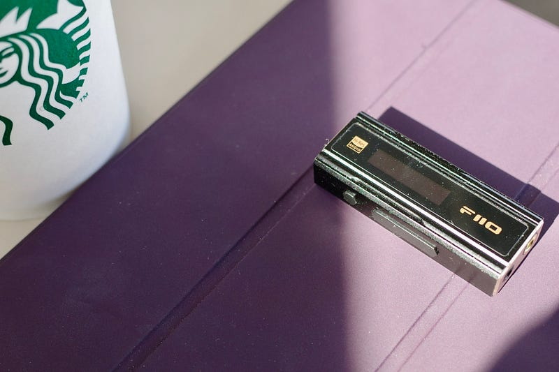

家で作業していると、音楽が欲しくなることがある。HomePodの部屋全体を満たしてくれる広がりのある音も好きだが、ヘッドフォンでの視聴体験を欲する時がある。そういう時には、iPad Proに USB-C — 3.5mm ヘッドフォンジャックアダプタをつけて音楽を聴く。

[**USB-C - 3.5 mmヘッドフォンジャックアダプタを購入**  
_USB-C - 3.5 mmヘッドフォンジャックアダプタを使えば、あなたのUSB-Cデバイスに、標準的な3.5 mmオーディオプラグをつなぐことができます。ヘッドフォンやスピーカーに最適です。_store.apple.com](https://store.apple.com/jp/xc/product/MU7E2FE/A "https://store.apple.com/jp/xc/product/MU7E2FE/A")

iPhoneはハイレゾロスレスを扱わないように設定している。AirPods Proで聞くにはハイレゾはオーバースペックだからだ。街の喧騒の中で、電車の乗り換えでじっくり音楽に耳を傾けるなんてことはしない。一方、iPad Proは家の中でじっくり音楽に耳を傾けたい時に使う。ハイレゾロスレスをフル活用できるように設定している。

DAC(Digital Analog Converter)を使って聞くこともある。もう長いこと使っているDENON DA-10はいい音なのだけど、そろそろ最新技術も取り入れたいと思っていた。DENON DA-10が発売された2014年から、技術は進化を遂げている。そんな中で重い腰を上げて新しく手に入れたのがFiiO KA5だ。

[**FiiO、超小型USB DAC内蔵ヘッドホンアンプに新フラグシップモデル「KA5」 - PHILE WEB**  
_エミライは、FiiOよりUSB-DAC内蔵ヘッドホンアンプの新フラグシップモデル「KA5」を4月21日（金）から発売する。価格はオープンだが、税込22,000円前後での実売が予想される。…_www.phileweb.com](https://www.phileweb.com/news/d-av/202304/13/57925.html "https://www.phileweb.com/news/d-av/202304/13/57925.html")

SonyやDENONなど、日本でよく知られているブランドもかつてはDACを出していた。今はプロダクトラインにすら残っていない。AppleがiPod Shuffleという形でシリコンプレイヤーを出すまで、DAP(Digital Audio Player)の市場には、日本では馴染みのない中国系や韓国系のブランドがたくさんあった。今のDACを取り巻く環境はその頃に似ている。ほとんどの人がiPhoneやAndroidで音楽を聴くようになった今、DACやDAPはより一層マニアックなガジェットだ。

KA5に話を戻す。KA5に付属のUSB Type-CのケーブルでiPad ProとKA5をつなぐと、KA5に電源が入り起動する。KA5にヘッドフォンのケーブルを刺す。さぁ、音楽を聴く時間だ。 専用のDACを使うことで、音の定位や重なりがよくわかるようになる。音楽の情報量が増してくる。使い始めてしばらくは「こんな音が入っていたのか」という発見があったりする。

KA5はバランス接続(4.4mm)に対応している。実はこれまで対応するデバイスを持っていなかったので、気にはなっていたが体験したことがなかった。気になりすぎて一時期バランスド接続対応のウォークマンを検討したこともある。

ちょうど運よく手持ちのヘッドフォンのバランス接続ケーブルが手に入ったので、すぐに体験することができた。3.5mmよりもLとRの分離がはっきりしているのがわかる。音の定位がはっきりすることで、より音が際立つようになる。

他のDACと比較して、ということはしていないので、数あるDACの中からKA5をおすすめするかはわからない。でも、ハイレゾロスレスに興味があるのであれば、環境を整えてみるべきだと思う。

最後に。ハイレゾやバランス接続を使って、定位がはっきりするという感覚は、空間オーディオでも感じたことがある。（映像世界やライブ録音はともかく）レコーディングサウンドの場合は、空間オーディオを使って音を散らすというより、音像を「正面」空間上でしっかり鳴らすというアレンジがされていることが多い。

そういう意味からすると、空間オーディオは、コストの高いフォーマット、コストの高いデバイスを使わなくても、定位をはっきりさせたり、音像をきっちり作っていくことができるという価値があると考えている。モノラルがステレオになったのと同じように、これからのフォーマットが空間オーディオになっていくというAppleが言っている音楽の方向性については共感している。