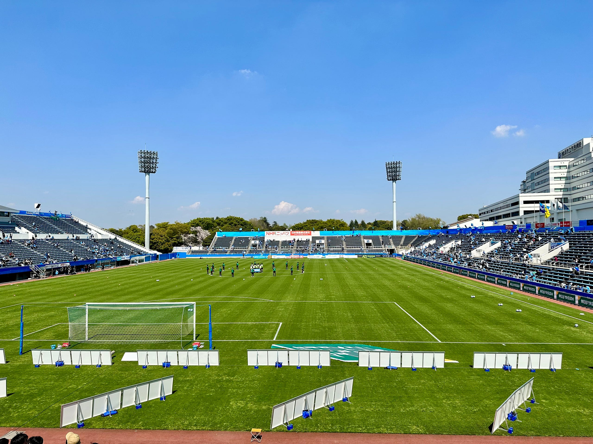
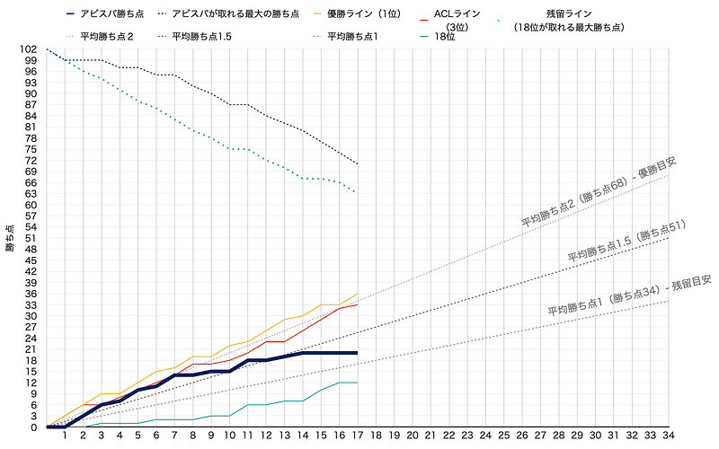

今日は “1年の半分だね” という会話が増える6月の、その半分をちょっとすぎた17日だ。ちなみに、365日の半分182日目は7月2日だそうで、本当の半分はもうちょっと先。

今年のJリーグは世界的に拡がった感染症の影響も小さくなり、また世界的なスポーツ大会の影響もない、久しぶりに平穏なリーグを迎えている。6月17日を含む第25週は、International Match WeekというFIFAが決めた代表選が入れられる週になっていて、日本代表の試合が組まれながら、JリーグではJリーグカップであるルヴァンカップの試合が割り当てられている。そして、J1リーグは第34節中第17節を終えた。つまり、折り返しだ。ここで、折り返し地点のアビスパ福岡について振り返ってみたい。

毎節終了後の勝ち点をグラフ化している。サッカーのリーグでは、リーグ戦終了した時に、試合あたりの獲得勝ち点平均が2あれば優勝に近く、1以下であれば降格に近いという目安があるようだ。実際、2023シーズンのJ1リーグの優勝争いのチームは平均勝ち点2を維持しているし、降格圏のチームは平均勝ち点1に近づこうとしている。

アビスパは、勝ち点20、11位。平均勝ち点1.29。目標はトップハーフ、平均勝ち点1.5以上と考えると、もう少し頑張りたいという位置にいる。今年のシーズンを見ていると、怪我、もしくはコンディション不良の選手が多いようで、チームとして最大火力を出せていないのを感じる。それでこの結果はまずまずという評価が正しいのかもしれない。ただし、アビスパは積極的に怪我情報を公表するクラブではないのである程度推測が入ってしまう。

プロスポーツである以上、クラブごとの戦力の大小はある。サッカーの場合はチーム人件費という形で表現されることが多いが、当然ながら額が大きいクラブの方が、質の高いチームを作れる可能性が高い。プレミアリーグ15/16でレスターが優勝したことは記憶に新しいが、金持ちチームを押しのけて優勝できたという事実が「奇跡」と呼ばれた所以だ。それくらい、チームの戦力はリーグの結果を左右する。

アビスパは、J1において、戦力が潤沢な方のクラブではない。そのクラブがトップハーフを目指すことはとてもチャレンジングだ。これからコンディションの調整が難しい季節を迎える。クラブのチャレンジを引き続き応援していきたいし、今シーズン最大火力のチームを見たい。