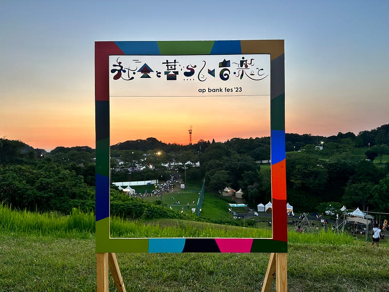

今年も、つま恋で開催されたap bank fes ’23 〜社会と暮らしと音楽と〜 に参加した。ap bank fesがつま恋で開催されたのは2018年以来5年ぶりのこと。2021年にもオフラインで開催する予定で準備を進めていたそうで、今回のオフィシャルグッズの中には2021のロゴがついたものもある。2021年はオンラインで開催された。

2018年のつま恋も暑かったのをとてもよく覚えている。今年は暑さを考慮して、ステージ開演を15時にしてライブそのものをコンパクトにして開催された。出演したミュージシャンの数や、全体の曲数は減ったが、だからこそ、集中して楽しめるフェスになったのではないかと思う。それでも酷暑となったDay3には医療スタッフが忙しそうに動いていた。

[**ap bank fes '23 ～社会と暮らしと音楽と～ ＠ つま恋リゾート 彩の郷 (静岡県) (2023.07.15 ～ 2023.07.17) | ライブ・セットリスト情報サービス【…**  
_ap bank fes '23 ～社会と暮らしと音楽と～ ＠ つま恋リゾート 彩の郷 (静岡県) (2023.07.15 ～…_www.livefans.jp](https://www.livefans.jp/events/1540260 "https://www.livefans.jp/events/1540260")

今回特筆すべきはMr.Childrenのパフォーマンスだった。Mr.Childrenのステージは、ソロライブ含めたくさん見てきているけれども、つま恋のMr.Childrenは、どこか肩の力が抜けて、自然体で音楽を楽しんでいるように見えた。ハプニングすら楽しもうという余裕があった。だからこそ、演奏全体の感情の起伏が激しく、音や言葉が強く刺さってくる。会場のリアクションに反応して、演奏が変わっていく。圧巻のパフォーマンスだった。

それとともに、アイナ・ジ・エンドにも触れておきたい。彼女の歌声が特徴的なことはすでにBiSHで体感したことがある人も多いと思うが、コンテンポラリーダンスを随所に散りばめながら歌う彼女の姿は、”ボーカリスト”ではなく”表現者”であることを高らかに宣言しているように見えた。 そして、彼女が歌った１曲目は”Swallowtail Butterfly”。岩井俊二と小林武史が最初に組んだ映画「スワロウテイル」の主題歌でもあるこの曲を、ap bank fesで歌う。それは、岩井俊二と小林武史のタッグが生み出してきた歌姫の系譜に並んだ、そう感じた。Charaや、Salyu、そして森七菜が並ぶ系譜だ。

最後には、岩井俊二監督最新作「キリエのうた」主題歌「キリエ・憐れみの讃歌」を歌う。この曲は後半ボレロのリズムが力強く鳴り響く。それは、グループ活動が終了し、ソロになったアイナ・ジ・エンドの背中を力強く押し出すかのようだった。

ap bank fes ‘23には小田和正も登場した。つま恋はフォークソングの聖地とも呼ばれ場所である。その場所で、小田和正が歌うという意味はとても大きい。

> ap bank fesは、気持ちのよい場所で音楽を聴きながら、環境問題を身近に考えてもらう場として、また、さまざまな取り組みの実践の場として2005年に始まりました。

フェスの数日前、こんな話を聞いた。「アメリカは、東海岸から北アメリカ大陸を西に向かって開拓し、西海岸にたどり着いた。その後、太平洋戦争、朝鮮戦争、ベトナム戦争など、西に向かって戦争を続けていた。その動きを見直そうとした動きがカウンターカルチャーだ。」そして、カウンターカルチャーは、その後、インターネットカルチャーや、環境問題の運動につながる。

日本でカウンターカルチャーの影響を受けたのがフォークソングだった。その聖地がつま恋だった。

環境問題を考える場所として誕生した ap bank fes がつま恋で開催され、そこで小田和正が歌い、アイナ・ジ・エンドが歌ったことは、想像以上に大きな意味があるのではないか。そんなことを考えながら、to Uを聴いていた。

今年の夏もいい夏だった。

