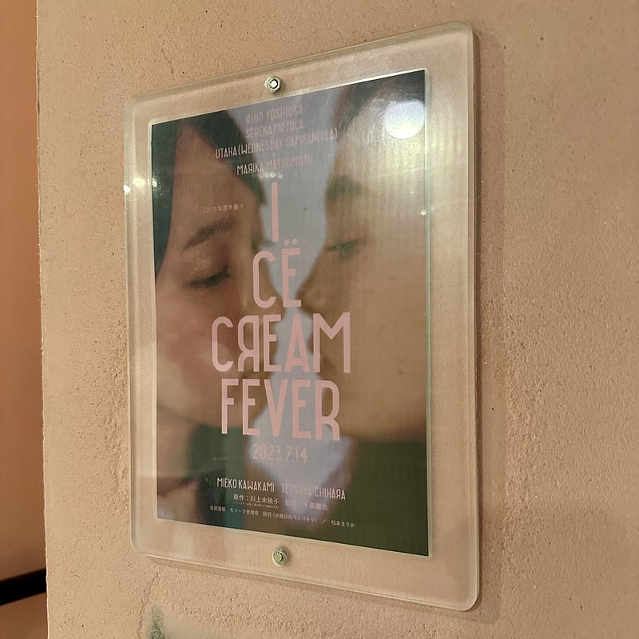
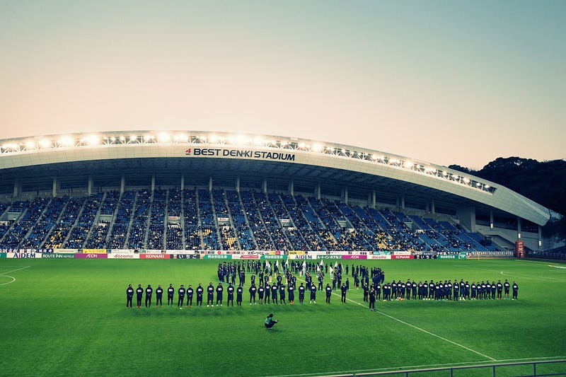

J1リーグは7月16日の第21節を最後に、2週間の中断期間に入った。その間、日程の関係で開催できていなかった試合だったり、海外のクラブがやってきたり、話題はいろいろあったけれども、J1リーグは止まったままだった。いよいよ8月5日、J1リーグが再開する。

この2週間、週末のJ1リーグを楽しみに過ごしていた人たちは何をするのだろうと疑問に感じたりすることもある。

一方で、日本のフットボール文化の発展を考える上で必ずぶち当たる壁がある。「日本には娯楽がたくさんある」という壁だ。自分自身は、海外の状況は知らないので、”日本だけ”の問題かどうかわからない。

この2週間、自分自身はさまざまなエンターテイメントを楽しんだ。「アイスクリームフィーバー」という映画を見に行ったり、限定公開されていた「なぞの転校生」というドラマを見たり、FF16を始めたり、櫻坂46が開催している展覧会「[新せ界](https://sakurazaka-shinsekai.com)」を見に行ったり、10月に開催される「[あの夜で会えたら](https://event.1242.com/events/anoyoru2/)」のステッカーをもらいに行ったり。試合がない日は、別の娯楽を楽しめる期間でもある。

しかし、試合がある日は、フットボールの日なのだ。ついまた、フットボールの日程を中心に、スケジュールを組む自分がいるし、万全の体制でフットボールを見ることができるかを考えている自分がいる。

