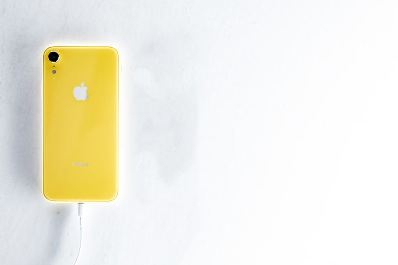

夏の暑さが落ち着き始めましたね。もしかしたら１ヶ月後には毎日手にしているiPhoneが違うものになってるかもしれない時期で、全世界の携帯電話業界が慌ただしくなる頃ではあります。

Appleはいつもイベント開催の前週にしか正式に告知しないので、イベント開催日すらもざわざわっと噂になるわけですが、今年はいよいよiPhoneの端子がLightningからUSB-C端子に切り替わることが確実なのではないかということで、静かにざわついています。

話の前提として、個人的な今の環境を説明すると、ケーブルを使って充電しているのは、MacBook Pro、iPad Pro/iPad mini、AirPods Max、GR3、信者の石ことApple純正モバイルバッテリー、そして、PS5のコントローラだけです。この中で、Lightning端子を使っているのは、AirPods Maxとモバイルバッテリーです。なので、特段iPhoneの端子がどうなろうと気にしていません。

旅行中、もちろんiPhoneを充電することがあります。その時はケーブルを使っています。持ち運び充電セットにはUSB-C to USB-CとUSB-C to Lightningの２本が用意されています。iPadも同時に充電したいことがあるから。なので、iPhoneの端子がUSB-Cに変わった場合には、USB-C to USB-C を２本持ち歩くようになるのだと思います。本当は、AirPowerの登場をとても待ちわびていたのです。

iPhoneの端子がUSB-Cになったのと並行して、AirPodsシリーズやその他のiPhoneの付属品の充電端子もUSB-Cに順次変わるのだと思います。どういうことかというと、AirPods Max 2 が出るかもしれないし、AirPods Proのケースが新しく出るかもしれないということです。

そして、個人的にとても気にしているのは、iPhone Proの値段です。