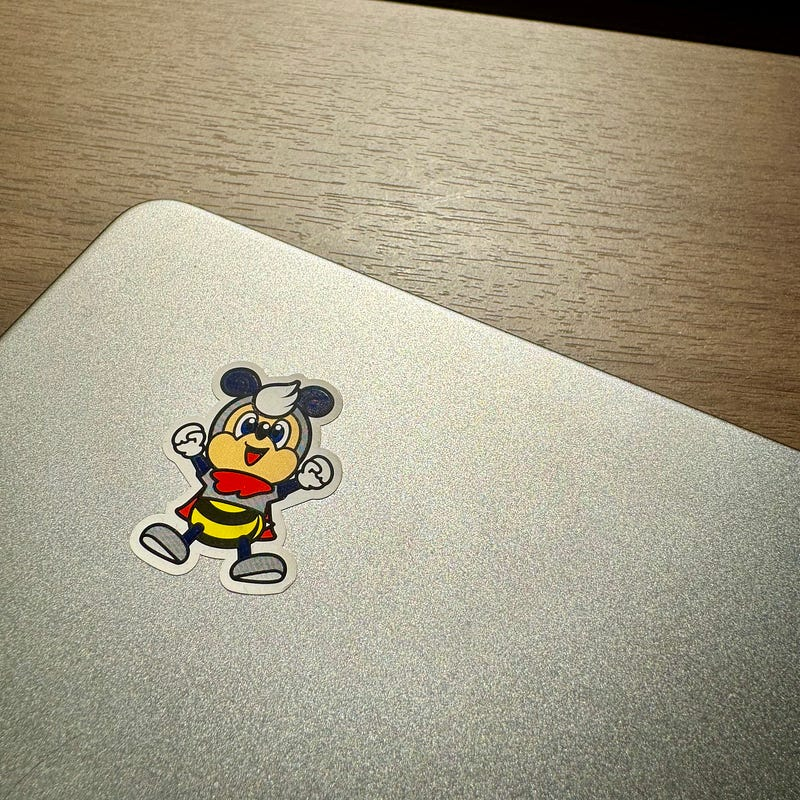

11月4日、アビスパ福岡はルヴァンカップ決勝の試合を迎える。場所は国立競技場。世界規模のスポーツ大会のために作り直されたスタジアムである。そのメインスタジアムを訪れる機会がこんなに早く訪れるとは思わなかった。しかも、アビスパ福岡を応援するために。

アビスパ福岡のこれまでの歴史の中でJリーグの表舞台に立つことはほとんどなかった。まさにハレの日。福岡を離れた福岡を愛する人を含めたすべての人がアビスパのサッカーに触れることができる機会となることを願う。

小学生の頃、サッカーの一大ブームが訪れ、昼休みにはボールを追いかける日々を送っていたのを覚えている。それが2002年にワールドカップを日本で開催するぞというムーブメントを受けたものだということを知ったのは、大人になってからだった。そのムーブメントの中で、Jリーグが開幕した。1993年5月15日、開幕の試合を当時仲が良かった友だちのうちの小さなテレビで見ていたのを覚えている。

ブルックスというチームが藤枝から福岡にやってくること、アビスパ福岡というJリーグクラブが誕生したことを西日本新聞朝刊の誌面で知ることになる。

当時のJリーグはよくNHKをはじめとする地上波で放送されていた。休みの日の昼間にいつもファミコンをやっていたテレビでJリーグの試合を見ていたのを覚えている。福岡県内に住んでいたものの、福岡市内に遊びに行くことはほとんどない生活で、博多の森という場所がどこにあるのかはまったく知らなかった。

上京して、いろんな偶然が重なり、アウェイのゴール裏でチャントを歌うようにもなった。熊谷で開催された天皇杯準々決勝(2010/12/25)では、後半ATからの失点で涙を飲んだ。J2暮らしが長く続き、偶然のようにJ1に上がっては、差を突きつけられ、落ちるという繰り返しだった。

そうして、すっかり生活の一部になったアビスパ福岡から経営危機の話が上がったのは2013年10月のこと。全国のJリーグファミリーが明太子を買って応援していただいたりしていた中で、今の経営基盤となるアパマンさんが名乗りを上げてくれたのもこの流れからだった。

[**必然だったアビスパ福岡の経営危機問題＝露呈した構造的問題と長く険しい再建の道 - スポーツナビ**  
_「多くの支援への感謝の気持ちを忘れずに、魅力あるクラブに生まれ変わろう」「来年ココで笑顔で会おうよ」 Ｊ２第４２節・アビ..._sports.yahoo.co.jp](https://sports.yahoo.co.jp/column/detail/201311250005-spnavi "https://sports.yahoo.co.jp/column/detail/201311250005-spnavi")

2019年には鳴り物入りで就任した監督が、プレイモデルをチームに定着させることができず去っていき、その後プレイモデルを持たないチームはJ3降格の危機に直面した。長谷部監督の就任が決まったのは、降格の危機を回避した2020年のこと。

このチームに長谷部監督が最初に実施したのはプレイモデルの構築だった。ラインを下げて守ること、中央で縦パスを実行させないこと、サイドで前向きに奪うこと、前向きに奪ったあと素早くゴールに向かうこと。トップに高い選手、サイドアタッカーに足の速い選手を配置したこの戦術は堅守速攻と呼ばれた。

2021年にはJ1での戦いが始まった。開幕戦名古屋グランパスとの試合では、その圧倒的スピードを体感し、J1のレベルが高いことを痛感した。失点しないこと、確実にJ1に残留すること、勝ち点を積み上げることを優先することを実行したチームはJ1 8位というクラブ史上最高位の結果を残してみせた。

2022年は、J1定着を前提に、複数得点を取れるチームへのチャレンジを始めていたが、チーム内の感染症の蔓延を受け、GKがフィールドプレイヤーとしてピッチに立つほどのチーム事情となり、勝ち点を積み上げることを優先せざるを得なかった。2年連続のJ1残留を成し遂げ、5年周期を終わらせた。

2023年、今年は複数得点を取れるチームへのチャレンジを着実に進めてきた。ラインを高く、できる限り高い位置でボールを奪うこと、奪ったボールを素早くスペースに運ぶこと、コンビネーションを含めた方法でゴールを奪うこと。今シーズンのベストゲームの一つに柏レイソル戦があげられるだろう。前半相手に制圧されていた試合を、少しの立ち位置の変更と見事な交代策でひっくり返してみせた。

2023年11月4日、アビスパ福岡はルヴァンカップ決勝のピッチに立つ。星が欲しい。そのまたとない機会を手に入れた。星を手に入れればミッションが完了する。

相手は浦和レッズだ。アビスパ福岡（16億7700万円/2022年）の倍近いチーム人件費（28億5300万円/2022年）をもつチームだ。（[ゲキサカ](https://web.gekisaka.jp/news/jleague/detail/?384990-384990-fl))

どんなプロスポーツもそうだけれども、上手な選手にはそれなりの出費を必要とする。普通に考えれば、アビスパ福岡よりも上手な選手が多い浦和レッズに勝つのは難しい。しかしサッカーの神様は微笑んでくれるかもしれない。その可能性に賭けて、最後の笛が鳴るまでチームを鼓舞したい。2021年8月15日にフロンターレに勝った、その再現を信じるのみである。

星が欲しい

