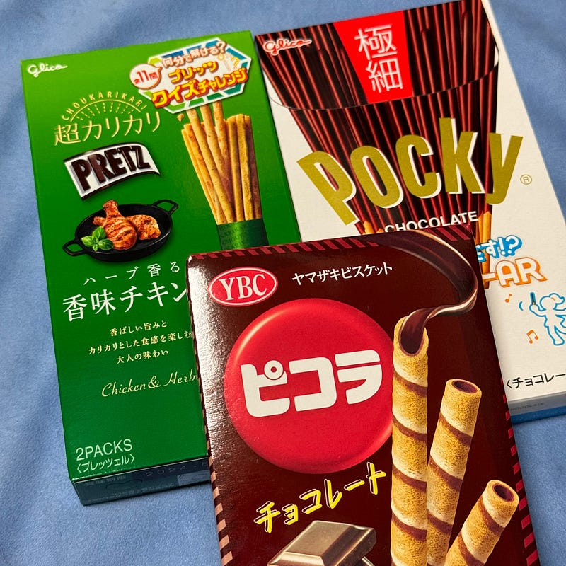

2023年11月4日、アビスパ福岡がルヴァンカップで、浦和レッズに勝ち、優勝した。28年で初めてのタイトルだ。普段、地元のメディアでも大きく取り上げられることがないクラブが、この時ばかりは地元や全国の多くのメディアで取り上げられ、多くのサッカー関係者がもしかしたら今まで公の場で口にしたことがない「アビスパ」という単語を発している。時が止まっているかのように、今日11月10日まで、そのことで情報が溢れかえっている。すごいことを成し遂げた。その充実感でいっぱいだ。

気づけば、次の試合は今日に迫っている。我々が浮かれている中でも、チームはすでに切り替えて次の試合に向けて準備万端だ。気づけばシーズンも残り3試合、全勝して気持ちよくチームの解散を迎えたい。

J2は残り1試合となった。自動昇格枠、そしてプレーオフ枠が大混戦で、最終節は全試合同時キックオフとなることもあり、該当チームのサポーターは忘れられない日が訪れそうだ。サポーターでなくても、この日は注目してしまう。

そんな、Jリーグがシーズンの最終局面を迎えつつある中、[とあるアイドルのライブ](https://www.tokyu-kabukicho-tower.jp/shinzanmono/)を見に行っていた。ちょうど一年前、彼女らはまだ加入前で最後の合宿を控え、先輩たちのライブを東京ドームで見ていた。

そんな彼女らが2時間近く、20曲近くを全員で、しかも高いレベルで踊り切るというステージは、ストーリー上、とても重要なできごとだった。今週末には、そのステージを2日連続で1日2回公演するという、とてもタフな予定が組まれている。

ロケーションは、新宿ミラノ座跡地に建てられた、ビルの中にあるTHEATER MIRANO-zaだ。普段この辺りに集まる人たちは、アイドルのことにはあまり詳しくないと思うのだけど、ビル全体がアイドルで染まっている期間中は何を感じるのか、ちょっと知りたくなっている。

彼女らの最新情報や、ファンの情報は、Xで得ることが多い。特にX Proの検索機能を使って、ハッシュタグを継続的に追いかけることで、さまざまな人がいることがわかる。

ハッシュタグをなくすという動きもあるようだけれども、そうなった場合は、自分はファンの人たちを自分のアカウントでフォローするつもりはないので、別の専用アカウントを作って同じように観察することになるのだろうと思う。いわゆる「趣味アカ」である。

インプットがアウトプットの原動力になるというのはその通りだと思う。インプットすることでいろんなことを考えるきっかけになり、それがアウトプットの種になる。実際、自分のXでの投稿が増えたきっかけもたくさんの投稿を見ているからだ。

さて、今日は11月11日だ。

