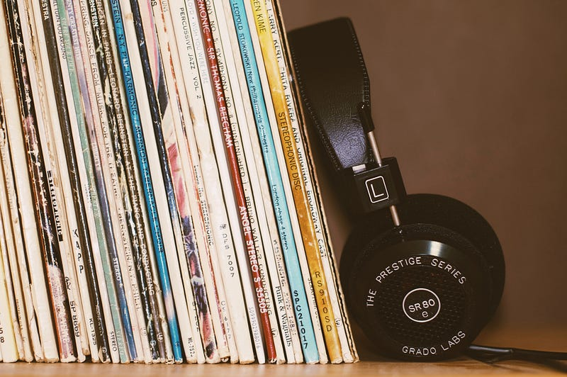
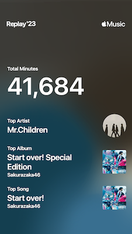

Apple Musicが「お気に入り」の機能を強化し始めた。これまでは、「ライブラリに追加」する必要があったが、今は「お気に入り」にするだけで、楽曲がライブラリに追加されるようになっている。

[**iPhone、iPad、Android の Apple Music でお気に入りを追加して見つける方法**  
_Apple Music のサブスクリプションに登録すると、一番好きな曲、アルバム、アーティスト、プレイリストをお気に入りに追加できます。お気に入りは Apple Music…_support.apple.com](https://support.apple.com/ja-jp/HT213350 "https://support.apple.com/ja-jp/HT213350")

この挙動はSpotifyと同じだ。Spotifyは楽曲やプレイリストにあるハートマークをOnにすることで、ライブラリに追加することができる。Spotifyにおける「ライブラリ」はショートカットようなもので、ライブラリに追加している楽曲は探しやすいという形になっている。

もともと個人がローカルマシン上にあったライブラリを取り扱っていたiTunesから変化する形で進展してきたApple Musicもついにここまで到達したんだなと、ずっと使ってきたユーザーとしては感じるところが多い。

ところで、iTunes時代、楽曲の評価は5段階だった。楽曲ごとに「お気に入り度」みたいなものをつけることで、「五つ星の楽曲リスト」みたいなプレイリストを作ってiPodに同期させたりして聴いていた。この5段階の評価は、仕組み上絶対評価なのだが、評価している中で相対評価になっていった。”あの曲が4なら、こっちは3かな” という感じでレートをつけていくことが多かった。

「人は違いすぎるものを評価できない」という話を聞いたことがある。例えば、手元にあるiPhoneの大きさを１として、富士山がそのiPhoneの何倍かを比較して正確に答えることができるだろうか。ほとんどの人が、数値上で計算しようとするはずで、例えば目測で見積もりを出すということは難しい。

アンケートの世界でよくある10段階評価も、人間の感覚として10段階を正確に認識して答えることは難しいのではないかという話もある。

そういう意味で言うと、好きか嫌いかを単純に2択で答えさせる「お気に入り」という機能は理にかなってるのではないかと思うことがある。そして、この2択は、以前Twitterにもあった。

今のXには、ハートマークの「いいね(like)」がある。以前は星のマークで「お気に入り(favorite)」だった。そして、「お気に入り」は、今の「いいね」の意味でも、「ブックマーク」の意味でも使われていた。人によって使われ方が異なっていたのだ。 初期のTwitterのお気に入り(favorite)がスターだったのは、もしかしたらGmailテイストが混入していたのかもしれないと思う。Gmailには、スターという機能があり、既読になってもすぐにメールを探し出せる、ブックマークのような機能として使われている。

話をApple Musicに戻したい。 今年も残りわずかとなり、Apple Musicも今年の締めくくりの雰囲気が出てきた。今年一年41,684分の音楽を視聴し、3,192曲を聴いてきた。コンテンツの中身はまたどこかでまとめたいなと思っているが、来年も多くの音楽を楽しんでいきたい。

