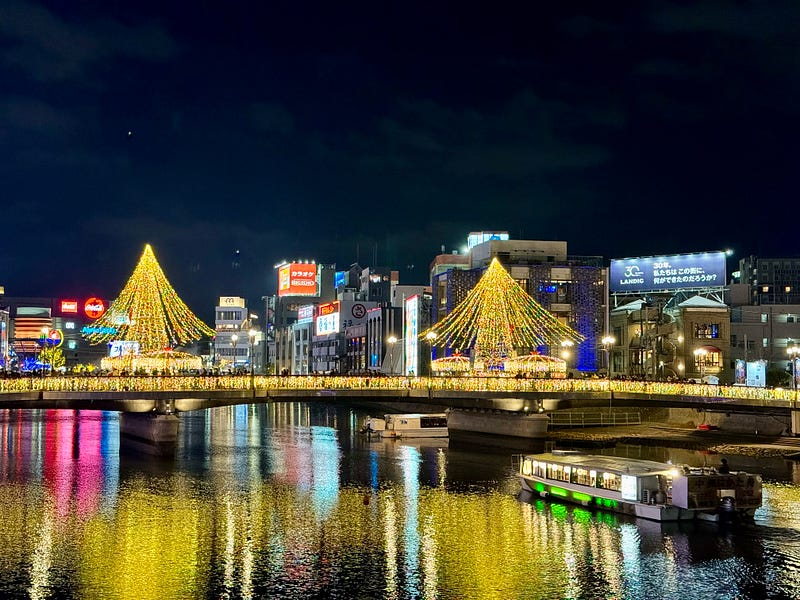

もう師が走り回る季節ですか。そろそろ締める時期だなと思い、今年の体験の棚卸しをしていたら、さっきやってきた羊文学のアルバムがとてもよすぎて語彙がなくなってしまいました。

[**羊文学の「12 hugs (like butterflies)」**  
_羊文学の12 hugs (like butterflies)をApple Musicで聴く。2023年年。12曲。時間：41分。_music.apple.com](https://music.apple.com/jp/album/12-hugs-like-butterflies/1714742640 "https://music.apple.com/jp/album/12-hugs-like-butterflies/1714742640")

さて、本題に。12月最初の週末となった先週は、アビスパ福岡の今シーズン最後のホームゲームを見に、ベスト電器スタジアムに行ってました。福岡に帰るのはとても久しぶりだったので、前泊して楽しみました。

12月の福岡は、クリスマスマーケット。中心地が華やかに光り、その周辺では屋台に灯りが灯っていました。

当日、ベスト電器スタジアムには18,000人を超える多くの人が集まりました。数年前のベスト電機スタジアムは1万人を超えると、動線が混乱したりしたイメージがあったのですが、この日はスタジアム外のイベントで時間を過ごしたり、スタグルを比較的スムーズに入手できたりして、快適に過ごせました。そして、やっぱりホームは安心感がありますね。福岡のチームを応援する関東民としては、関東のスタジアムにアウェイ観戦することが圧倒的に多いのですが、我が家のような暖かさを感じることができました。

試合はスコアレスで進行していましたが、後半アディショナルタイムに失点し、残念ながら敗北。相手のサンフレッチェ広島はめっちゃ強かったです。来年、新スタジアムに行きたいです。

恒例のシーズン最終戦セレモニーも、負け試合の後ということで、ルヴァンカップ優勝したシーズンですが、どこか歯切れも悪く。

地元の暖かさが身に沁みた2日間になりました。すっかり行き来が減ってしまったのですが、もう少し福岡にいる時間を増やしたいなと思いました。ちなみに今回の旅の中でラーメンは食べてません。

今シーズンもおつかれさまでした。また来年楽しみましょう。