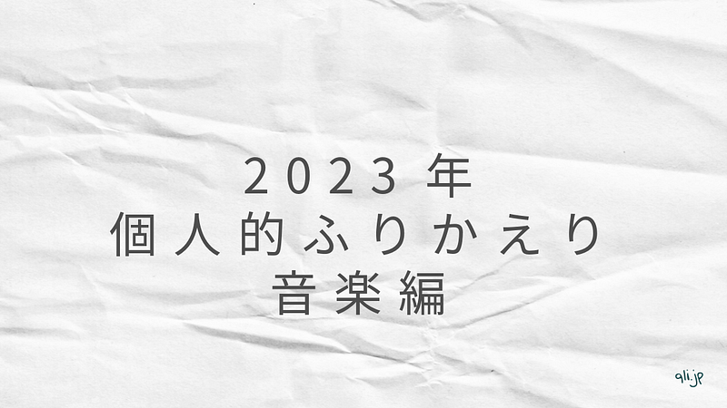

年の瀬も迫ってきましたね。というわけで、今年も音楽と映画の個人的一年間のふりかえりを始めます。

その前に、昨年2022年のを見返していたら、次のような文章を書いていて、つい感慨に耽ってしまいました。

> 今年は、エンタメが何らかの事情で止まったり延期になることも少なく、落ち着いた一年だったなと思います。

もう、止まりそうな雰囲気すらもうなくなったし、止まりそうだった感覚も止まってた感覚も忘れかけているかもしれません。

[**2022年の音楽と映画をまとめて**  
_Edit description_qli.jp](https://qli.jp/2022%E5%B9%B4%E3%81%AE%E9%9F%B3%E6%A5%BD%E3%81%A8%E6%98%A0%E7%94%BB%E3%82%92%E3%81%BE%E3%81%A8%E3%82%81%E3%81%A6-eb1663222e7f "https://qli.jp/2022%E5%B9%B4%E3%81%AE%E9%9F%B3%E6%A5%BD%E3%81%A8%E6%98%A0%E7%94%BB%E3%82%92%E3%81%BE%E3%81%A8%E3%82%81%E3%81%A6-eb1663222e7f")

そろそろ本題に。音楽と映画の個人的2023年のふりかえりを始めましょう。書いていたら長くなったので2回に分けて公開します。少々長くなりましたが、お付き合いください。

#### 帰ってきたフェス

今年の個人的に音楽シーンで一番のトピックは、ap bank fes ’23 @ つま恋 の開催じゃないでしょうか。今年もいっぱい遊びました。それと同時にひさしぶりに多くの時間を屋外で過ごすフェスで、これまで以上に身の危険を感じました。

この後デビューすることになる、Mr.Childrenのお久しぶりな、かつ驚きのセットリスト、この後デビューすることになるKyrie（アイナ・ジ・エンド）、やっと生音を聞けたAnly、元気でやっていたBankbandなど、トピックスがたくさんありました。

今年の暑い夏がここから始まった、そういっても過言ではありません。

#### 円熟味を増す凄み

今年は、くるりとMr.Childrenがそれぞれアルバムを発表。なんと、同日発売でした。

くるりのアルバム「感覚は道標」は、オリジナルメンバーでもある森信行が制作に関わるというメモリアルなアルバムであると同時に、シンプルにくるりらしさが溢れた作品でした。映画「くるりのえいが」では、大人になった少年たちが、培った経験を活かして音楽を作っている様子が展開されていました。

これからのバンドの音楽を聴いた時に、歳をとったときにどういう音楽を奏でるのだろうと期待に胸を膨らませることがあります。Mr.Childrenが今年発表したアルバム「miss you」は、まさに50代になった彼らだからこそ奏でられる楽曲が揃っていました。音ひとつひとつが聞き漏らしたくないと思える洗練されたサウンドで、そしてLyricも渋みを増した、まさにそれ。中でも際立つのは、サウンドはロックではないのに、歌詞がロックすぎるために、ロックとして成立しているちょっとひねった楽曲「アート=神の見えざる手」。この路線のMr.Childrenはお気に入りです。

#### 出会いと別れ

2月に開催されたクラムボン「添春編｛overture｝」の中で、クラムボンとしてのバンド活動の一旦休止が発表されました。ネガティブなことは何もないので、ファンとしては次のニュースを待つのみです。

シューゲイズバンド For Tracy Hide は、3月25日のライブをもって解散しました。昨年リリースされた最新作「Hotel Insomnia」は素晴らしいアルバムで、次回作への期待もあったので、残念な気持ちは正直ありますが、その潔さにかっこよさすら感じました。

赤い公園解散から、2年。音楽シーンに、石野理子が戻ってきました。石野理子が赤い公園のボーカルになり、上京し、赤い公園復活の狼煙となるアルバム「THE PARK」を発売して直後の解散だっただけに、これからどのような生き方を選択するのか注目していました。

11月にリリースされたBricolageにはさまざまな感情が詰め込まれていて、感傷に浸ってしまいそうになるのですが、音楽シーンに戻ってきてくれたこと、ファンのひとりとして素直に喜びたい。

#### 駆け上がっていく音楽シーン

12月には、羊文学「12 hugs (like butterflies)」、Chillie Beans「welcome to my castle」が発表されました。

羊文学「12 hugs (like butterflies)」には、これまでの羊文学から期待されるサウンドを裏切らない、でも確実に新しい音楽が詰まっていました。MVが制作された収録曲「GO!!!」はその象徴のような一曲。

Chilli Beans「welcome to my castle」は、お城に遊びに行くというコンセプトで制作されたアルバムで、空間オーディオDolby Atomsを最大限に活かした遊び心のあるサウンドになっていました。ストリーミング全盛の時代に、コンセプチュアルなアルバムを出してくれたことにまず感謝。ぜひステレオペアのHomePodで聴いてほしい。グループとして新しい扉を開けたようにも感じますが、それまでにリリースされたシングル「you n me」がうまい具合に扉の向こうと繋いでくれているおかげで、連続性を感じることができる。そういうアルバムでした。

#### Sakurazaka46

音楽シーンの一部として、櫻坂46についても軽く触れておきます。 今年は1月に新しいメンバーとして三期生が加入し、10月発売シングル「承認欲求」では、メインとして活動する選抜メンバーに数名が参加。そしてそのほかのメンバーも1月にBACKSメンバーとして活動することが決まっています。

これまで秋に開催していたツアーを春に開催するカレンダーを採用したり、11月に野外スタジアムでAnniversary Liveを実施するなど、今後の基本となりそうなスケジュールをこなしてきました。欅坂時代からのカラーでもある、ライブパフォーマンスを軸に、今後も坂道グループの領域を拡大していくことになりそうです。12月には、韓国発のコネペティションであるAsia Artist Awardsで、賞を受賞し、東アジアへの足がかりをきっちりとつけることができたように感じます。

AKB48をはじめとした48グループ、そして乃木坂をはじめとした坂道グループは、CDの発売とともに「握手会」を実施していました。握手会チケットのためにCDを買うという、批判も多かったビジネスなわけですが、感染症蔓延により握手会がオンラインに移行して、実はCDの売上枚数が下がっていました。

２類相当の扱いも、2023年5月8日に解除され、オンラインも続けつつ、実際にファンと会う機会もつくられつつあるのですが、今のところCDの売り上げは戻っていないようです。エンタメ業界の中では興味深い変化だなと思います。

「オンラインの世界」が3年続いたため、”メイン顧客層の世代が変わった”とも言えるかもしれません。

#### 最後に

今回は2023年の音楽についての個人的ふりかえりを書いてきました。夏のフェスも本格的に帰ってきつつ、オフラインの大型イベントのチケットの売り上げがこれまで以上に早いという、ちょっと異常な状況が続いています。ぶり返しとも見て取れるのですが、実際はファーストビジターが多くなってきたりしていて、世代交代の流れも感じます。

音楽番組を見ても、パフォーマンスグループが増えて、バンドが少なくなっていました。番組構成上、楽器の編成をセットするのは大変なので、あらかじめ録音された音楽を流すだけでよいパフォーマンスグループは都合がいいと言えるのかもしれません。

その中で、マカロニえんぴつや、Mrs. Green Apple、そして羊文学のようなバンドがテレビに出続けていることは、バンドサウンドが好きな自分にとってよいことだなと思います。

