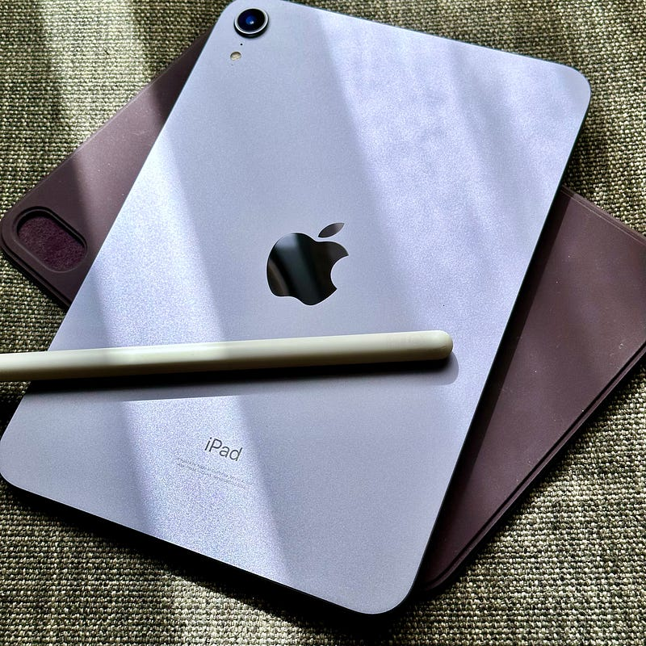

iPad mini(第6世代)を手に入れた。64GBでWi-Fiモデルで8.3インチでパープルな、iPad miniだ。理由はいくつかあるが、まずは本を読む、気軽に持ち出せるデバイスが欲しかった。

Wi-Fiモデルであることは少し快適性を欠く。特にThingsやReederなど「勝手に同期しといてくれて開いた時には最新状態」みたいなアプリには煩わしさがある。iPhoneでのテザリングは簡単だし、街にはたくさんWi-Fiがあるので、通信環境に困るということはない。そのためだけにPocket Wi-Fiを持ち歩いてた頃を考えるととても楽になった。

64GBであることも少し快適性を欠く。Wi-Fiモデルなので、たとえばYouTubeなどは事前にキャッシュをダウンロードしておくということをしたくなる。特に新幹線の車内など通信環境に不安がある移動中に使う場合には。ところが、64GBという制限は、そのままキャッシュの制限に直結する。

8.3インチであることは快適性を与えてくれる。とても軽い。若干不安があったディスプレイだったが適度に綺麗に表示してくれる。手に持って使うデバイスとしてはとても楽で便利だ。逆に、テーブルに置いて使うタイプのデバイスではない。

パープルは実にいい色合いだと思う。これまでシンプルにブラックを選ぶことが多かったので、ちょっと色を添えたくなった。選んで正解だったと思う。

発売からもうすぐ2年が経つiPad mini。おそらく、今年のホリデーシーズンには第7世代が出るのだろうと思う。

MacBook ProとiPad ProとiPhone Proとを併用している自分の環境にも、iPad miniが滑り込むスペースはあったようだ。むしろ、MacBook ProとiPad Proの併用について考え直す機会を提供してくれたように感じる。

iPad mini(第7世代)はきっと今年発売されるだろうと思う。今年のホリデーシーズンに向けて、少し考え直してみたいなと思う。