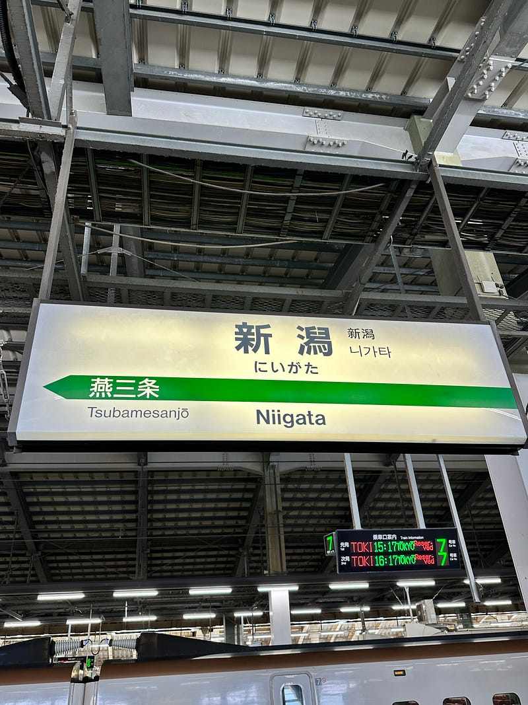

ひょんなことから、新潟に行った。実は新潟には全く縁がなく、これが初上陸だった。

東京駅から新幹線ときに乗って２時間ほどで到着する新潟駅。リニューアル工事が続いているようで、ちょっと寂しい感じもあったが、そこはとても綺麗な駅だった。そこから、臨時シャトルバスで20分ほどで到着したのが、デンカビッグスワンスタジアム。アルビレックス新潟のホームスタジアム。

このスタジアムは2022年ワールドカップを契機に建てられたスタジアムの一つで、デンマークとイングランドの試合などが行われている。ワールドカップを念頭に整備されたスタジアムだけあって、バスの発着所からスタジアムへの導線、そしてスタジアムの周りのスタグルスタンドまで、全ての空間が広くて、快適だった。

試合が終わり、そのまま帰りのシャトルバスで、渋滞もない道をスムーズに走り、駅に到着。渋滞に巻き込まれた時のために少し時間を空けてとっておいた新幹線も直前で早い便に変えられるくらいのスムーズさで、19時には東京に戻っていた。

ただスタジアムに行っただけで、新潟で遊んだりしたわけではないが、新潟がいい場所であることはわかった。またいつか観光で遊びに行きたい。もちろん佐渡島にも。

今回の日帰り旅では、iPad miniを同行させた。それについてはまた別の機会に。

