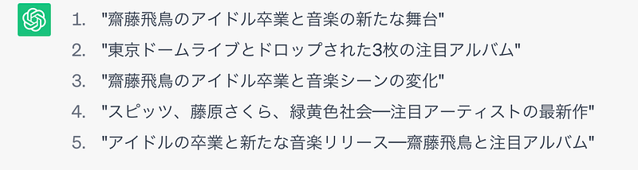

17日と18日。2日間の東京ドームライブを終えて、齋藤飛鳥さんがアイドルを卒業した。アイドルって、ある意味、オトナの世界で決まったことをやらされる立場だったりすることが多い。そんな世界で彼女はいつも正直で、Publicなところで「やりたくない」って発言したりする姿は、人として好感が持てる部分だった。東京ドームライブの直前に、SHOWROOMという配信サイトで配信していて、”アイドルとして最後だから”という前提をつけつつ、普段ならやらないことを全うしようとする姿勢とか、DAY2の退場間際のアイドルらしいセリフとか、彼女が真面目な人で、そしてアイドルというものが好きなんだなというのが見えた瞬間だった。

タイミングを同じくして、17日に3枚のアルバムがドロップされた。いや、もっと多くの作品がドロップされたと思うのだけど、その中で自分が注目しているのはこの3枚。正直に、供給過多でまだまだ聴き込めていないのでこれから感想が変わる可能性はあるが、簡単に書いていきたいと思う。

#### ひみつスタジオ (スピッツ)

極上スピッツ。スピッツサウンドが好きな人には響きまくるそんな1枚。

[**スピッツの「ひみつスタジオ」**  
_Apple Musicでスピッツの「ひみつスタジオ」を聴こう。"i-O(修理のうた)"や"跳べ"などの曲をストリーミングできます。_music.apple.com](https://music.apple.com/jp/album/himitsu-studio/1683240533 "https://music.apple.com/jp/album/himitsu-studio/1683240533")

#### AIRPORT (藤原さくら)

乾いたサウンドでまとめられた1枚。アレンジが最近の文脈に乗っかっていて、入りやすい。

[**藤原さくらの「AIRPORT」**  
_Apple Musicで藤原さくらの「AIRPORT」を聴こう。"わたしのLife"や"いつか見た映画みたいに"などの曲をストリーミングできます。_music.apple.com](https://music.apple.com/jp/album/airport/1682432630 "https://music.apple.com/jp/album/airport/1682432630")

#### pink blue(緑黄色社会)

これまでの作品をずっと聴き続けられているわけではないのだけど、音の響き方が変わってきてて、バンドくささや、もともと緑黄色社会が持ってるダイナミックなサウンドを持ち続けたまま前に進んでるのをちゃんと感じられる。Mela! は名刺がわりの一曲で、いろんな媒体で演奏しているのを見かけるが、ちゃんと懐かしい曲になりつつあるのを感じる。

[**緑黄色社会の「pink blue」**  
_Apple Musicで緑黄色社会の「pink blue」を聴こう。"ピンクブルー"や"Starry Drama"などの曲をストリーミングできます。_music.apple.com](https://music.apple.com/jp/album/pink-blue/1683495468 "https://music.apple.com/jp/album/pink-blue/1683495468")

他にも、chilldspotのシングルが発表されたり、自分の周りが最新の音楽で満たされまくっているのを感じる。今年は、久しぶりの声出し可能な夏フェスが予定されていて、「お久しぶり」がたくさんある。いろんなものと「with」を楽しんで行けたら。

ChatGPTにタイトル候補をもらった。たしかに、とは思ったが、なんだか違う。

