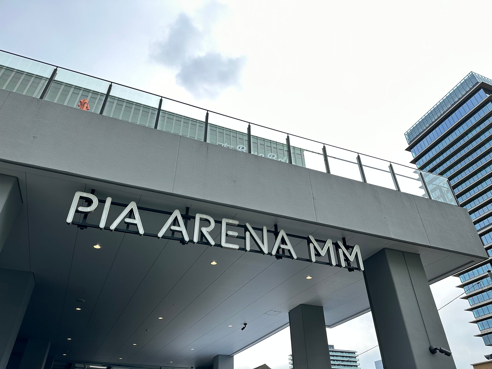

5月ももうすぐ終わりを迎え、夏の衣替えの時期も近くなってきた。冬の空気を纏った東京は空気が乾燥していて好きですが、夏は湿度が高過ぎてあまり好きではない。

そんな中、初めてアイドルの現場に行ってきた。櫻坂46 神奈川公演 Day3 @ ぴあアリーナMM。バンドライブに慣れた人目線で言えば、異文化に接した気持ちがとても強い。

これまで、多くのライブに行ってきた。東京ドームや日産スタジアムでのライブを初め、恵比寿リキッドルームや渋谷クアトロ、下北沢のライブハウス、有明ガーデンシアター、そして、Shibuya AX。そうそう、渋谷のビルの屋根裏みたいなライブハウスで、ロンドンからきたバンドを10人くらいの客で見守るというライブもあった。どこもそれぞれのよさがあるライブハウスで、公演ごとにそれぞれのバンドの空気感に包まれ、毎回ライブって素晴らしい、音楽って素晴らしいという余韻が残る。

櫻坂46のライブはこれまで配信で見ていた。画面を通して、櫻坂のメンバーと、彼女らに関わるスタッフで彩られるそのステージが、クオリティの高いステージであることも知っていた。そして、自分はそのパフォーマンスを現地で体感してみたくて、今回行くことを決めた。

平日にも関わらず開演が18時と早めだったので、仕事を早めに切り上げて現地に向かう。特にSNSが日常化した最近では、ライブはオンラインの知り合いと直接会えるイベントと化す。開場前はさながら同窓会だ。そして、キャパ1万人の施設となると、近くのカフェで隣で時間を潰している人がたまたま同じライブに行く人だったということも普通に起きる。

ぴあアリーナMMは、入り口のドアが大きく開き、一気に入場を誘導できる施設になっていた。設計上は、アリーナの一面を全部出入り口にできるんじゃないだろうか。

開場時点では、特別に制作されたダンストラックが会場全体を包む。バンドのライブだと、バンドや演出家がセレクトしたプレイリストが流れているものだが、Shazamしてみたもののヒットしなかったので完全なオリジナルなのだろう。

定刻18時。バンドのライブだと定刻で始まることは滅多にない。5分くらい押した後に急に暗転して、いよいよ始まることを告げる。そしてホールから拍手が起きる。

アイドルのライブは、定刻少し前にメンバーによる影ナレが始まる。公演に関する注意事項を読み上げた後、会場を包んでいたダンストラックのボリュームが少しずつ上がっていき、ステージの始まりを告げる曲Overtureが流れる。（この流れは配信でも流れるので馴染みがあるが、AKB48劇場で作られたフォーマットのようだ）

[**櫻坂46の「As you know? (Complete Edition)」**  
_Apple Musicで櫻坂46の「As you know? (Complete Edition)」を聴こう。"Overture"や"摩擦係数"などの曲をストリーミングできます。_music.apple.com](https://music.apple.com/jp/album/overture/1634006798?i=1634007048 "https://music.apple.com/jp/album/overture/1634006798?i=1634007048")

ライブのパフォーマンスは本当に圧巻だった。暗闇とスポットライトとレーザーとLEDを見事に使いこなした演出をただただ堪能した本編2時間だった。「アノ曲」の転換中の数秒で、ステージに演出スタッフが上がって、手動でライティングを変更してセットしてたのはちょっと痺れた。  
ステージセットは、会場に運んで組み立てるものなので、会場ごとに大きさが変わることはほぼない。しかし、ステージ外からの照明は会場によって設置できる場所や高さが変わるので、会場が変わるたびに「会場合わせ」が必要になる。各地ほぼ2Daysの日程で組んでいるツアーでそれをこなしているライティングチームには脱帽する。他にも、天井の高さを利用した演出もあり、これも会場で合わせる必要があるだろうと思う。

知っている人も多いと思うが、アイドルのライブというのは、ペンライトを振るのが定番だ。しかし、バンドのライブでは、何かを振ってリズムをとるという行為がまずない（カスタネットを鳴らしたことはあったかもしれない）。音楽を聴きながら何かを振るという行為そのものに慣れていない。ここが一番の異文化ポイントだった。無理なんですよ、ライブ会場の大音量の中で、体を揺らさずにリズムを取るのが。 オープニングから圧巻だったし、終始圧巻だったので、ペンライトを胸の高さに持って振るという行為そのものがどうでもよくなった。周りは振っていたし、会場が一色に染まる光景ももちろん好きだけど、ずっと体を揺らしながら見入っていたし、それでよかった。

会場にはいろんな人がいた。推しの名前を一生懸命叫ぶ人、うちわやスケッチブックを見せていた人さまざまだった。あくまでジャパニーズアイドルのライブだし、そういうことに応えるのを楽しみにしているメンバーもいる中で、そういう”コール&レスポンス”が発生しているのが正しい姿なのだろうとは思う。（昔は毛嫌いしていたが）最近はそういうことに慣れてきた。正確に表現すると、無関心になってきた。 年代的には、25歳前後が多かったようにも感じる。高校の制服を着ていた人たちもいたし、スーツをきていた人もいたが、なんとなく下北沢っぽい年齢構成だったように感じられた。

アイドルというのは、常に走り続けることになっている。ツアーの最終日にサプライズで次の活動を発表するというのは、ありがちな演出になっている。 今回の神奈川公演Day1では次のシングルが１ヶ月後に発売されることが発表された。そして、Day3では楽曲の新しいアレンジが披露され、次のステップアップを予感させた。ツアー最終日、海外を含めた配信が用意されている。

> 集大成となる最終公演では、どんな驚きが待っているのか!? 決して見逃さないでください！

煽ってくる。（[櫻坂46「3rd TOUR 2023」大阪公演最終日の生配信が決定](https://sakurazaka46.com/s/s46/news/detail/E00238?ima=0000)）

最後に。アイドルのライブは、音楽を楽しむライブというより、ミュージカルを1本見た、みたいな気持ちが強い。オンラインのバンドのライブが演奏している風景を楽しむものだったのに対して、欅坂46 THE LAST LIVEが代々木体育館をいっぱいに使った映像作品のようなパフォーマンスになったのも、この出発点の違いがあるのではと考えている。