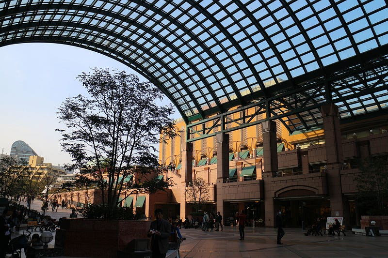

先日、竹内アンナのライブに行ってきた。今回は5枚目のEP、at FIVEを引っ提げての全国ツアーのファイナル。サポートメンバーにdawgssの二人を招き、スリーピースのアレンジで進行していくライブは圧巻だった。

「竹内アンナ」を知ったのは、2018年のこと。TwitterやFoursquareなどがブレイクしたお祭りイベントとして知られる、SXSW2018に出演した日本人ミュージシャンがいるという話を通じて名前を聞いた。Apple Musicでt検索し、曲を聴いて、それ以来、ずっと追っかけている”推し”のひとり。

彼女はK-POPの番組に呼ばれるほど、K-POP好きを公言していて、ライブ開演前のBGMでは日本ではなかなか流れないK-POPの曲が流れることもあるほど。それとは別に、Spotifyで毎月おすすめのセットリストを公開していて、そういう音楽好きとしての交流も楽しい。

さて、彼女の音楽はこれまでアップテンポなものが多く、これまでもLIQUIDROOMでもフルバンドのライブを行ったこともあるのだけど、ライブハウス全体がダンスフロアになって終わっていく、そんなライブが多かった。

今回のライブは、ダンスフロアになるだけではなくて、つい聞き入っちゃう弾き語りや、ギターを置いて、機材を使ったパフォーマンスをするなど、音楽の幅の広さが現れたライブになったなと思った。また、照明も、全体を暗くして、スポットライトを効果的に使うことで、無限の広さを表現したり、表現の幅が広がっていて、全体的なライブ演出がグッと１段階上がったような、そういう感覚を覚えた。

彼女の音楽には、社会的なメッセージがあったりするわけではないけど、イマドキのK-POP好きの20代の人が生活の中から等身大に発するからこその楽曲たちだと思っているので、個人的には彼女と同世代の20代の人たちに届いてほしいなと切に願う。