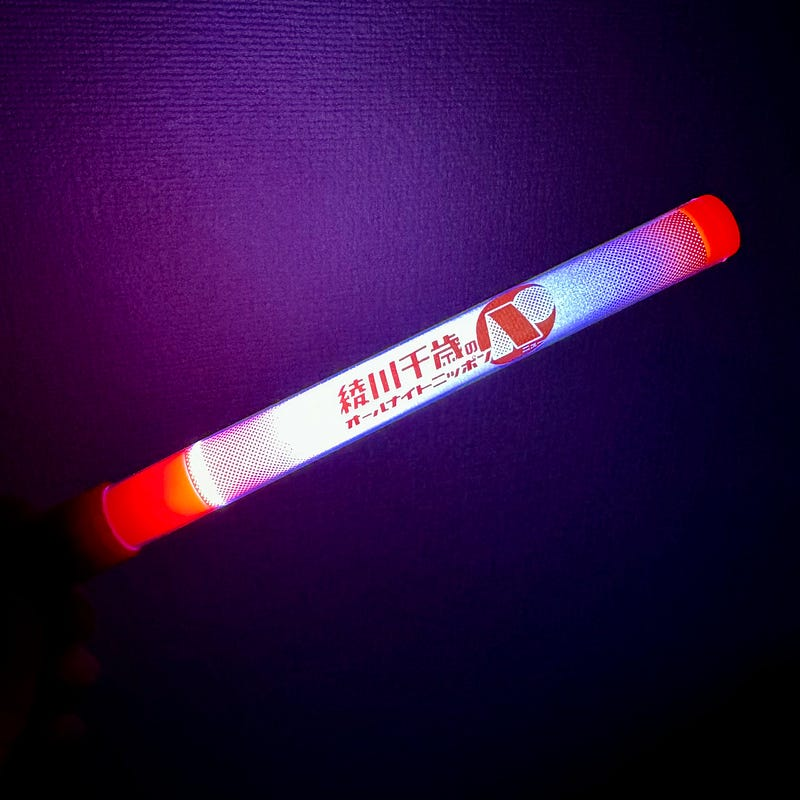

先日、「イケメン成人男性が生エビ食べたり、縄跳びを飛んだりするイベント」に行ってきました。

正確には、昨年から始まった「[綾川千歳のオールナイトニッポンN](https://www.allnightnippon.com/ayakawa/)」というラジオ番組が、この10月に番組イベントの開催とともに終了することになりました。聞き続けてきたリスナーとして、最終回を見届けようとイベントに参加したのですが、綾川千歳さんは出てこないのに、ゲストとして呼ばれている俳優さんが出てきて、生エビ食べたり、縄跳び飛んだりしてました。

…という、イベントの表裏を、国際フォーラムホールA＋楽屋＋ニッポン放送社屋内を使って表現したのが「あの日を覚えている」という作品でした。

[**あの夜であえたら｜公式サイト**  
_『あの夜を覚えてる』待望の続編。ニッポン放送とノーミーツが東京国際フォーラムから贈る舞台演劇番組イベント生配信ドラマ。_event.1242.com](https://event.1242.com/events/anoyoru2/ "https://event.1242.com/events/anoyoru2/")

入場し、ロビーを抜けて、席に着くと、ステージ上で “番組イベントの準備” をしていて、すでに演劇が始まっていました。イベント日当日に発覚する準備不足、イベント責任者のこだわりとラジオチームのこだわり、そして、ラジオ作家によるマジックと、さまざまな要素が絡み合って、作品が進んでいきました。

自分は、ソフトウェアエンジニアリングの世界に身を置いていて、そこでも、ビジネスとエンジニアカルチャーの鍔迫り合いみたいなのをいつも感じています。「あの夜」を見ると、そういうのを思い出してしまうんですね。生活に根付くものって、概して資本主義的ではない原則に基づくものが多い。好きなものを好きでいる気持ち、そして、ビジネスとしてそれと折り合いをつける必要性、難しいですよね。

「あの夜は覚えている」は11月5日までアーカイブで見ることができるそうなので、時間がある方はぜひ見てみてください。だいたい3時間くらいでした。会場で楽しんだ後に配信で”ふりかえり”したのですが、配信の方がストーリーがストレートに伝わってきました。

演劇を見る前は、映画「キリエのうた」を見ていました。

もともと岩井監督作品は好きで、公開されるたびに映画館で見るのですが、今回はキャストを見るとこれまで岩井監督作品に出てきたオールスターみたいなラインナップで、とても楽しみしていました。事前に読んでいた原作小説には、仙台や石巻での地震・津波の描写もあり、仙台出身の岩井さんがどのような形で描くのかも気にしていました。

歌を歌うときだけ声を出せるキリエの人生を、時間と場所を変えながら追っていくというのですが、その過程で出てくる、イッコや夏彦のキャラクターや人生も表現されていて、誰に感情移入したかを感想戦するのも楽しいかもしれません。

スワロウテイルを感じるシーンもあるし、花とアリスを感じるシーンもあるし、ラストレターを感じる要素もあるし、リリイシュシュのすべてを感じる要素もあるし、そういう一つ一つの要素が重なって、岩井監督作品なのだろうなと思いました。

ラストシーンの大きさ・壮大さは、キリエ役がアイナ・ジ・エンド以外は考えられない。そう思えるほど、素晴らしいシーンでした。

3時間という、近年の映画の中では長尺ですが、時間を感じさせないとあっという間でした。お時間を見つけてぜひ音響が整った劇場で見て欲しいと思います。

[**音楽映画『キリエのうた』| 10月13日（金）公開**  
_音楽映画『キリエのうた』公式サイト。原作・監督：岩井俊二 出演：アイナ・ジ・エンド 松村北斗 黒木華 ／ 広瀬すず_kyrie-movie.com](https://kyrie-movie.com "https://kyrie-movie.com")

「キリエのうた」「あの日を覚えている」を一気に摂取したあの日はずっと記憶にあると思います。ラジオ、音楽、映画、演劇と素晴らしい作品を作り続けている方々に感謝の気持ちです。