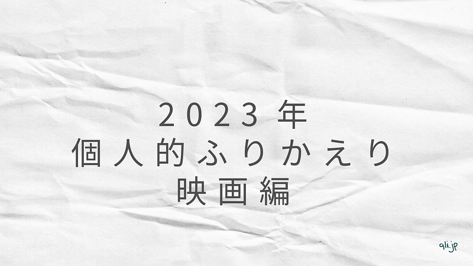

2023 年の個人的な映画のふりかえりです。 今年劇場で見た中から、6 つよかったものを紹介していきます。

## 生きててごめんなさい

今年の映画ライフは、「生きててごめんなさい」で幕を開けました。

男女の出会いから、倦怠期を描くこの映画は、穂志もえかさんの感情表現が豊かで、またところどころにさまざまなメタファーが織り交ぜられていて、とても好きな映画でした。

## リバー、流れないでよ

ヨーロッパ企画という名前に接する機会はなかったのですが、乃木坂 46 の久保史緒里さんが出演されているということで、見にいきました。

簡単に言えばタイムループもの。短い時間でどんどんタイムループしてしまうので、ちょっとしたパニック映画を見ているような気分にもなります。タイムループするたびに、雪が積もったり、はけたり、景色が変わってしまうところとか、結果を予想させる笑いや、突拍子もないエンディングなど、全体の設計が素晴らしく、ついつい見入ってしまいました。とにかくテンポがいい映画です。

そして、イントロで出てきた久保史緒里さん、そこで出てくるのね。

## アイスクリームフィーバー

ずっとスクエアの画角を使った映画で、とにかくおしゃれ。最先端のおしゃれすぎて、自分には理解できないものも当然含まれるのだけれども、とにかくおしゃれ（2 回目）。映画の中に隠されているトリックが最後に明らかになるのも見事。

## ほつれる

この映画は見た人によって設定されるテーマが異なるんだと思うのですが、自分は主人公の心情に寄り添ってみていました。事故死を発端としたストーリーなので、明るい映画ではない、のだけど、そういう映画だけに最後のシーンと、エンドロールに感じるものが多くある映画でした。 自分はエンドロールを見た後、しばらく動きたくありませんでした。

## キリエのうた

久しぶりの岩井俊二映画。かつて震災直後の映像を撮って映画にした、仙台出身の岩井監督が、震災を含んだ物語を描くということで少し緊張して見に行ったのを覚えています。 3 時間という長尺の映画ですが、ほとんどの時間 Kyrie が歌っていて、音楽映画だと思います。kyrie(アイナ・ジ・エンド)の歌声を聴きたい人にはおすすめできる映画です。

それと同時に脇役を固めるキャストの存在感も際立っていて、それが映画を成立させているという感じもあります。個人的には Kyrie の子ども時代の表現は難しかったんじゃないかと思いますが、好きでした。

## 市子

この映画の主題を書くと核心がネタバレするので書けないのだけども、プロポーズされた市子が翌日姿を消すというところから始まる映画。市子の過去を通して、さまざまな事実が明らかになっていくのだけど、そこで明らかになる事象がひたすらに重く、この映画のメインキャストが、人の温かみを滲み出る、杉咲花と若葉竜也の二人でよかった、と思いました。

## 朝がくるとむなしくなる

仕事を辞めて、コンビニで働く彼女の物語。主演である唐田えりかさんのいろんな表情が切り取られてる PV のような映画ではあるけれども、描かれるキャラクターがどれも濃いので、とても見やすい映画でした。そしてこの映画の核心の部分は、誰しもどこかで共感できると思います。 個人的には、唐田えりかが椅子の上であぐらをかいてカップ麺をすするシーンが大好きでした。いい絵だった。

## 最後に

今年は、特にシネコンと呼ばれる映画館を選ばなくなっている自分がいます。同じ映画でも、シネコン以外で見れるのであればそちらで見たいと思うようになってきました。この記事で挙げたタイトルを見ればわかるように、ほとんどが小さめの映画館でかかっている映画です。

今年の邦画は豊作だなって毎年言っている気がします。今年は見に行った映画の数は多くなかったですが、どれも個性の強い、濃い映画でした。

