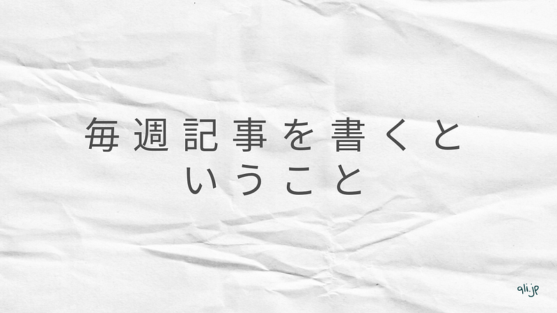

この記事は[medium](https://medium.com)というプラットフォームを使って公開しています。

ブログプラットフォームは、アカウントに紐づくブログがあり、そのブログを購読してもらう、もしくは記事を見にきてもらうというのが一般的なのですが、mediumは、書籍でいう共著のような形でブログを運営することができます。アカウントに紐づくページには、そのアカウントがさまざまなブログに投稿した記事を一覧で見ることができる、そういう仕組みになっています。

なので、mediumは本来、プロフェッショナルに基づいて、自分の経験や意見、知見を表明する使い方が自然です。

山崎怜奈さんの「言葉のおすそわけ」を読んで、その言葉の使い方に感銘を受けたり、

[**山崎怜奈の「言葉のおすそわけ」 | Hanako Web**  
_乃木坂46を卒業し、ラジオパーソナリティ、タレント、そして、ひとりの大人として新たな一歩を踏み出した山崎怜奈さんが、心にあたためていた小さな気づきや、覚えておきたいこと、ラジオでは伝えきれなかったエピソードなどを、自由に綴ります。（第3金曜…_hanako.tokyo](https://hanako.tokyo/tags/kotobanoosusowake/ "https://hanako.tokyo/tags/kotobanoosusowake/")

くるりの「近況と雑感」で始まる記事を読んだり、

[**くるり official｜note**  
_【くるり official note】ロックバンド・くるりのnoteです。_note.com](https://note.com/quruli "https://note.com/quruli")

そんなことをしながら、もっと足元を見ながら言葉を繋いでいきたいと思って、今年は毎週土曜日正午更新（できれば）というのを始めてみました。3月から35本の記事を書きました。毎週テーマを出していくという試みは刺激的だったなと思います。

そろそろ年末です。毎年、特に音楽と映画について、自分なりのまとめを出していますが、今年も必死に書いているところです。別に何かを総括したり、評したりする立場ではないのですが、自分の視点から見えた景色を書き残しておきたいと思っています。

