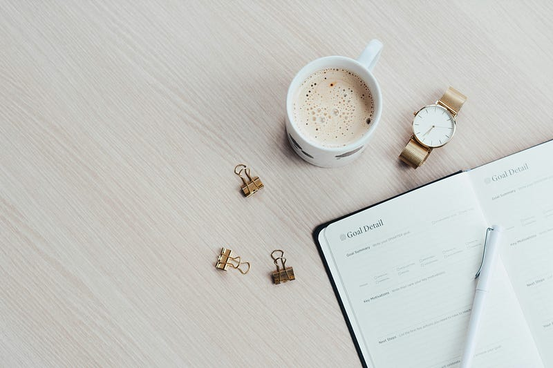

3月に入りましたね。今日は、ThreadsとBlueskyでハッシュタグのサポートが弱いよね。Twitterで一番大きいのはそれなので、使い分けされるかもね、みたいな記事を用意していましたが、Blueskyが見事にハッシュタグサポートをリリースしたので、ボツになりました。Blueskyは本当によいマイクロブログになってくれると思うので、今後に期待したいと思います。

[**Bluesky (@bsky.app)**  
_📢 App Version 1.70 is rolling out now (1/6) Hashtags! You can now use #hashtags in your posts. When you tap them…_bsky.app](https://bsky.app/profile/bsky.app/post/3kmjbfqrrbu2t "https://bsky.app/profile/bsky.app/post/3kmjbfqrrbu2t")

というわけで。以前、OmniFocusの記事を書いたことがあります。ここは個人的なブログなので、決してSEO的なことには興味がありませんが、それでも多くの方に読んでいただいているようです。

[**OmniFocusで定番の3つのパースペクティブ**  
_Edit description_qli.jp](https://qli.jp/omnifocus%E3%81%A7%E5%AE%9A%E7%95%AA%E3%81%AE3%E3%81%A4%E3%81%AE%E3%83%91%E3%83%BC%E3%82%B9%E3%83%9A%E3%82%AF%E3%83%86%E3%82%A3%E3%83%96-9e956484e2e2 "https://qli.jp/omnifocus%E3%81%A7%E5%AE%9A%E7%95%AA%E3%81%AE3%E3%81%A4%E3%81%AE%E3%83%91%E3%83%BC%E3%82%B9%E3%83%9A%E3%82%AF%E3%83%86%E3%82%A3%E3%83%96-9e956484e2e2")

この記事の中で紹介したのが３つのパースペクティブ「次」「THE LIFE」「THE WORKS」でした。最近、もうひとつ加わりました。それが「予測」です。

OmniFocusがThingsやその他のリマインダーアプリと決定的に異なる挙動として、”延期”が日ベースではなく時間ベースであることがあげられます。何時になったらこのアクションに着手するか（できるか）が明確に宣言できます。

Things「今日」のようなリストを持っているリマインダーアプリは多いと思います。こういうリストでは”今日一日着手することができるアクションリスト”を確認しながら次のアクションに着手することになります。いいように書けば、一覧できていいじゃん、になるのですが、悪いように書けば、リストを見るたびにいろんな雑念が湧いてくることも確かです。（仕事帰りに牛乳買ってこいって言われたんだったって思い出すみたいに）

OmniFocusのカスタムパースペクティブ「次」では、今着手できるアクションだけを並べることで、今すべきことのみにフォーカスすることができる状況を作り出すことができます（牛乳のことは一旦忘れることができます）。しかし、別のデメリットもあって、それは1時間後の未来が見通せないということ。アクションを着手している間に次々と新しいアクションがアクティブになったら、ゾンビ映画で次々と土の中からゾンビが現れるようなものです。これはパニック映画のよくある手法です。

それを防ぐために「予測」も使うようにしました。（もしかしたら、Things「今日」を使うようにこっちを見ながらタスクを片付けているよという方もいるかもしれません）。

朝コーヒーを飲みながら、1日の計画を立てるように「予測」を見て、1日の流れを確認する。もう少し余裕がありそうだなと思ったら、「THE LIFE」や「THE WORKS」を見ながらタスクを追加していく（実際には、予測タグである”TODAY”をつけていく）。

なんだかThingsの使い方を示したドキュメント”Getting Productive with Things”の”Establish your daily routine”に似ている気もします。

[**Getting Productive with Things 日本語版**  
_Edit description_qli.jp](https://qli.jp/hings-is-the-app-for-every-thing-you-do-da30ac092b55 "https://qli.jp/hings-is-the-app-for-every-thing-you-do-da30ac092b55")

Daily review とまでは言いませんが、朝イチに今日のスケジュールをアシスタントに聞いて確認する、くらいのことはやってもいいのかもしれませんね。朝刊を読む習慣のように。