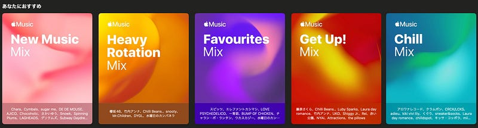

先日、ビルボード横浜に行ってきました。アルバムDRAMASをリリースした竹内アンナのライブ。彼女のライブは、ライブごとに編成が変わったり、アレンジが変わったりしていて、実に”ライブ感”のあるのが魅力。早すぎるライブ記事が上がっていたので、気になる方はこちらをどうぞ。

[**【ライブレポート】竹内アンナ初のビルボードツアー、思い出のステージでパジャ海と"カッコいいライブ"（写真7枚）**  
_竹内アンナ初のビルボードツアー「Billboard Live Tour 2024」の最終公演が昨日3月20日に神奈川・Billboard Live YOKOHAMAで開催された。_natalie.mu](https://natalie.mu/music/news/565772 "https://natalie.mu/music/news/565772")

当日はアルバムの発売日だったので、早速Apple Musicでひたすらリピートしてました。

Apple Musicには視聴履歴などをもとにパーソナライズして作ってくれるMixと呼ばれるプレイリストがあります。 よく聴いてる曲やお気に入りに入れた曲を中心に選ぶ Favourite Mix（英国綴りなのがまたお気に入りのポイント）、アッパーな曲を選ぶ Get Up! Mix、ゆったりな音楽を選ぶ Chill Mix、新しい音楽を紹介してくれる New Music Mix。これらは基本週１の更新です。

ここに新しいMixが追加されています。それがHeavy Rotation Mix。最近よく聴いている曲をセレクトしたMixで、毎日更新です。これを見たら、最近よく聴いている曲がバレるというやつです。

とりあえず何か音楽か欲しいなという時は、この Heavy Rotation Mixを流すと、とりあえずよく聞いている音楽が流れるので重宝しています。集中力を高める作業にBGMが必要な時は、Chill Mixを流しています。自分が好きなサウンドはこのMixに入っていることが多いので、街を歩くときのBGMなど、よく聞いているMixかもしれません。

どういうプレイリストを聴くことが多いですか？