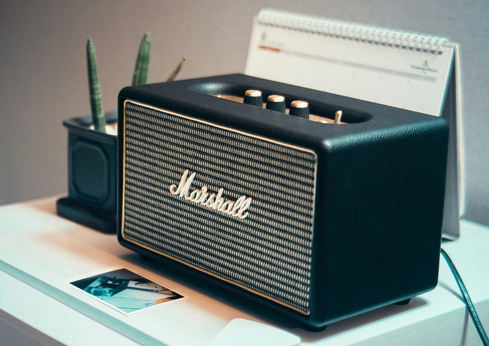

このブログでも紹介したことがある「続きと始まり」を読み終えました。パンデミックが始まった環境下で、3.11のことを思い出しながら進行していく物語が、「そこ」に終着していく感覚は、著者が関西出身であることと切り離して考えることはできないんだろうなと感じました。ネタバレはしないので興味持った方は、結末から読まずに最初から読んでほしいです。 映画「きょうのできごと」を見返したくなりました。自分がこのブログを書くときのスタンスとしている”Things on a planet”は、この映画の副題”a day on a planet”からいただいたものです。

[**映画『きょうのできごと a day on the planet』の感想・レビュー\[4096件\] | Filmarks**  
_きょうのできごと a day on the ..._filmarks.com](https://filmarks.com/movies/20813 "https://filmarks.com/movies/20813")

2020年初めから始まったパンデミック。家で酒を飲む習慣はなかったのに、飲食店が何とか生き延びるために始めた通販を利用して、酒のアテを用意し、家で配信ライブを見ながら簡単なパーティモードの食事とかやってたのは、今思うと相当精神的にヤバかったんだなと思ったりします。実際何も手につかない時期も過ごしてたので自覚はあったのですが、自覚以上にやばかったみたいです。

そんなパンデミック初期に始めたのがラジオを聴くことでした。たまに地元福岡のラジオをチェックすることがあったのでradikoプレミアムは契約していたのですが、radikoを日常的に活用するようになったのはこの頃から。今では、ダレハナこと、「誰かに話したかったこと」（TOKYO FM）を日常的に聴く習慣がついてしまいました。

[**山崎怜奈の誰かに話したかったこと。**  
_生活の"現場"で感じるモヤモヤ・ザラつき...山崎怜奈がリスナーのアナタとともにすっきりさせていく番組です！_www.tfm.co.jp](https://www.tfm.co.jp/darehana/ "https://www.tfm.co.jp/darehana/")

BGMがわりにラジオを流しているオフィスもあると思いますが、自分は東京でそんな環境に身を置いたことがなく、この時間に家にいるようになったという環境の変化が大きいかもしれません。

ラジオは仕事のBGMとして、生活のBGMとして聞いていることが多く、ながら聞きがほとんど。深夜ラジオをリアルタイムで聴くということはほとんどありません。オールナイトニッポンのいち番組が東京ドームでイベントやってしまう時代ですが、実は「芸人のラジオ」にはハマったことがないんですよね。

昼のラジオは、音楽が流れるタイミングやコーナーが時間通りに進行するので時計がわりに使えることも大きいです。作業に集中しちゃうと、ラジオの声が入ってこなくなるのですが、コーナーが流れる時間を体が覚えていてふと「もうこんな時間なのか」と感じることが多々あります。例えば、ダレハナは14:55に終わるのですが、終盤に「読み聞かせ」コーナーがあり、それが始まると、習慣になっている「3時のコーヒー」を淹れなきゃと思ったりします。

夜のラジオは、Twitterが相棒になります。ハッシュタグを使った実況が盛り上がっているので、事前収録の番組でも、一緒に聴いている人の反応を見ながら聴くことができます。ゲームしながら聴いていることも多々ありますが、そういう時は大抵内容は頭に入ってないですね。

テレビは目から入る情報が多すぎること、そして、進行がどうしても紋切り型になるので、「ながら」がしづらいと感じることが多いです。自分の仕事もある意味で”メディア”に関連しているので、パンデミック状況下、”集まれない”けど集まりたいときにどうするかを考えたときにも、映像の場合はある程度紋切り型にしないと視聴体験が悪くなることを強く感じました。

音声だけのラジオは、コーナーとかなくても、誰かが喋っていれば成立しちゃう。そういう意味では、エンジニア界隈でPodcastが流行ったのも納得できます。

パンデミックがなければラジオとは疎遠な人生でしたが、昨年はダレハナのラジオイベントにも行きました。他のイベントが被ったのでいけませんでしたが、先日名古屋のラジオ局CBCラジオのイベントにも行きかけました。確実に今の自分の生活の一部にはなっています。

今は3月。改編期を経て、4月からどういうサイクルが始まるか楽しみです。

