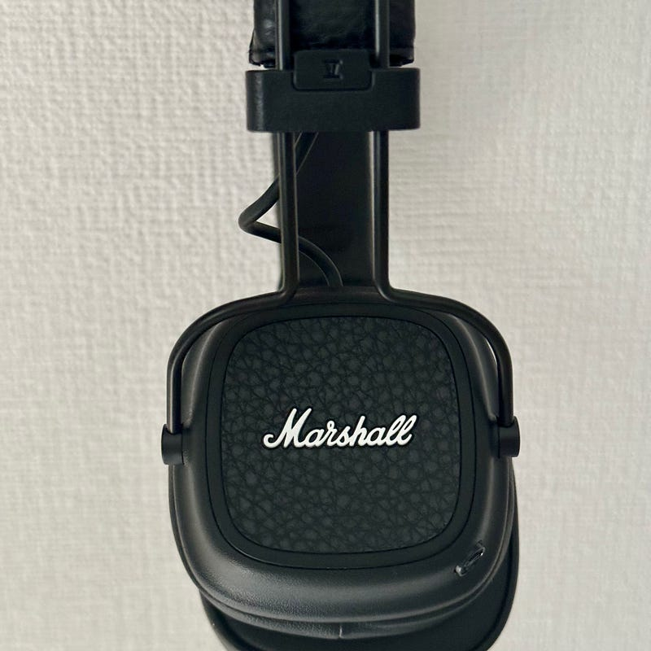
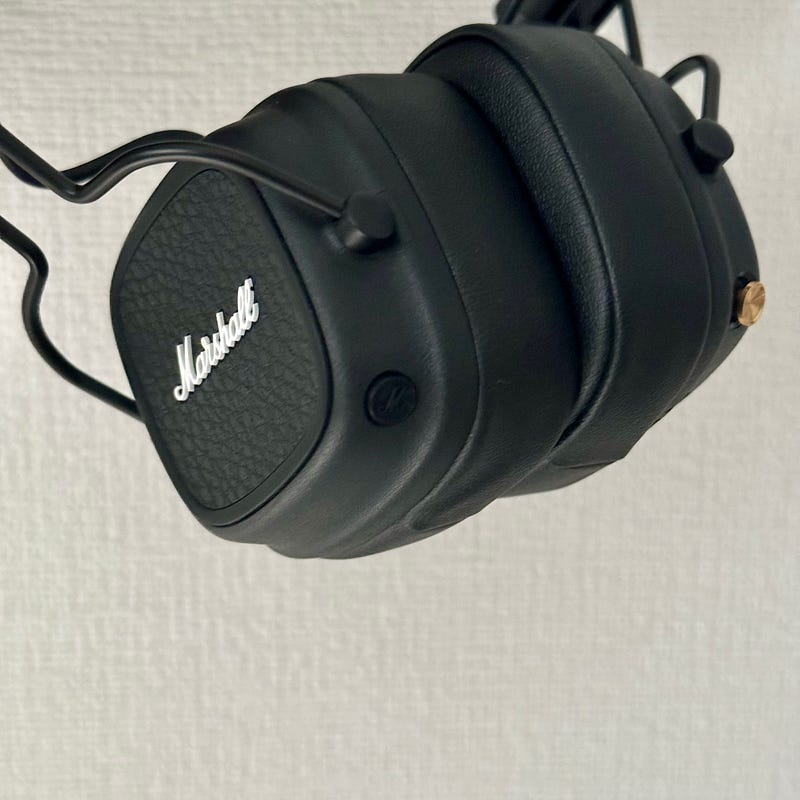

Covid-19が5類に移行して初めてのGWということで、この機会を使って帰省したという人も多いんでしょうね。自分はどちらかというと、音楽三昧な日々を過ごしていた気がします。GWという言葉を生んだ映画ももちろん見てきましたし、国立新美術館や東京タワーに行ったりもしました。

パンデミック以降、そんな遠出ではないカジュアルなお出かけというものが増えていて、軽めの荷物で出かけることが多いのですが、そんな時に使うヘッドフォンが Marshall MAJOR IVでした。

このブログでも紹介したことがあるヘッドフォンなのですが、ノイキャンはないが、いつ充電したのか忘れるくらいバッテリーが持ちすぎていて、軽いです。地下鉄を使わないとかの時は選択することが多いです。ヘッドフォンは会話したい時は外せばよいので楽なんですよね。

[**ギターを綺麗に聴かせてくれるヘッドフォン Major IV**  
_新しく発売されたMarshall Major IVで Mr.Children 20枚目アルバム SOUNDTRACKSを聴きました_qli.jp](https://qli.jp/%E3%82%AE%E3%82%BF%E3%83%BC%E3%82%92%E7%B6%BA%E9%BA%97%E3%81%AB%E8%81%B4%E3%81%8B%E3%81%9B%E3%81%A6%E3%81%8F%E3%82%8C%E3%82%8B%E3%83%98%E3%83%83%E3%83%89%E3%83%95%E3%82%A9%E3%83%B3-major-iv-74a74092e28d "https://qli.jp/%E3%82%AE%E3%82%BF%E3%83%BC%E3%82%92%E7%B6%BA%E9%BA%97%E3%81%AB%E8%81%B4%E3%81%8B%E3%81%9B%E3%81%A6%E3%81%8F%E3%82%8C%E3%82%8B%E3%83%98%E3%83%83%E3%83%89%E3%83%95%E3%82%A9%E3%83%B3-major-iv-74a74092e28d")

そんなお出かけで頻繁に使っていたところ、耳当ての部分、つまりイヤーパッドが少し劣化してきていることに気づきました。スポンジ自体が劣化しているのではなく、外装の皮っぽい部分が劣化してたんですね。というわけで、いろんな経緯があり、タイミングよく、その次のモデルである Marshall MAJOR Vを手に入れました。

発売日が4月23日だったそうで、出たばっかり。[日本の代理店である完実電気ではまだ取り扱いが始まってないようでした](https://marshall.kanjitsu.com/product-category/headphones/)。簡単にレビューしていきます。

MAJOR IV で変わったところ。まずは外装です。ヘッドフォンのデザインが、ツルツルしていたデザインから、Marshallのアイデンティティでもある凹凸があるデザインに変わりました。

L側に、新しく黒いMと書かれたボタンが追加されました。標準では、Spotify TAPという機能にアクセスできます。Spotifyが起動して推奨プレイリストを流してくれるという機能だそうです。そのほかにも、Marshallアプリでカスタマイズできて、iOSであればSiriを起動してくれるようにもなりました。なので、Apple Music勢もこのボタンからSiri経由で好きなプレイリストを選択できるようになっています。

あとは、Bluetoothが5.3になったり、LE Audioに対応したりなど、最新技術にも対応していて、個人的に操作しにくいなと思っていたR側のボタンも軽く操作しやすくなりました。

いまどき、ノイズキャンセルもないヘッドフォンですが、最近日本でも地味に支持が広がっているように感じます。たまに装着している人を見かけますね。これから一緒にお散歩したいと思います。

気になる方はぜひ。

追記：Marshall MAJOR Vには最近のヘッドフォンでは定番になったワイヤードで聴ける機能があります。ただそれを使うと、Marshallなサウンドは聞けないので、このヘッドフォンの個性を消してしまうため、あまりお勧めしません。