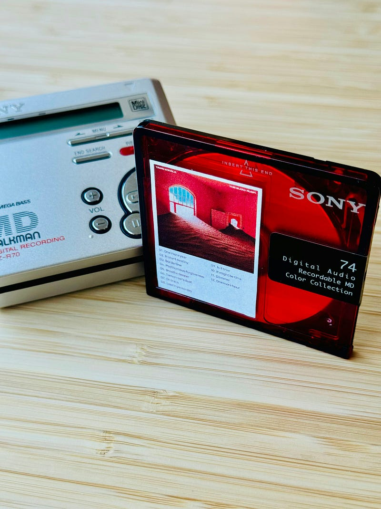

10月に入り、さまざまな場所で変化が起きるタイミングですね。自分に変化がなくても、テレビやラジオの番組が変わったりしていて、それと連動して生活習慣が変わったりします。

[**TVer - 無料で動画見放題**  
_TVer（ティーバー）へ、ようこそ。TVerにあるテレビ番組はすべて無料！最新話から過去人気番組まで見放題！_tver.jp](https://tver.jp/episodes/epsh64acrx "https://tver.jp/episodes/epsh64acrx")

先日始まった「 若草物語 」というドラマの1回目を見ました。そのドラマの主人公は、ドラマ制作現場で働く人で、その回の主題にドラマの脚本についての衝突がありました。マスメディアで流す以上、できるだけ多くの人に共感してもらおうと多数派が抱くイメージを入れようとする脚本家と、マスからこぼれ落ちた少数派でも存在する以上スポットライトを当てるべきという監督（助監督）の衝突が描かれているわけですが、最近は後者のドラマが流行ってるような気がします。

少し前「洋楽離れなのでは」というトピックが注目を集めたりしました。自分の感覚を書いておきたいなと思いました。

80年代、90年代はテレビでいくつもの音楽番組がありました。注目を集めるテレビの力を借り、”お茶の間”に広がっていった音楽は、多くの人が当たり前に知っている音楽として、今でも定着しているように感じます。多くの音楽番組が終わり、”お茶の間”がなくなったとされる今の音楽は、そのような定着ができていないというように感じます。つまり、みんな知っているという音楽がなかなか出てきていないのではないかなと思います。少子高齢化と言われる人口比率も、もしかしたら新しい音楽が定着することを阻害しているかもしれません。

TBSの朝の番組で、アナウンサーがB’zの曲を歌うくだりがありますが、あれがYOASOBIやそれ以降の若いアーティストの曲ではなくB’zであるところに、それらが現れているのではないかと考えたりします。

若年層も90年代の曲に触れていて、文化として、「あの頃の」音楽は受け継がれているように感じます。ロックの前の音楽は歴史（教養）としてしか知らないが、ロック以降の音楽は文化として根付いてる。そんな感覚です。

ここ最近の若いロックバンドの動向を見ていると、東京では1万人程度のハコでライブを開催するバンドでも、地方では1000人、2000人サイズのハコでライブをしていることが珍しくありません。全国のアリーナを回ったり、ドームを回ったりしてるのは、それこそ90年代に人気があったロックバンドがほとんど。一方で、昔は「開催が難しい」と言われ、ひとつのステータスを形成した「日本武道館」公演は、いろんなバンドが開催しています。

好きな音楽を思う存分聴いた時間が最近ありますか？

推しを応援するときにおまけのようについてくる音楽、移動中など耳が寂しいときのラジオ代わりのBGMとしての音楽、友だちと踊ったりするときのBGMとしての音楽、メディアを彩るための音楽、そのような形で音楽と接している人の方が多いんじゃないかなと思っています。SpotifyやApple Musicで好きな音楽を好きなだけ聴いている人、つまり、音楽が好きで音楽を聴くことを趣味にしている人って実は多くないのではないでしょうか。そんな感覚を持っています。

洋楽離れ、どころか、好きなバンドの好きな音楽を好きなだけ聴く、という楽しみ方が減っているのではないか、と考えています。

資本主義は「できるだけ少ない労力で大きな利益を得ること」が正義なので、どうしてもデータをとって、マスをめがけて商売をするということが正義です。そのため、さまざまな統計で、どこがマスなのかを見極めることが大事だし、マスこそが当たり前だったりします。最近ドラマや映画で描かれがちな「見えないようにされている人」は、そういうマスからこぼれ落ちた人が多いんだと思います。

音楽の世界も同じようにSpotifyのおすすめにあんまり出てこない「見えなようになっている」音楽を聴く人はもちろんいます。自分の好きな音楽を好きなだけ聴く、音楽を聴くことが好きな人が多くいてほしいという気持ちはあります。それと反するように、PodcastやRadikoを起動する時間が増えて、音楽を聴く時間を確保できないことが多いのも事実です。