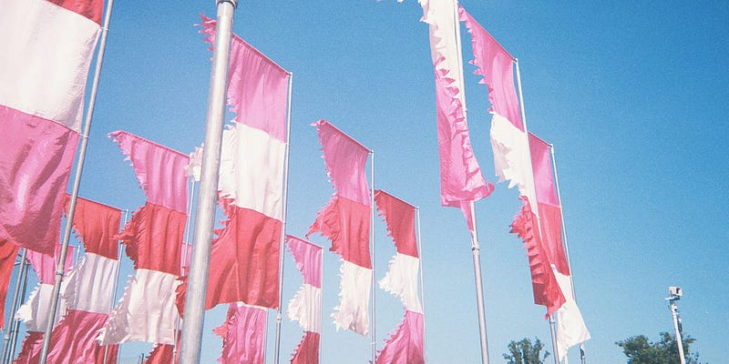

夏フェスに行ってきました。いく予定もなかったのですが、いろんな条件が重なって、1日だけ参加することにしたのです。

突き抜けるような青い空、どこまで広がる緑色の芝生、そして、フェス飯に並んでも、日陰で休憩している時でも、いつ何時でも聞こえてくる音楽。勇ましいロックが流れてくることもあれば、ダンスサウンドが流れてくることもある。聞き馴染みのよいメロディを持つポップサウンドが流れてくることもある。

その空間は音楽好きにとってはたまらないもので、居心地がいいもの。

でも心配なのは暑さ対策。最近は、帽子と、サングラスが必須アイテムになりました。頭への直射日光と、目に入ってくる光を落とすことで、1日が終わった後の疲れがかなり楽になったなと思います。特にサングラスを使う前は、まわりが明るすぎることで頭痛を伴うこともありました。頭はタオルでも守れるんですが、サングラスは代わりになるアイテムがないんですよね。

意外と触れられてないけど大事だなと思うのは日焼けした後のケア。いろんなメーカーがあると思いますが、自分はこれを常に冷蔵庫に入れていて、日焼けした後に使うようにしています。日焼けってすごい乾燥するので、その対処ですね。

[**(株)大阪製薬 メンターム サンベアーズ アローバジェル 1個 (x 1)**  
_Amazon.co.jp: (株)大阪製薬 メンターム サンベアーズ アローバジェル 1個 (x 1) : ビューティー_www.amazon.co.jp](https://www.amazon.co.jp/dp/B000YZSU0I/ "https://www.amazon.co.jp/dp/B000YZSU0I/")

最近は日焼け止めの性能がよくなったからか、日焼けすることも少なくなったし、フェスの会場で塗り直しする人も見かけなくなったなと思います。

これから、夏フェスに参加する方がいれば参考にしていただければ。