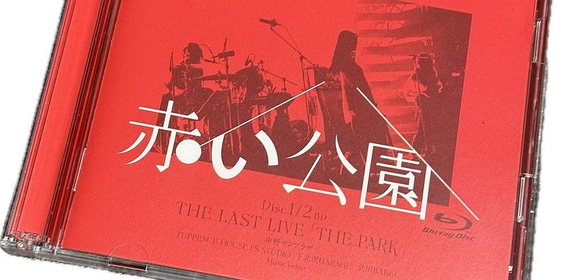

2024年5月28日、赤い公園 ラストライブから3年が経ちました。その日はラストライブの映像を見返していました。

2021年5月28日に中野サンプラザで行われたそのライブは、パンデミックの影響で、50%のキャパで開催されました。映像に収められた3人とサポートメンバーの空気感がとても素敵でした。

ライブの最後、「黄色い花」「凛々爛々」で締めてくれたことが、何よりありがたい。

> _もしもあなたが / 悲しくって俯いてしまった時には / せめて咲いてるタンポポでありたい   
> （黄色い花 / 赤い公園 / 作詞 津野 米咲）_

赤い公園の楽曲たちは、今でも手の届くところにずっと置いてあって、聴き続けてます。最後となった「THE PARK」（まさに「公園」というタイトル）は名盤だと思っています。

解散から3年経ち、メンバー3人はそれぞれの人生を形にし始めているのも、ファンのひとりとして、嬉しいのです。一番若いメンバーでもある、石野理子さんは、ソロとAoooというバンドのボーカリストとなりました。先日スタジオライブ映像が公開されたんですが、それがまたかっこよくてですね。リピートしてます。

赤い公園のあの空気感も、会場となった中野サンプラザも、もう戻ってこないんだろうなと思います。でも、素敵なバンドや音楽はたくさんあるし、赤い公園が解散しなければきっと生まれていなかったAoooもその中のひとつです。これからも音楽を楽しんでいきたいなと思います。

当時は緊急事態宣言下で全てのコトが進んでいて、あっという間だった。その中でも、赤い公園を”津野米咲を中心にクリエティブしたバンド”という枠に収めてくれたことが何よりありがたいなと、3年前の映像を見ながら改めて感じました。