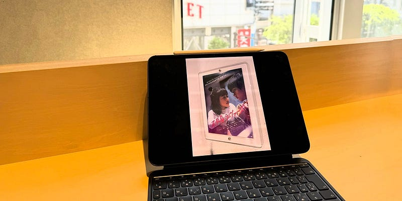

5月15日に受け取ってから、おおよそ1週間。iPad Pro M4を使ってみた。選んだサイズは11インチ。このタイミングで、これまで使ってきた13インチから小さくした。その理由や使ってみた感想などを書いてみたい。

13インチ iPad Proは素晴らしい製品だ。13インチという画面サイズを数年使っていて、13インチiPad Pro はMacを捨ててiPadをメインデバイスにする人、もしくは広いキャンパスでお絵描きをしたい人のためのデバイスだなということを最近強く感じていた。今はMacBook Proをメインに使っているが、これを捨ててiPadをメインにすることは考えられないなと思った。

iPad miniを使ってみた経験も今回の選択を後押しした。iPad miniのポータビリティは13インチにはない機敏性を与えてくれる。13インチを買うなら、iPad miniを併用すると快適だなと感じたほど。

しかし、iPadには携帯電話回線をつけておきたい。使いたいときに情報が全てアップデートされている状況を作りたいから。しかし、複数のiPadに複数の回線契約はさすがに厳しい。使うデバイスは少なくしたい。

もちろん、Magic Keyboardも導入した。Magic KeyboardはiPadの脱着がしやすく、iPadのホームポジションとしてとても使いやすい。そして、Magic Keyboardにつけている状態で 腕を伸ばしてTouch IDを使うことはあまり想像ができない。ここはFace IDの方が楽だなと思った。これが、Proを選んだ最大の理由。

もちろん、AirよりProの方が軽いとか、ディスプレイが綺麗とか、そういったことも影響している。

かつての13インチ iPad Pro + Magic Keyboardはとても重かった。それと比べると軽く、サイズ的に扱いやすい。画面が小さいことで不便を感じるかとも思ったが、それは慣れの問題だけ。文書を書く上では全く問題がない。

Apple Booksで本を読むにも全く問題がない。厳しいなと思うのは、Kindleで提供されている雑誌類。レイアウトを活かす前提で配信されているので、ほぼPDFのような状態で提供されていて、もともと文字サイズが小さいので、文字を追いかけづらい。

13インチから11インチになって、キーボードのレイアウトは少し変わっている（記号系のキーサイズが半分になっている）。そこは慣れが必要になる部分。

11インチiPad Proはメインのコンピュータにこそならないが、出先で使うUMPCや、MacBookの傍に置いてあるサブデバイスとしては必要十分。

iPad Pro関連の発表があった後、必ず聞かれる「iPadにmacOSを入れて欲しい」という声。そう考える人には、iPadは必要ないんだろうなとは思っている。

YouTubeでvlogを漁ってみるのが好きだけれど、今やiPhoneで撮って、iPadで編集しているケースが本当に多い。ほとんどの人は、iPhoneとiPadで十分生活できる状況が生まれている。Proである必要すらない。

「技術発展はモノの値段を安くする」って声を聞いたことがある。自分の部屋の中でDTMで音楽を始めた人が、日本武道館でバンドを従えてステージに立つ時代でもある。今回のアップデートで、カジュアルにデジタルデバイスを楽しむ人がもっと増えるといいなと思う。

_Originally published at_ [_https://thingsonaplanet.substack.com_](https://thingsonaplanet.substack.com/p/ipad-pro-m4-1)_._