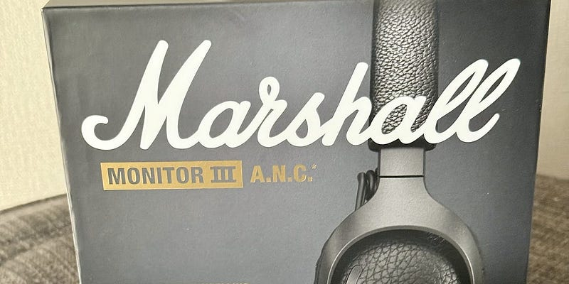

嫌な暑さも落ち着いてきて、ヘッドフォンでお出かけすることが増えてきました。お供なのは、Marshall MAJOR V。これで聴く音楽が楽しいこと、そして、軽くて楽なこと、それが決め手です。欠点として、ノイズキャンセリングが入っていないので、地下鉄に乗る予定がある時などは、セカンドチョイスとしてAirPods Proを選ぶことが多くあります。

とあるSNSで「なぜイヤホンではなくヘッドフォンを選ぶのか」という質問投稿を見かけたのですが、自分がヘッドフォンを選ぶ理由の80%は、ヘッドフォンというスタイルが好きだからですね。音楽を聞かない時、人と話す時は首に引っ掛けておけばいいので、AirPods Proより楽なのです。あとの20%は、耳につっこむタイプのイヤホンを使う時間をできるだけ制限したいからです。外耳炎までは言わないですが、できる限り負荷を減らしたい。あと、ヘッドフォンのスタイルだと、バッテリーが大きいので意外と長く持つというのもあるかも。独りでの長時間の移動の場合には重宝します。

MAJOR Vと一緒にお出かけしているうちに、Marshallの音をずっと聴いていたいという気持ちが強くなっていました。新幹線や飛行機など、周りの音が大きいところでも使いたい。

そこでちょうど発売になったのが、 Marshall MONITOR III A.N.C でした。

[**ワイヤレス再生に対応したアクティブノイズキャンセリングヘッドホン | Marshall.com**  
_アクティブノイズキャンセリング機能を搭載したオーバーイヤーヘッドホンで、音楽に集中しよう。あらゆる調整が可能で、何時間ものワイヤレス再生が楽しめます。_www.marshall.com](https://www.marshall.com/jp/ja/product/monitor-iii-anc?pid=1006861 "https://www.marshall.com/jp/ja/product/monitor-iii-anc?pid=1006861")

MAJORシリーズはON EARスタイルですが、MONITORシリーズはOVER EAR、つまり耳をすっぽり覆うタイプのヘッドフォン。形状で言えば、AirPods Maxと同じスタイルです。

MAJORほどではありませんが、扱いやすい軽さで、小さくコンパクトに畳むこともできます。

音はいわゆるMarshallのサウンド、もちろんMarshallアプリによって、自分好みのイコライザーを使うこともできます。Marshall Headphonesが好きなのであれば、サウンドに不安に感じる必要はありません。ただ、高音が刺さる感覚がすこしありました。これは好み（個人の聴覚の特性）にも寄るので、気になるようであれば試聴してみて、としか言えないですね。

サウンドステージ空間オーディオに対応しています。これはDOLBY ATMOSということではなく、音場が広くなります。重なり合ったサウンドがそれぞれ聞き取りやすい音で聞こえるので、これは聴いていてとても楽しい。ノイズキャンセリングとの相乗効果で、とても聞き取りやすいです。

ノイズキャンセリングはどれくらいの強さかというのが気になることもあるかと思うので、使ってみた感想を書いておきます。ノイズがうるさいで有名な大江戸線ではテストしていませんが、同じようにうるさいりんかい線で試したところ、ノイズに邪魔されることなくバッチリ音楽を楽しめました。AirPods Pro 2 と同等かそれ以上と考えておいてもいいかもしれません。もちろん、トランスペアレンスモードこと、外部音取り込みモードもありますし、脱着を確認して自動で音楽を一時停止したり、再生したりする機能もついています。

Bluetooth接続がSBCとAACのみの対応なのは、iPhoneには優しいのですが、AndroidユーザーはaptX/LDAC対応が欲しいと思うかも。サウンドを聴くと余計に。

有線接続にも対応しています。MAJORは3.5mm接続ケーブルでしたが、このMONITORは付属のUSB-C — 3.5mm接続ケーブルを使います。ヘッドフォン側がデジタル接続(USB-C)になるので、ヘッドフォンの電源はONにしておく必要があります。つまり、アナログ信号を一度デジタルにして、ヘッドフォンのDACでアナログに再変換している？？？公称70時間再生できるヘッドフォンとはいえ、この仕様は賛否が分かれるかも。試しに、手元のUSB-Cケーブルで、iPadと直繋にしたところ、iPad側は何も認識しませんでした。外部DACの機能は持ち合わせていないようです。

この製品、グローバルの公式サイトから購入することができるのですが、この記事の執筆時点では、日本代理店である完実電気はまだ取り扱っていないので、日本の家電量販店などで購入することができません。また、Marshallブランドは人気が高く模倣品も多いようなので、有名ショッピングサイトなどで購入される場合はご注意ください。もちろん、技適マークは確認済みです。二重構造になっているヘッドバンドの裏にマークがありました。

それでは。