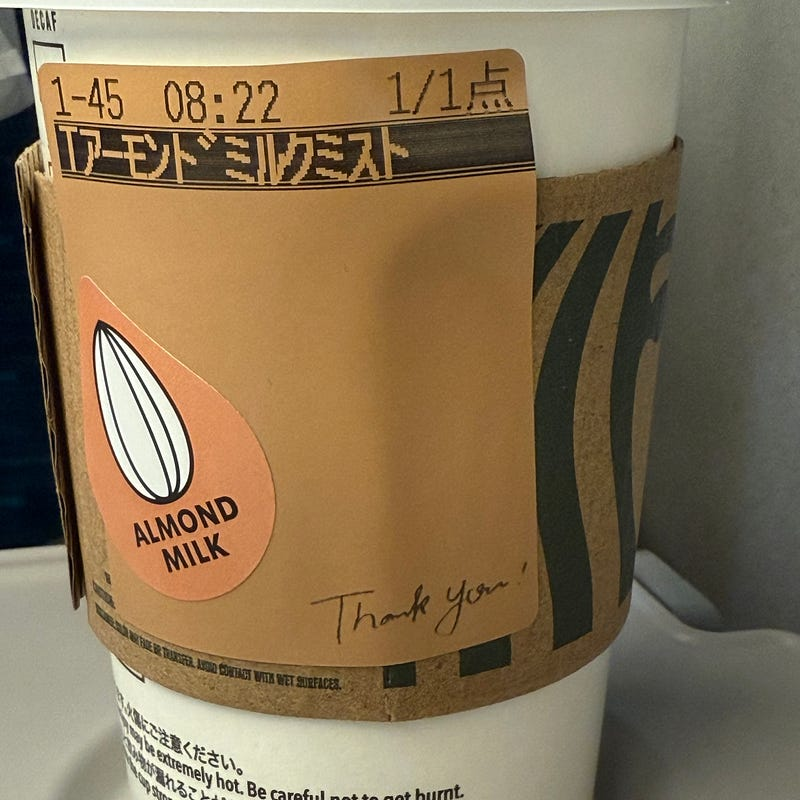

涼しくなってきて、カフェに入って飲むものもホットコーヒーを選ぶことが多くなりました。自分のXをフォローしている人はわかるかもですが、カフェというとStarbucksを選ぶことが多いです。アーモンドミルクカフェミストが好きなんですよね。

以前はスタバでも「今日のコーヒー」こと、ドリップコーヒーを選ぶこともあったし、エクストラホットダブルトールラテを呪文のように注文してたこともありました。最近はほとんどアーモンドミルクカフェを選んでいます。スタバのドリップコーヒーが苦手ということ、そして、牛乳も苦手っぽいということがわかってきたので、いろいろ試してアーモンドミルクに落ち着いています。他のカフェチェーンではソイミルクはあるものの、アーモンドミルクが置いているところを見たことがないですね。アーモンドミルクの風味が好きなのです。

アーモンドミルクカフェを選ばない店舗もあります。それは、リザーブドを用意している店舗。この店舗だけは、ドリップコーヒーを選ぶことが多いです。いちからいれてくれるコーヒーは、コーヒーの香りと味わいが出ていて、贅沢な気持ちになれます。おそらく、ワイン好きの人がワインを味わってる感覚に近いのかもしれません。

冬になると、カフェで過ごすだけでなく、散歩して冷えた体を温めるためにカフェに入るのも楽しみの一つです。温かいアーモンドミルクミストを片手に、窓から外を眺めながら過ごす時間は、まさに至福のひとときです。

読書だったり、習字レビューだったり、ちょっと雰囲気を変えて作業するときに、CCCが運営しているシェアラウンジを使うことがあるのですが、アーモンドカフェミスト、選べると嬉しいですね。