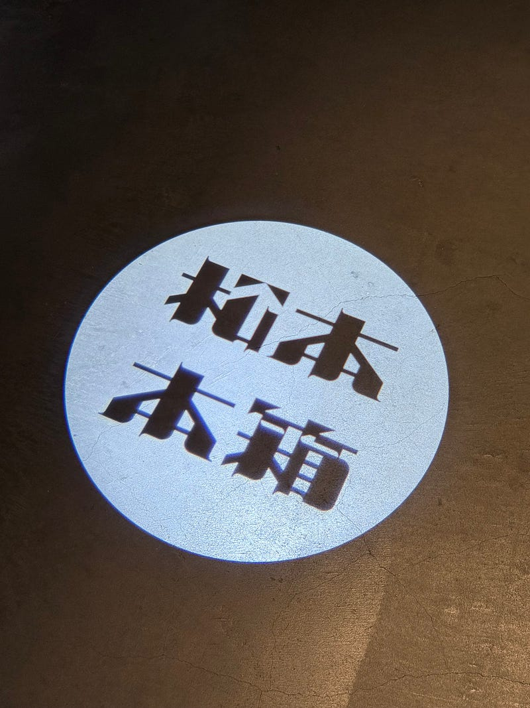
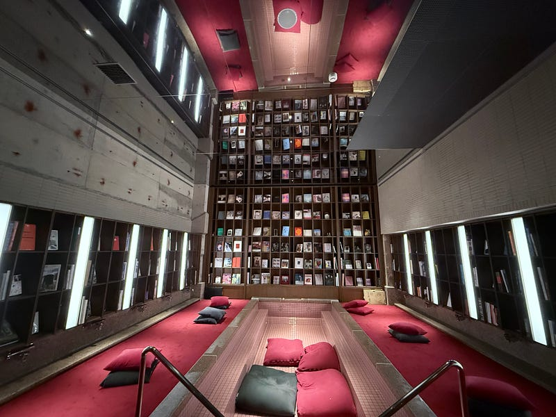
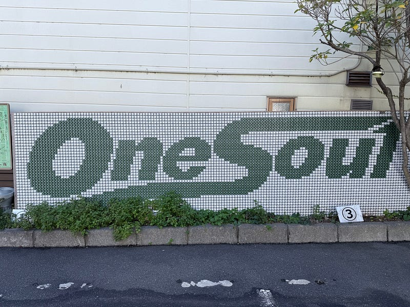

休みの期間を利用して、松本に旅行に行きました。もともと旅好きと呼ばれる人ではないのですが、リモートワークで働くようになって、毎日長時間同じ場所に座る時間が増え、ミーティングも会議室に行ったりせずにその場で過ごすという環境になったので、1年に1回ちょっと東京を離れてまったりした時間を過ごすことを意図的に企画するようになりました。

これまでは近場の熱海、箱根あたりを攻めていたのですが、久しぶりに長時間の電車移動を挟みたいなと思って、松本を選びました。行ってみたかった宿が松本にあったのです。

松本に行ったのは2度目とかだったと思います。とはいえ、前回は上高地に行く途中に立ち寄っただけだったので、観光するのは初めてでした。少しの時間お散歩をしただけですが、いい空気が流れている街だなと思いました。

初日は大雨。大雨になることは天気予報を見て確認していたため、観光の予定は入れず、駅からバスで宿の近くまで向かいました。バスの時間のタイミングで少し時間が空いてしまったので、駅の中にある「松本からあげセンター」で山賊焼きを食べることに。お昼時だったのですが、回転が早く、行列待ちをして30分くらいでお店を出た気がします。電車の中で本を読んでいたら少し酔ってしまっていたので、軽めに済ませたこともあるかもしれません。

バスでホテルに移動しました。今回のホテルは「松本本箱」。客室はシンプル、空間を広くとった部屋がとても過ごしやすく感じました。客室内に露天風呂もあり、水はホテル内にウォーターサーバーが置いてありました。  
客室内に、タンブラーが用意してあり、ウォーターサーバーの水を自由に飲めるようになっているのですが、ホテル内には本棚があるエリアがあり、そこで自由に本に没頭できるようになっていました。

2日目は太陽光と共に目覚めることができるくらい、天気がよく、チェックアウトまでの時間をゆっくり過ごすことができました。

松本の街はコンパクトなので、松本城を中心にゆっくり散歩しながら駅まで歩きました。当日は大きな通りを歩行者天国にしてお祭りが行われていて、とても賑わっていましたね。武家屋敷を思わせる風景の中に、イノベーションされたようなお店があり、また、とても手触り感を大切にしているお店が多いような感じもしました。

**p.s.**

帰りに松本駅のスタバに寄ったのですが、とても広いスタバでした。あのスタバが都内にも欲しい。いよいよ、ウインターシーズンの、ジョイフルメドレーが始まりましたね。