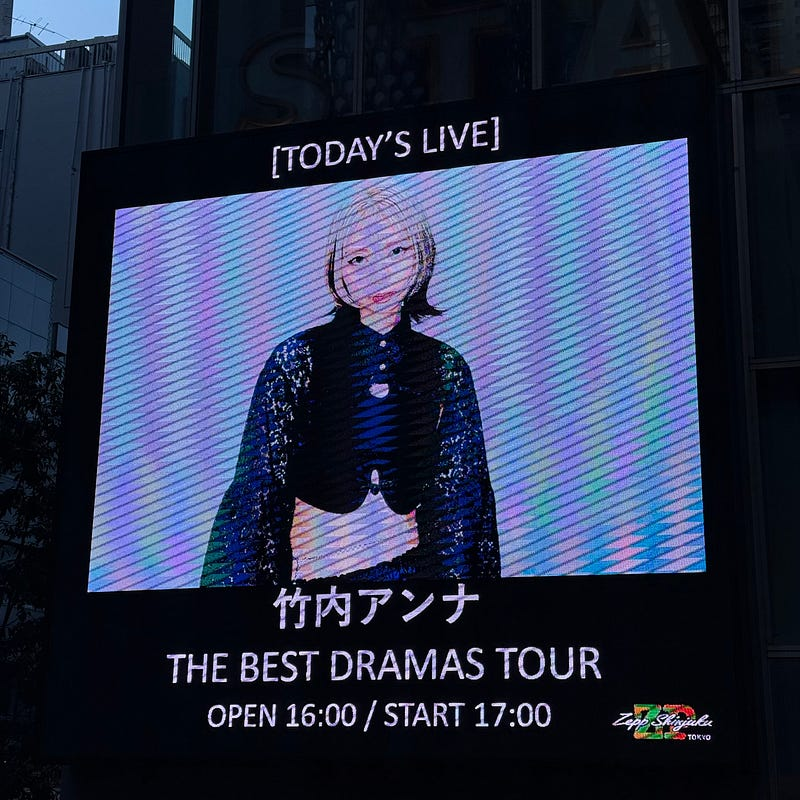

今年もたくさんの音楽に出会うことができた。その中から、今年の音楽の中で個人的なハイライトをまとめて置く。

#### ブレずに今を発信し続ける Mr.Children

Mr.Childrenに出会ったのは約30年前。その頃から、彼らの音楽は日常を彩るBGMとして、常に身近にあり続けている。昨年10月に発売された新アルバム「miss you」には驚かされた。今年、そのアルバムを引っ提げたツアーに参加することができた。決して大衆向けではない、無骨でストレートなサウンドが印象的で、体の中から湧き出るような歌詞が響く。ステージでは、その圧倒的な音を余すことなく表現していた。そのライブは、これまで見たMr.Childrenのライブの中で、特に印象に残ったものだった。

特に印象的だったのは、セットリストから「innocent world」「CROSS ROAD」「Tomorrow never knows」を外したことだ。これらの曲はブレイク期を象徴する楽曲で人気が高いが、今のMr.Childrenを表現するには、この選曲が最適だったと感じた。

[**Mr.Children ＠ Kアリーナ横浜 (神奈川県) (2024.10.27) | ライブ・セットリスト情報サービス【 LiveFans (ライブファンズ) 】**  
_Mr.Children ＠ Kアリーナ横浜 (神奈川県) (2024.10.27)のセットリスト(セトリ)や日程、会場、ライブ会場の客層の統計などライブがもっと楽しくなる情報が満載です。_www.livefans.jp](https://www.livefans.jp/events/1710271 "https://www.livefans.jp/events/1710271")

そのライブの最後に披露された新曲「in the pocket」に心を奪われた。その音像は驚くほどシンプルで、丁寧に刻まれるドラムトラックの上に、バンドの音が一つひとつ重なり、ボーカルの声が真っ直ぐに響いていた。余計な装飾を排したサウンドは、長年の経験と実績が支える確かなもの。そんな曲だからこそ、30周年を超えたMr.Childrenが見せる新たな挑戦を信じさせてくれる一曲だった。

#### オルタナティブを貫き続ける羊文学

Burning / 羊文学 は個人的な今年を象徴する曲のひとつ。これまで独自のサウンドを確立してきた羊文学が新曲でどんな世界を見せてくれるのか、毎回楽しみにしている。この曲は、オルタナティブで、シューゲイズなサウンド。シューゲイズは「靴先を見ながら（俯きながら）演奏する音楽」から名前がついている通り、決して明るい音楽のジャンルではない。そのサウンドで勝負して、少なくとも東京ガーデンシアター 2Daysをやり切るほどの人気を獲得している状況はシンプルにすごい。この音楽にたくさんの人がついてこれている現状に、安堵感すら覚える。

#### とても短い映画主題歌 リベリオン

3曲目として リベリオン / クレナズム を取り上げたい。クレナズムは福岡を拠点に活動しているバンドで、リベリオンは映画「新米記者トロッ子」の主題歌になっている。リベリオンを初めて聴いたとき、全く気づかなかったのだが、実は1分56秒という短い曲なのだ。その中に、あらゆる展開が詰まっていて、短い曲だということを感じさせない。 クレナズムのサウンドにはベースにはシューゲイズがあり、重厚なギターサウンドが特徴で、その中でも過去の情景、夏の曲が多いので、夏休みの情景を思い浮かべながら聴いていることが多い。

#### スーパーバンド Aooo

次に紹介するのは、今年メジャーデビューを果たしたバンド Aooo。ソロで活動していたメンバーが集まって結成したバンド。Aoooボーカルの石野理子は、2021年5月に解散したバンド、赤い公園のボーカルだった。3年の時を経て、またバンドを結成してくれたことが嬉しかった。このバンドの楽曲を聞けば、その演奏力の高さはわかる。バンドサウンドの中に、時折遊び心を感じられるのがとても楽しい。

#### 今年出会ったバンド muque

今年、個人的に一番の発見だったのが、福岡を拠点に活動しているバンドmuqueだ。いつも聴いている「山崎怜奈の誰かに話したかったこと」（TOKYO FM / #ダレハナ）でゲスト出演しているのを聴いて知った。

10月には1stアルバム『Dungeon』をリリース。EDMビートをベースにしたキャッチーなメロディが特徴で、どことなくゲーム音楽を思わせるサウンドが印象的だ。この年末には、大阪のRadio CrazyやCOUNTDOWN JAPAN 24/25といった大型フェスにも出演予定で、そこでさらに注目されるのではないかと思う。

アルバム『Dungeon』は、muqueの音楽的な個性が詰まった一枚。今年の出会いをきっかけに、これからも注目していきたいバンドだ。

#### 最後に

いつも使っているApple MusicのReplay ‘24によると、今年は2776曲を聴いたらしい。ほとんどシャッフルやランダムで聴いているので、曲ごとの再生回数はすっかりロングテールの状態になっていると思う。それでも、特に櫻坂46の新曲がリリースされた直後は繰り返し聴くことが多く、「年末のまとめ」的なデータでは結果的に聴いているアーティストの上位に櫻坂46が来ることがよくある。

また、今年は18本のライブに参加した。Chilli Beans.、Laura day romance、羊文学、クレナズムといったバンドの曲を生で楽しむことができ、とても充実した時間を過ごした。特にZepp Shinjuku（TOKYO）にはやっといくことができた。縦長のライブハウスながら、とても見やすいと感じました。物販が動線を邪魔しないのは素晴らしいなと思います。

来年はどんな年になるか予測はできないけれど、これからも素晴らしい音楽とともに歩んでいきたいと思っている。

