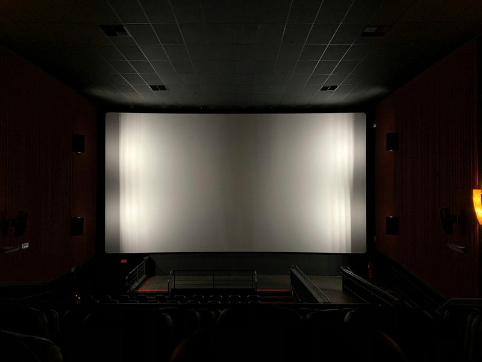

今週もカフェに行ってこの記事を書いている。ここ最近は毎週のアビスパ福岡の試合をDAZNで満喫しつつ、映画や音楽イベントに行くという生活が復活しつつある。その中でもカフェでまったりする時間は、大事な「ひとりの時間」という感じになっている。

自分は映画を家で見られないタチで、それは部屋づくりにも影響していると思うのだけど、映画館ほど映画に集中して見られる場所ではないのと同じように、ひとりカフェでは、何も気にせず目の前のiPad Proに集中することができ、思考を巡らすことができる。

思えば、電車通勤で1時間くらいかかる場所に住んでいた時は、電車の中で小説を読んでいて、あの頃は結構な量の本を読んでいた。家で仕事するようになったこともあるけれども、今は”そういう場所”がカフェになったような気がする。

このブログに書いたことがあるかわからないけれども、最近シェアラウンジを利用するようになったのもそういう文脈がある。今やvlogで「2時間スタバで勉強しました」なんてやると、お節介さんがコメントしてきたりもする。実際、スタバは勉強する人で埋まっていることもよくあるのだが、空いているかわからない場所を利用するよりも、あらかじめ予約できる場所の方が使い勝手がよいと感じる。あらかじめスケジュールを立てて、その通り行動するのは苦手な性格ではあるけれども。

パンデミックの前くらいに、涙活というワードがメディアを賑わせたことがある。泣ける映画を見に行って思い切って泣くという活動のことだ。映画で泣くことは多くないけれども、自分は映画館で映画をみて、目の前にスクリーンだけに没頭する時間を贅沢だと感じる。

毎年言っているが、今年も「見たい邦画」がたくさんある。音楽イベントへ参加の予定も徐々に決まってきた。夏に向かって、今年もいろんな刺激を受けながら生活していきたいなと思う。