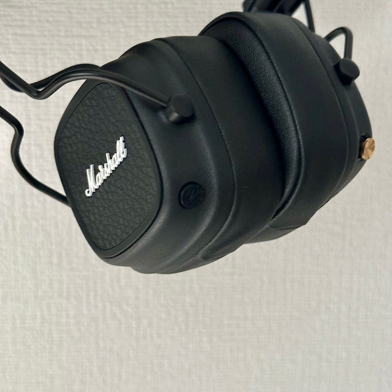

Covid-19 が 5 類に移行して初めての GW ということで、この機会を使って帰省したという人も多いんでしょうね。自分はどちらかというと、音楽三昧な日々を過ごしていた気がします。GW という言葉を生んだ映画ももちろん見てきましたし、国立新美術館や東京タワーに行ったりもしました。

パンデミック以降、そんな遠出ではないカジュアルなお出かけというものが増えていて、軽めの荷物で出かけることが多いのですが、そんな時に使うヘッドフォンが Marshall MAJOR IV でした。

このブログでも紹介したことがあるヘッドフォンなのですが、ノイキャンはないが、いつ充電したのか忘れるくらいバッテリーが持ちすぎていて、軽いです。地下鉄を使わないとかの時は選択することが多いです。ヘッドフォンは会話したい時は外せばよいので楽なんですよね。

[ギターを綺麗に聴かせてくれるヘッドフォン Major IV](/posts/6425fd3c-1f27-4b2e-92b1-c398e4c70b49/)

そんなお出かけで頻繁に使っていたところ、耳当ての部分、つまりイヤーパッドが少し劣化してきていることに気づきました。スポンジ自体が劣化しているのではなく、外装の皮っぽい部分が劣化してたんですね。というわけで、いろんな経緯があり、タイミングよく、その次のモデルである Marshall MAJOR V を手に入れました。

発売日が 4 月 23 日だったそうで、出たばっかり。[日本の代理店である完実電気ではまだ取り扱いが始まってないようでした](https://marshall.kanjitsu.com/product-category/headphones/)。簡単にレビューしていきます。

MAJOR IV で変わったところ。まずは外装です。ヘッドフォンのデザインが、ツルツルしていたデザインから、Marshall のアイデンティティでもある凹凸があるデザインに変わりました。

L 側に、新しく黒い M と書かれたボタンが追加されました。標準では、Spotify TAP という機能にアクセスできます。Spotify が起動して推奨プレイリストを流してくれるという機能だそうです。そのほかにも、Marshall アプリでカスタマイズできて、iOS であれば Siri を起動してくれるようにもなりました。なので、Apple Music 勢もこのボタンから Siri 経由で好きなプレイリストを選択できるようになっています。

あとは、Bluetooth が 5.3 になったり、LE Audio に対応したりなど、最新技術にも対応していて、個人的に操作しにくいなと思っていた R 側のボタンも軽く操作しやすくなりました。

いまどき、ノイズキャンセルもないヘッドフォンですが、最近日本でも地味に支持が広がっているように感じます。たまに装着している人を見かけますね。これから一緒にお散歩したいと思います。

気になる方はぜひ。

追記：Marshall MAJOR V には最近のヘッドフォンでは定番になったワイヤードで聴ける機能があります。ただそれを使うと、Marshall なサウンドは聞けないので、このヘッドフォンの個性を消してしまうため、あまりお勧めしません。
