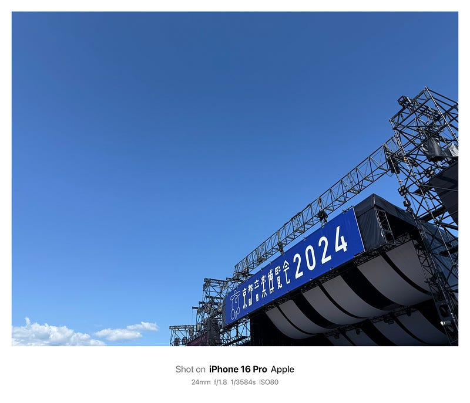
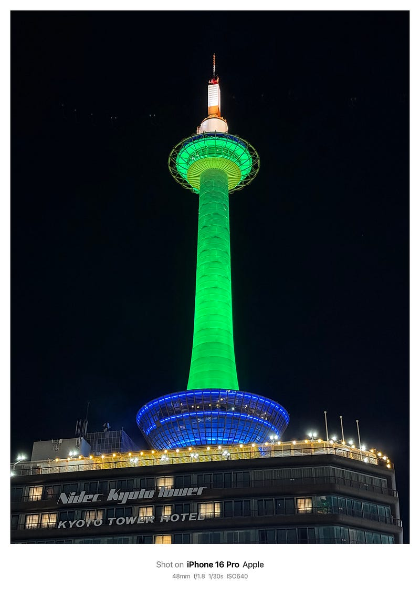

秋の3連休は行楽シーズンということもあり、お出かけした方も多いのではないでしょうか。そんな中、自分もDay1となった12日にはいつもより少し早起きをして、朝ごはんを食べることもなく電車に乗りました。目指したのは京都。そう、京都音楽博覧会2024に参加するためです。

博覧会を辞書で開くとこんな説明が載っています（スーパー大辞林 on macOS）

> 種々の文化財・生産品などを陳列して人々に観覧させ，産業や文化の振興に役立たせようとする催し。

大型の音楽フェスはロックやポップを中心に人気のある音楽を楽しむことができるのですが、京都音楽博覧会では少しニッチな、でも確実にレベルの高い音楽を楽しむことができます。普段の生活ではどうしても自分の好きな音楽を楽しみがちですが、普段自分では選ばないような音楽を、野外ライブという比較的聴きやすい形で楽しめる音楽イベントで、とても好きです。秋に開催されるのも好きですし、京都で開催されるというのも好きな要因かもしれません。

ここ最近の京都音博は雨が降ることが多く、レインコートが手放せないイベントになっていました。今年は雨の心配が一切ないくらい晴れていて、逆に日焼けしたくらいです。

出演した方々の中で最初に取り上げなければいけないのは Daniele Sepe & Galactic Syndicate。くるりの新曲を一緒に作り上げたグループで、今回京都音楽博覧会のためにナポリからやってきてくれました。

そのセッションはすばらしいのひとこと。Daniele Sepeがバンドのタクトを振りながらさまざまな展開を見せていくのですが、そのセッションを見ているだけでも楽しむことができました。時には、こちらに手拍子を求めてくることも。

バリトン歌手 平野和も素晴らしかった。普段はコンサートホールで聴くような歌声ですが、野外ライブで京都の風を感じながら聴くことができたのは唯一の体験だったと思います。シンプルに歌声に聞き入ってしまいました。

そして、くるり。今回は2日間フルで参加して、昨年聞けなかった「宿はなし」を聴くことができました。同じ曲でも、アレンジを変えたりして楽しませてくれるのが嬉しくありました。

京都に行くのも、昨年の音博ぶりで、本当に久しぶりで、今回は観光もあまりしていないのですが、京都で過ごした3日間はとても楽しかったです。雨の心配がない野外イベントはやっぱりいいですね。

京都音博があるから、普段触れない音楽に触れられるし、そのおかげで興味を示すことができている音楽もきっとあるのだろうと思います。

最後に。10月12日、13日の夜に京都駅を通りかかって、京都タワーが緑色に光っていることに気づいた方もいるかもしれません。もう何年も前から、京都音楽博覧会当日には緑色に光らせてくれています。来年また見かけたらぜひ思い出してもらえると嬉しいです。

