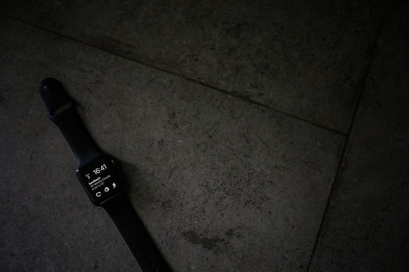

こんにちは。今回もお読みいただいてありがとうございます。

最初からただし書きみたいになってしまうのですが、週末に記事を公開するポリシー継続中です。この記事をご覧になっている頃には、13日の金曜日の夜に開催されるiPhone予約イベントが終わっていて、もしかしたら、家電量販店の開店予約祭りも終わった頃かもしれません。この記事は、11日の水曜日に、当日リリースされた、あいみょんのアルバム「猫にジェラシー」を聞きながら書いているので、予約できたかどうかは今の時点ではわかりません。未来の自分、大丈夫かな。

そうです。今回取り上げたいのは、9月のりんご狩りイベントです。ちなみに10月にも開催されることが噂されています。

今回のイベントの名称は「時が満ちる」、英語では “It’s glowtime”のとおり、Apple Watch 10 の紹介から始まりました。Apple Watchは2014年9月に発表されて、10年目のシリーズ10。薄くて軽くて速い、そんなデバイスになりました。

シリーズ1では 38mmと42mmだったラインナップも、今回の発表をもって41mmと46mmになりました。ちなみにこのサイズは、ケースのサイズ。ついに「シリーズ1の大きい方≒シリーズ10の小さい方」になってしまったので、注意です。

ちなみに自分は毎年買い替えるポリシーを卒業してしまったので、今年はステイです。（店頭で見てしまって衝動買いすることは想定していません）

AirPodsシリーズは、新製品AirPods 4と、AirPods Pro 2への新技術、そしてAirPods Maxのリフレッシュが発表されました。AirPods 4 にノイズキャンセリングモデルが加わったことで、ノイズキャンセリングがスタンダードになりました。

AirPods Maxがカラーリングの変更と、充電端子の変更に留まったのは意外でした。さまざまな反応がありますが、H3チップが出てこないのを考えると、次のステージに移行するための技術がまだ成熟してないという話がもっともらしいかなと思いました。

それはそうと、AirPods Pro と AirPods Maxの音の味付けがあまりにも違うことは長い間気になっていました。AirPods Maxは、iPadやApple TVで映画を見るための音響デバイスなんだろうなと整理しています。そういう意味で言えば、Apple Musicのロスレスやハイレゾを聴くためのH3チップが開発されたとき、それを載せるデバイスはAirPods Proなのではないかとも思います。

それはこの動画を見て、整理できました。

最後にiPhoneです。Appleは従来から普及機であるスタンダードモデルと、ハイエンドなクリエイターモデルという2つのラインナップをそれぞれのカテゴリで展開しています。スタンダードモデルは無印で、クリエイターモデルはProという名称をつけることが多いです。

2つのラインナップが揃ったのは2019年に発表されたiPhone 11。「これからのiPhone」を謳ってFace IDを搭載したiPhone Xの次のモデルです。そこから、Proにハイエンドな機能を実装し、よかったものを次の年のスタンダードモデルに搭載するというサイクルが徐々にできあがっていきました。

XでAppleの情報を逐一追いかけてるような人たちは、Proと無印の差を気にしてProを選ぶことが多かったのですが、そうではない人たちは 無印、もしくはSEを選ぶことが多いのではないかと思います。（Appleの情報を追いかけてる人の中でも記事を書く人たちは、普段から写真を撮ったり映像を撮ったりするので、カメラの性能が充実しているProを選ぶ理由もあったのです）

今年、iPhone 16 と iPhone 16 Pro の差がグッと縮まりました。iPhone16にA18、iPhone 16 Proに A18 Pro が搭載されたことで、大きな性能差がなくなりました。これはAppleからの明確なメッセージ。Proを選ぶような一部の人ではなく、多くの人にApple Intelligenceを使ってほしいということではないかと思います。

普及機であるスタンダードモデルは、ファッションを意識したさまざまなカラーバリエーションがあるのも魅力。普段Proを選んでいたけど、今回はこの色が綺麗だから、とiPhone 16を選ぶ例も多くあるかもしれません。

iPhone 16 Pro は、モバイルフォンというカテゴリに留まらず、商業で使えるような撮像デバイスへの道をひた走っています。思えば、クリエイターが映像を公開する方法は映画だけではなく、InstagramやTikTokなど、さまざまな媒体があります。高解像度のSol-moが気軽にとれるデバイスによって、TikTokでSlo-moが流行る状況は見てみたいかもと思っています。

iPhone 16にせよ、iPhone 16 Proにせよ、今後のApple Visionへの展開を想定して、空間動画撮影に必要なカメラを一列に並べ、カメラを上部にして構えられるようにカメラコントロールをつけたのはAppleらしいテクニックだなと思います。カメラコントロールがとりあえずシャッターボタンつけました、ではないところにも。

最後に、ソフトウェアについてまとめておきます。

イベント後、iOS18は9月17日（日本時間）にリリースされることが発表されています。Apple Intelligence は 英語版のBetaが”next month” にリリースされることが発表されているので、10月リリースの予定です。

Apple Intelligenceは、ゼロから新しいものを創り出さないというポリシーで実装されているそうです。Appleは以前「クリエイターのためのツールを作る」ということを言っていたのを思い出します。Apple Intelligence は iOS 8.1 として出る予定です。

マイナンバーカードの電子情報をiPhoneの中で管理するためのマイルストーンと言われているアップデートがiOS18.1でリリースされる予定になっています。マイナンバーカードに限らず、10月以降iPhoneの新しい使い方が提案されるかもしれません。

追伸： BeatsがiPhoneケース出した のはやっぱり気になります。

[**Beats iPhone 16 Case with MagSafe - リップタイドブルー**  
_Beats iPhone 16 Case with MagSafeは、衝撃を吸収するように設計されています。薄くて、軽くて、持ちやすいデザインです。apple.comで今すぐ購入できます。_www.apple.com](https://www.apple.com/jp/shop/product/MCFE4PA/A/beats-iphone-16-case-with-magsafe-%E3%83%AA%E3%83%83%E3%83%97%E3%82%BF%E3%82%A4%E3%83%89%E3%83%96%E3%83%AB%E3%83%BC?fnode=f803132495fb9553e121b8db5a21728ecaa7a1be40b07ceab8fac8d9dfb31b4d0b624706ff3458e72d70b6cf0f451199678edb11271f4ab6b270ce1828987a61d7c7ea2ba7a3d4507e45647d07bb954cf8d2fef66ece5367db1fc6967af37160 "https://www.apple.com/jp/shop/product/MCFE4PA/A/beats-iphone-16-case-with-magsafe-%E3%83%AA%E3%83%83%E3%83%97%E3%82%BF%E3%82%A4%E3%83%89%E3%83%96%E3%83%AB%E3%83%BC?fnode=f803132495fb9553e121b8db5a21728ecaa7a1be40b07ceab8fac8d9dfb31b4d0b624706ff3458e72d70b6cf0f451199678edb11271f4ab6b270ce1828987a61d7c7ea2ba7a3d4507e45647d07bb954cf8d2fef66ece5367db1fc6967af37160")