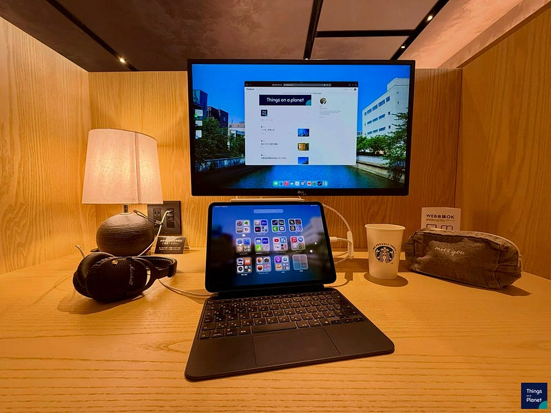

iPad Pro M4 (11インチ)をお迎えしてから約半年が経った。もちろん、毎日使っている。今の使い方をまとめてみた。

ちなみに半年前のレビュー記事はこちら。

[**iPad Pro M4 1週間レビュー**  
_Edit description_hiro.medium.com](https://hiro.medium.com/ipad-pro-m4-1%E9%80%B1%E9%96%93%E3%83%AC%E3%83%93%E3%83%A5%E3%83%BC-6e0fa7c1925c "https://hiro.medium.com/ipad-pro-m4-1%E9%80%B1%E9%96%93%E3%83%AC%E3%83%93%E3%83%A5%E3%83%BC-6e0fa7c1925c")

#### iPadの主な用途

iPadの主な用途を書き出すと、動画再生のサブディスプレイ、文章のライティングツール、読書、HomePodのリモートコントローラ、と言ったあたりだろうか。

#### 動画再生のサブディスプレイ

テレビを主ディスプレイとして、例えば推しの配信が被ったみたいな時にサブディスプレイとして使う。PS5でゲームをしながら、裏で配信を開いているということもよくある。

AppleTVに対応してくれていない映像系のサービス、TVerやNHK+を見る時に使っていることも多い。

#### 文章のライティングツール

ブログを毎週更新しているが、気分転換を兼ねて文章は自宅ではなくカフェで書いていることが多い。その時に使っているのがこのiPadだ。軽くて文章を書くだけであれば十分使い勝手がよいので重宝している。

また、個人でシェアオフィスのようなところを使うこともあり、そういうところで外部ディスプレイを使うと、もうMacBookを持ち歩く必要はないなと感じる。

#### 読書

最近はもっぱら電子書籍で読書を楽しんでいる。本の収納スペースに困らない点も魅力だが、マーカーで自由に線を引ける点が特に気に入っている。物理本ではマーカーが苦手な自分でも、電子書籍なら気軽にできる。iPadはApple Pencilとの相性が良く、手軽にマークが可能だ。

#### HomePodのリモートコントローラ

HomePodの音設定の中に「低音を抑える」という項目がある。これをONにしてからHomePodの利用頻度が格段に増えた。詳細は割愛するが、iPadでradikoアプリを開き、流れてきた音声をHomePodから再生する形で、radikoを聴くことが増えた。Apple MusicもHomePodで聴きたいなと思う時は、いつも近くにあるiPadからHomePodにストリーミングしているし、iPadには容量を確保しているので、ハイレゾロスレス音源をダウンロードしてヘッドフォンで聴くこともある。

#### 半年間の感想

自宅では常に手元に置いて使うほど、iPadは便利で手放せないデバイスだ。11インチというサイズは、可もなく不可もなくというサイズで、重すぎることもなく、画面サイズが小さすぎることもない。もちろん、作業の没頭感を得られるのは13インチの方だと思う。

旅先では、このiPadが唯一のディスプレイになることも多く、移動車両内や宿泊先で情報を摂取するのにも使いやすい。

ずっと相棒として使っていきたいデバイスだと思っている。